### Topic 1. Splay 复杂度分析

用到了势能分析的方法。

$$
\hat{c_i}=c_i+\varphi(D_i)-\varphi(D_{i-1})
$$

定义平衡树 $D_i$ 状态的势能 $\varphi(D_i)=\sum\limits_{i \in T} R(i)=\sum\limits_{i \in T} \log size(i)$，$size(i)$ 是 $i$ 子树的大小。

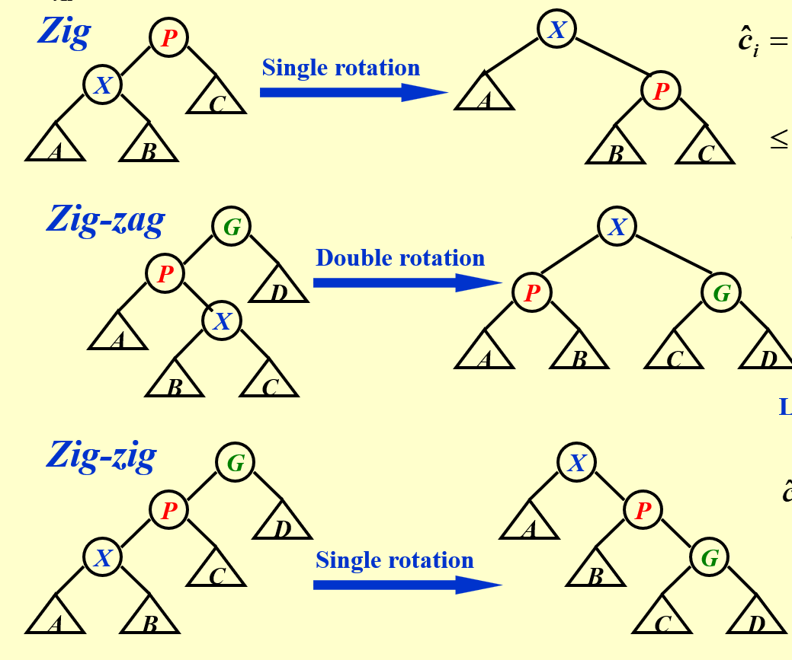

考虑 **单个** 节点的 Splay 到根的过程，会经历若干次如下过程（其中 zig 至多经过一次）：

+ 引理（对数均值不等式）

    若有 $a+b \le c$，那么 $\log a + \log b \le 2 \log c - 2$。

    证明：等价形式 $4ab \le c^2$，这是显然的。

+ zig

    $$
    \begin{aligned}
    \hat{c_i} & =  c_i+\varphi(D_i)-\varphi(D_{i-1}) \newline
    & = 1 - R(P) - R(X) + R(P') + R(X') \newline
    & = 1 + R(P') - R(X) \newline
    & \le 1 + R(X') - R(X) \newline
    & \le 1 + 3(R(X')-R(X))
    \end{aligned}
    $$

+ zig-zag

    $$
    \begin{aligned}
    \hat{c_i} & =  c_i+\varphi(D_i)-\varphi(D_{i-1}) \newline
    & = 2 - R(G) - R(P) - R(X) + R(G') + R(P') + R(X') \newline
    & = 2 - R(P) - R(X) + R(G') + R(P') \newline
    & \le 2 + R(G') + R(P') - 2 R(X) \newline
    \end{aligned}
    $$

    由于 $size(G') + size(P') \le size(X')$，由引理 $R(G')+R(P') \le 2R(X')-2$。

    进而

    $$
    \begin{aligned}
    \hat{c_i} & \le 2(R(X')-R(X)) \newline
    & \le 3(R(X')-R(X))
    \end{aligned}
    $$

+ zig-zig

    $$
    \begin{aligned}
    \hat{c_i} & =  c_i+\varphi(D_i)-\varphi(D_{i-1}) \newline
    & = 2 - R(G) - R(P) - R(X) + R(G') + R(P') + R(X') \newline
    & = 2 - R(P) - R(X) + R(G') + R(P')
    \end{aligned}
    $$

    由于 $size(X) + size(G') \le size(X')$，由引理 $R(X)+R(G') \le 2R(X')-2$。

    进而
    
    $$
    \begin{aligned}
    \hat{c_i} & \le 2R(X')-2R(X)+R(P')-R(P) \newline
    & \le 3(R(X')-R(X))
    \end{aligned}
    $$

于是，单个节点旋转到根的步数 $\sum\limits_{i=1}^k c_i$ 满足 $\sum\limits_{i=1}^k \hat{c_i} = \left( \sum\limits_{i=1}^k c_i \right )+ \varphi(D_k)-\varphi(D_0)$。$k$ 表示某次操作旋转的次数。

记第 $l$ 次 Splay 操作总耗时为 $F(l)=\sum\limits_{i=1}^k c_i$。由于 $\sum\limits_{i=1}^k \hat{c_i} \leq 3(R(T)-R(X))+1 = \mathcal{O}(\log n)$，所以 $F(l) + \varphi(D_l) - \varphi(D_{l-1}) \leq \mathcal{O}(\log n)  $。

再考虑全部操作序列（共 $m$ 次操作）。

$m$ 次操作累加，得 $\sum\limits_{l=1}^m F(l) + \varphi(D_m) - \varphi(D_0)=\mathcal{O}(m \log n) $

由于 $\varphi(D_m) - \varphi(D_0) > 0$，故而 $\sum\limits_{l=1}^m F(l) = \mathcal{O}(m \log n)$。这也是整个算法的复杂度。

### Topic 2. Red-Black Tree

+ 红黑树的五条性质

    1. Every node is either red or black.
    2. The root is black.
    3. Every leaf (NIL) is black.
    4. If a node is red, then both its children are black.
    5. For each node, all simple paths from the node to descendant leaves contain the same number of black nodes.

    注意有 NIL，也就是说有个虚拟的叶子节点。

+ 红黑树的高度界

    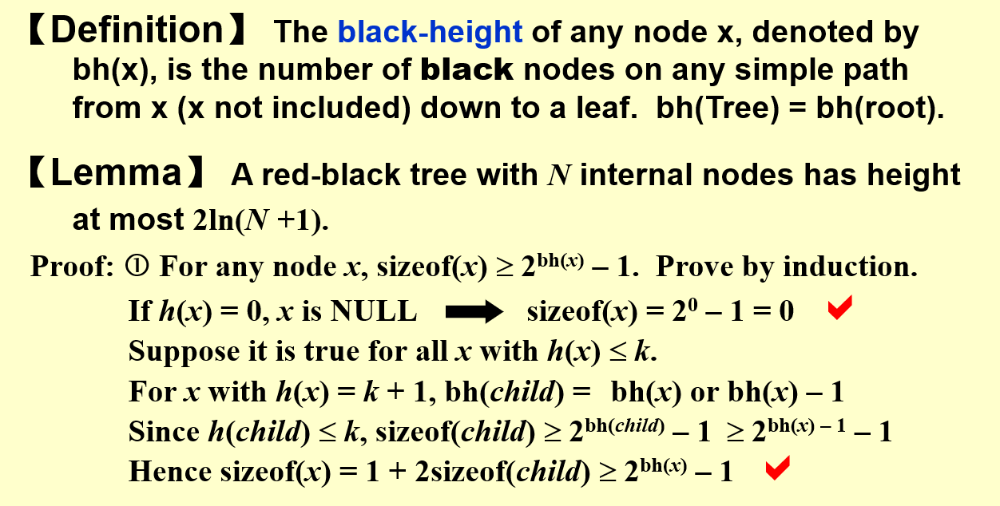

+ 插入操作

    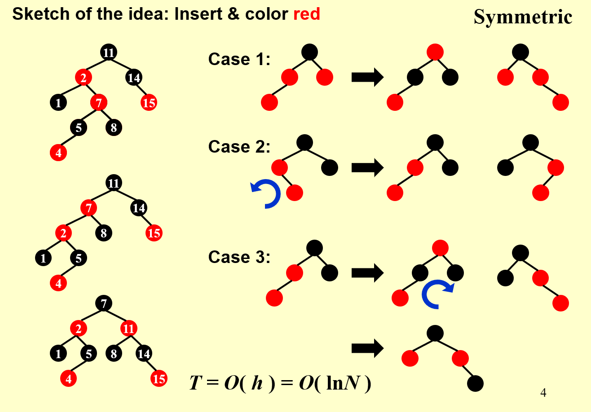

    步骤与正确性分析：

    + 首先，插入的点令为红点，其父亲若为黑点则可以直接完成插入，接下来只需讨论父亲为红点的情况。记插入红点为 $x$，父亲为 $p$，爷爷为 $g$，叔叔为 $u$。

    + 在正确性分析过程中，着重关注性质 4（红子必黑）和性质 5（黑高等同）是否能得到满足。插入前 4/5 均是满足的，插入后性质 4 不再满足（且只有一处），性质 5 依然满足。也就是说，接下来通过归纳证明性质 5 的始终满足，并能经过调整使得性质 4 得到满足。
    
    + 【初始状态】根据 $u$ 的情况分为两类：显然 $u$ 要么为红点要么为 NIL，分别对应到 Case 1 与 Case 3。

    + 在接下来的三种 case 的讨论中，我们约定深度最大的那个红点为 $x$，其父亲为 $p$，爷爷为 $g$，叔叔为 $u$。

    + 【Case 1】假设调整前此时性质 5 满足，性质 4 只有一处不满足。那么做一次 $g$ 层和 $f,u$ 层的颜色对换。显然对换后 **性质 5 依然可以得到满足**，性质 4 是否满足则要根据 $g$ 父亲的颜色决定。若 $g$ 父亲为黑色，性质 4 得到满足，状态转移结束，红黑树完成颜色维护；否则，将 $g$ 视作新的 $x$（向上递归），转移到 Case 1/2/3，此后性质 4 依然只会有一处不满足。

      值得一提的是，在本 case 中 $x$ 是可能有后代的。因为 Case 1 不一定总是初始状态，也可能由其它的 Case 1 转移而来。

      在 Case 1 中 $x$ 和 $f$ 的关系并不重要（$x$ 是 $f$ 的左右儿子都执行的一样的颜色对换操作）。

    + 【Case 2】假设调整前此时性质 5 满足，性质 4 有一处不满足。那么我们接下来进行一次左旋即可。不难发现左旋之后性质 5 依然是满足的，但性质 4 则未得到修复（依然有且只有一处不满足）。不过我们转移到了 Case 3。

      仍然，在图中可能 $f$ 具有左子树，$x$ 有子代，$u$ 有子代。不过这些并不影响左旋后性质 5 的始终满足，也不会使得左旋后性质 4 在其它地方得到破坏。Case 3 同理，后续不再说明。
    
    + 【Case 3】假设调整前此时性质 5 满足，性质 4 不满足。那么接下来先进行颜色调换，而后右旋。在纸上画一下可以发现这两波操作之后性质 5 依然满足，同时性质 4 在此处得到修复。

+ 删除操作

    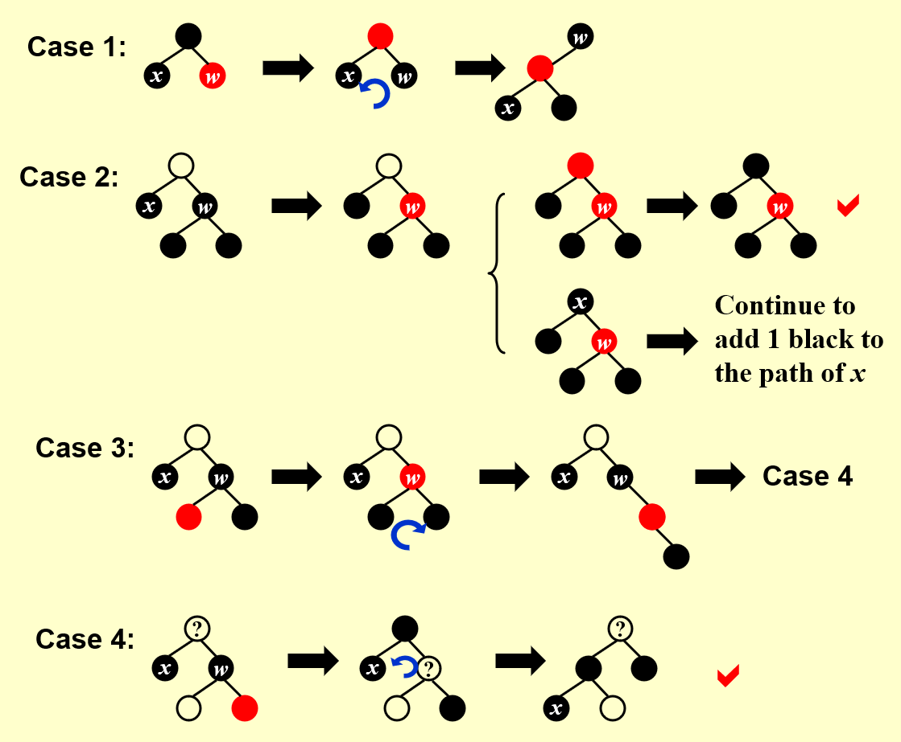

    步骤与正确性分析：

    + 首先像普通的 BST 那样，在待删除的节点左侧找一个最大的 / 右侧找一个最小的，和待删除节点进行键值交换（不换颜色）。

    + 记交换后待删除的节点为 $x$。若 $x$ 为红色则可以直接删除；若为黑色则需要想办法在 $R \to x$ 的路径上加一个黑点（且不影响其他部分，亦即这个黑点只能作用于 $x$ 下的叶子），然后再删除 $x$。接下来只考虑后者。记 $x$ 的父亲为 $p$，兄弟为 $w$，侄子为 $c$。

    + 【初始状态】根据 $x$ 的兄弟 $w$ 分到 Case 1 / Case 2.3.4，再根据侄子 $c$ 的情况分为 Case 2 / Case 3 / Case 4。接下来考虑状态转移，正确性分析时性质 5（黑高等同）会是一个难点。

    + 【Case 1】调整前性质 4, 5 均满足。通过 $p,w$ 颜色对换以及一次左旋转移到 Case 2/3/4 的情况（注意两次操作后 $x$ 的兄弟变黑了）。不难发现操作和性质 4 和 5 依然是满足的。

    + 【Case 2】调整前性质 4, 5 均满足。若 $p$ 为红色，那么可以将 $p,w$ 颜色对换来使得 $R \to x$ 的路径上多一个合适的黑点。调整直接结束。

        若 $p$ 为黑色，则我们首先把 $w$ 标红，然后递归地处理 $p$（$x$ 的父亲 $p$ 作为新的 $x$，可能进到 Case 1/2/3/4 中的某个）。注意我们只是要让 $R \to p$ 上的黑点多一个，待删除的 $x$ 本身是 **始终不发生移动的**。只要能处理好这个递归的子任务后，再删除 $x$ 便可以让 $R \to w$ 和 $R \to p$ 的黑高全部到达一个合法的情况。

        注意 Case 2.2 的 Notation 和图片所示有所差异。

    + 【Case 3】调整前性质 4, 5 均满足。通过一次 $w,c$ 易色和右旋，改变树的结构以进入 Case 4。显然调整后性质 4, 5 依然是满足的。

    + 【Case 4】调整前性质 4, 5 均满足。通过一次 $p,w$ 易色和某个侄子 $c$ 的红变黑，以及一次左旋，使得有且只有 $x$ 处不满足性质 5，其他依然满足，在此情形下删除 5 即可完成维护。同时显然性质 4 一直得到了满足。

+ SP：若某操作后发现根是红的，将其染黑即可。

+ 红黑树的单次 Insert / Delete 都是 $\log$ 的。

### Topic 3. B+ Tree

B+ Tree 的查找时间复杂度是 $O(\log_{\frac{m}{2}}n)$！

B+ Tree 的插入：下图展示了插入 19 的过程。大概思路就是，首先放进对应的节点，如果发现节点吃不消了（大于 $m$）就分裂，然后让父节点儿子数目加 1。如果发现父节点吃不消了（大于 $m$）就再次分裂，让爷节点儿子数目加 1。这个过程是不断向上的，直到某个祖先吃得消为止。

如果到根都吃不消的话，则需要对根进行分裂，然后创建一个新的根节点。

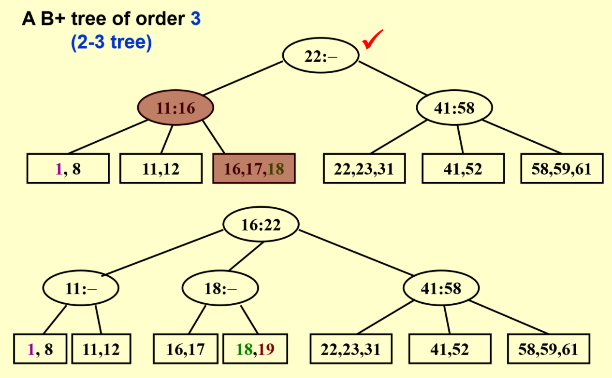

*注意上图似乎有些问题。首先按照 Wikipedia 的说法，2-3 树是 B 树而非 B+ 树。其次，大多数网络资源定义 m 阶 B+ 树叶子节点大小为 m-1，非叶节点的孩子数目为 m；ADS 课程中则定义 m 阶 B+ 树叶子节点大小为 m，非叶节点的孩子数目为 m。非常诡异。*

// FIXME: 定义问题

### Topic 4. Inverted File Index

+ 基本存放方法

    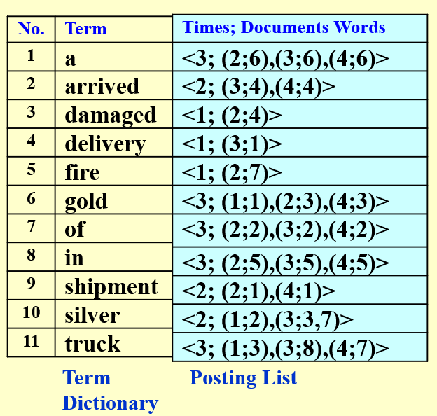

    查找时，例如想找 silver truck，只需要将 10 和 11 号的 Posting List 取并。图中取并后剩下 `<1,3>`，说明检索结果为 1, 3 两篇文章。

    Posting List 一般采取链表查询。

+ 插入（新文档）

    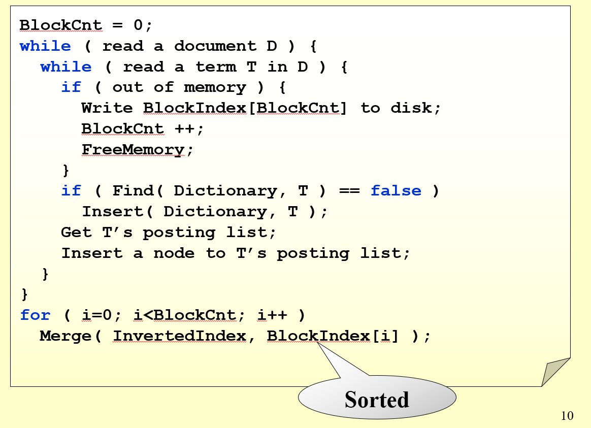

    + `read a document D` 直接遍历所有文档

    + `read a term T in D` 读取所有的 term

        需要语义分割算法。

    + `Find (Dictionary, T)` & `Insert (Dictionary, T)` 看某个 term 是否在字典（参见上表 Term 列）中；如果不在则插入。

        可以使用 B+ / Trie 等数据结构对 Term 进行存储。 

    + `Insert a node to T's posting list` 向 $T$ 后面跟的 Posting List 插入本文档的索引。

        一般使用链表存储 Posting List。因为涉及插入操作且长度不定。

+ 查询（对于若干词汇）

    例如，现有关键词 $A,B,C$，只需要将 $A,B,C$ 的 Posting List 中的链表项取 AND 即可。

+ Tricks

    1. Memory 不够时的插入

        解决方案如上图所示。当内存不够时，可以把当前处理好的 Posting List 事先写入硬盘，最后在排序之后依次合并（排序是为了归并加速）。

    2. Posting List 存储空间不够

        使用分布式存储，方案有如下两种（一般而言认为第二种更好）。

        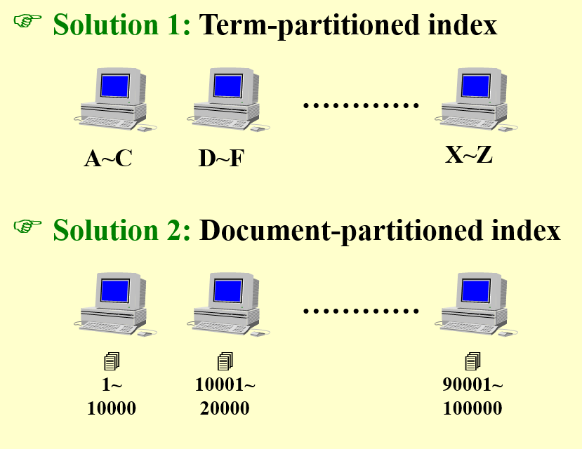

    3. Dynamic Indexing

        假如整个 Index 的修改需要很长时间，那么一旦产生新文档就将其加入 Index 是一个低效率的方法。

        解决方案是将 Index 分为 Main Index（快读慢写）和 Auxiliary Index（慢读快写）。每当有新文档产生时先将其加入 Auxiliary Index，等一定周期（例如一天）统一地将 Auxiliary Index 中的内容加入 Main Index。

        注意搜索时需要同时搜索 Main Index 和 Auxiliary Index。

    4. Posting List 地址差分压缩

        回顾本节的第一幅图。每个 term 实际上对应了一个 Posting List。

        每个 Posting List 的地址都不一样，将他们存储下来，例如 $\{2,15,47,\cdots,58879,58890,\cdots\}$ 可能需要很大的空间开销（例如 long long 都不够存储地址位置）。

        一个可能的方法是使用差分「压缩」这些数字的大小。比如上面的例子就可以压缩为 $\{2,13(15-2),32(47-15),\cdots,11,\cdots\}$，节省数字的存储空间。

    5. 查询策略：从更稀有的单词开始查找

        之前提到，对于关键词 $A,B,C$，要查询对应的文档，只需要将 $A,B,C$ 的 Posting List 中的链表项取 AND 即可。

        如果 term $A$ 的链表大小为 $10$，term $B$ 的 $10^3$，term $C$ 的链表大小为 $10^6$，显然以 $A \to B \to C$ 的顺序进行取和更好。

+ 搜索质量评估

    奇了怪了，作业题全是这玩意儿。

    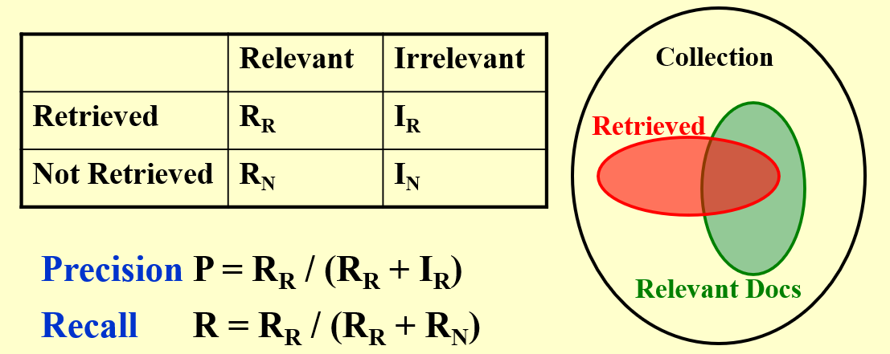

    Retrieved 是搜索引擎抓出来的结果；Relevant 是理论上相关，应该被抓出来的结果。

### Topic 5. Left Heap & Skew Heap

左偏树使得整个堆的「重心」整体左移，以约束「最右路径」的长度在 log 级别。

左偏树在不改变原有堆操作的复杂度基础上，将合并两堆的时间复杂度降至 log。

+ npl 零路径

    The null path length, $\text{Npl}(X)$, of any node X is the length of the shortest path from X to a node without two children. Define Npl(NULL) = –1.

    $$\text{Npl}(X) = \min \{ \text{Npl}(C) + 1 \ | \ \text{C is children of X} \}$$

+ 左偏树的 npl 性质

    对于一个左偏树，满足对于其中的所有节点 $x$，$x$ 左儿子的 npl 必然大于等于右儿子的 npl。

    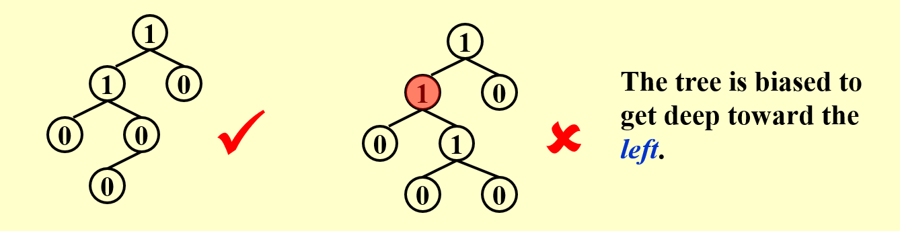

    不难发现，对于左偏树中的任何一个节点 $x$，其 null path 一定是以 $x$ 为子树的最右路径。

+ 最右路径的 log 上界

    证明：对于一个最右路径长度为 $r$ 的左偏树，它至少具有 $2^r-1$ 个节点。

    证明考虑归纳。当 $r=1$ 时显然成立。假设本命题对于 $1,2,\cdots,r$ 的情形都成立，我们去证明对于 $r+1$ 的情形依然成立。

    最右路径长度为 $r+1$ 的左偏树，其右子树的最右路径长度为 $r$；同时，根据左偏树的 npl 性质，其左子树的最右路径长度至少为 $r$。那么左子树和右子树都至少具有 $2^r-1$ 个节点，于是整棵树至少具有 $2^{r+1}-1$ 个节点。证毕。

+ 左偏树的 merge

    insert 操作可以看成一种特殊的 merge，所以不必再单独讨论。merge 采取如下递归策略：

    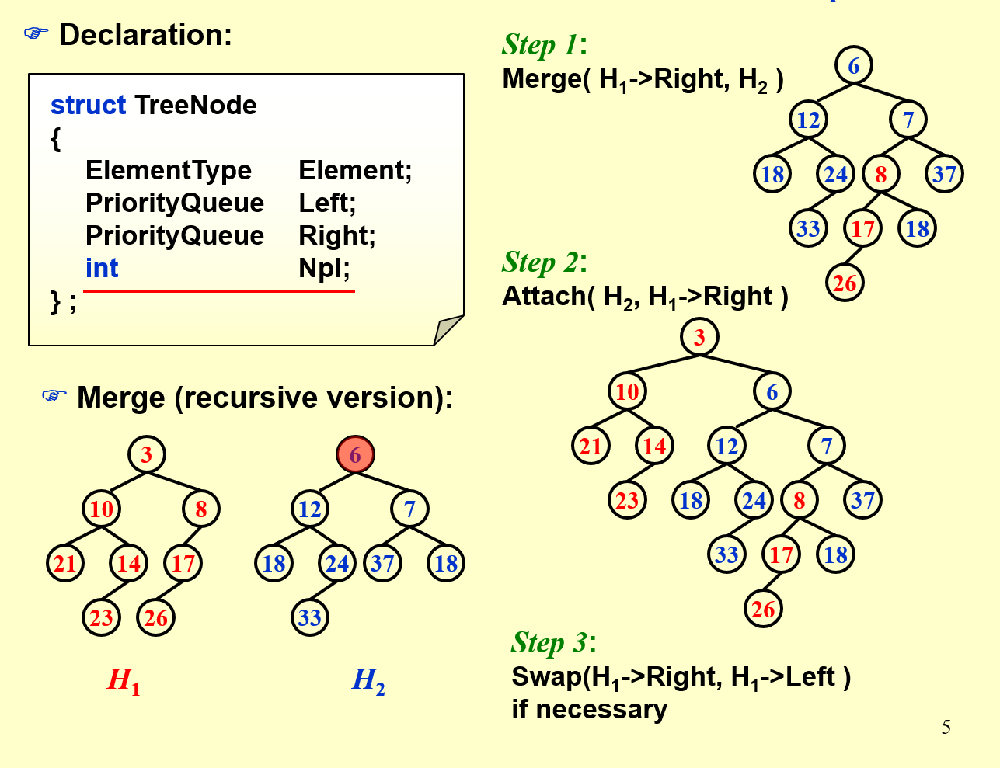

    注意递归中，时刻保持 $H_2$ 的根值更大（否则交换）。

    **关于正确性的证明：** 假设在合并前 $H_1,H_2$ 均为合法的左偏树，下证明合并后依然为左偏树。使用归纳证明。假设 step 1 `merge(H1 -> Right, H2)` 是正确的，那么经过 step 2 后 H1 的右子树一定满足左偏性质，同时由于左子树没有动过，亦满足左偏性质。最后经过 step 3 的判断，一定保证 H1 的根满足左偏性质。综上整棵树都满足左偏性质。

    **关于复杂度的证明：** 注意每次递归是 `merge(H1 -> Right, H2)`，这意味着递归后的 $H_1$ 和 $H_2$ 的「最右路径」长度之和总会减一。由于「最右路径」的长度是 log 的，故而单次合并是 $O(\log n)$ 的。

接着说斜堆。注意 **斜堆** 和 **左偏树** 不是一种堆，之所以将其放在一起是因为它们的「最右路径」在算法流程或分析中都很关键。

+ 斜堆的 merge

    insert 和 delete 操作都可以看成一种特殊的 merge，所以不必再分类讨论。

    斜堆的 merge 遵循以下规律：

    1. 对于待合并的节点 $u, v$，通过一次交换机会保证 $val(u)<val(v)$。
    2. 交换 $u$ 的左右儿子（和左偏树不同的是，此处无脑交换）。
    3. 将 $u$ 的（交换后的）左儿子和 $v$ 合并。递归下去即可。

    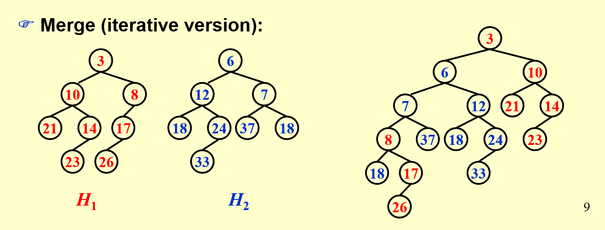

+ 斜堆的复杂度分析

    可以证明，skew heap 的均摊复杂度为 $\Theta(\log n)$。需要使用势能分析的方法。

    定义 **重节点**（注意和树剖中的定义不同）：若 $x$ 的左儿子数目大于右儿子数目，则称 $x$ 为重节点，反之称轻节点。

    定义 **势能函数** $\phi(D_i)$（其中 $D_i$ 表示第 $i$ 时刻的「堆森林」）为 $D_i$ 中重节点的数目。

    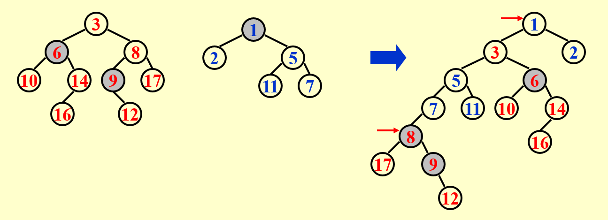

    考虑一次 merge 操作。记待合并的两堆分别为 1 号堆和 2 号堆，它们「最右路径」上的轻节点数目分别为 $l_1,l_2$，「最右路径」上的重节点数目分别为 $h_1,h_2$，非「最右路径」上的重节点数目之和为 $h$。

    合并之前，$\phi(D_i)=h_1+h_2+h$。

    注意在单次合并的递归过程中，我们的（递归的）待合并节点 $u,v$ 一定始终在初始两堆的「最右路径」上。这意味着 **合并不会改变任何不在「最右路径」上的节点的轻重特性**。(1)
    
    接着考虑初始「最右路径」上的重节点们，经过合并之后它们一定会变成轻节点。这是因为原本它们的左儿子就更大，在交换之后右儿子一定更大，并且后续还会向右儿子合并节点，所以无论如何在合并之后它们一定会变为轻节点。(2)

    至于初始「最右路径」上的轻节点们，在合并之后它们既可能为轻，亦可能为重。(3)

    根据上述三个特性，我们在合并之后必然有 $\phi(D_i) \le l_1+l_2+h$。

    不难发现，一次合并至多只会对「最右路径」上的节点进行遍历。故而一次合并的时间开销为 $T_{worst}=l_1+l_2+h_1+h_2$。根据势能分析法，记均摊复杂度为 $T_{amortized}$，那么有

    $$T_{amortized}=T_{worst}+\phi(D_{i+1})-\phi(D_i) \leq 2(l_1+l_2)$$

    而 $l_1+l_2$ 是 log 级别的。证明可以考虑这样一个思想实验：从最右链的叶子向上跳，每跳一个轻节点都会让子树大小至少翻倍。

    势能函数 $\phi$ 始终非负。所以均摊合并复杂度为 $O(\log n)$。

### Topic 6. Binomial Queue 二项队列

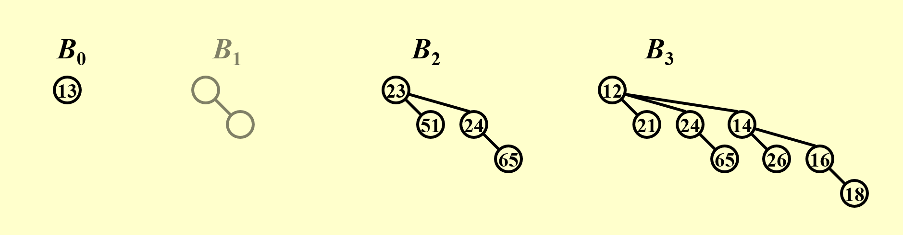

二项队列由若干个大小为 $2^k$ 的堆构成。类似于二进制分解，比如 $13=2^3+2^2+2^0$，则大小为 $13$ 的二项队列由 $k=3,2,0$ 的堆构成。

+ 二项队列的 Merge

    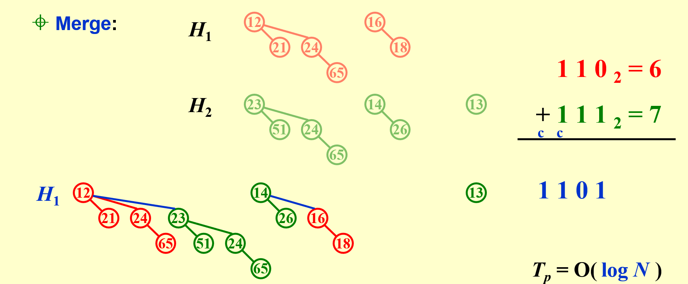

    类似于二进制加法。二项队列的插入可直接视作合并。

+ 二项队列的 Delete Min

    首先找到所有 root 中的最小值。这部分是 log 的。

    设整个队列为 $H$，最小 root 所在的堆为 $H_m$。将 $H_m$ 的 root 删除，$H_m$ 分裂成若干个堆。

    将 $H_m$ 与 $H-H_m$ 合并。这部分也是 log 的。总的也是 log 的。

+ 【Claim】A binomial queue of N elements can be built by N successive insertions in $O(N)$ time.

    考虑势能分析。记 $\phi_i$ 为第 $i$ 次合并之后二项队列中堆的数目。

    显然有 $c_i+\phi_{i}-\phi_{i-1}=2$（考虑加入一个点，首先是 1 单位操作；此外也增加了一颗 $B_0$，势能函数加 1；最后每产生一次进位会使用 1 单位操作，但也会让堆的数目减 1）。

    求和，$\sum_{i=1}^n (c_i+\phi_{i}-\phi_{i-1}) = \sum_{i=1}^n c_i + \phi_n - \phi_0=2n$。

    显然 $\phi_n \ge \phi_0$，所以总复杂度为 $O(n)$。

+ 二项队列的实现细节

    1. 「左孩子右兄弟」的存储方式。

        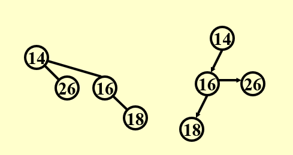

        注意和之前算法中的顺序是反的。例如对于上上张图中的 $B_3$，第二层的链接方式应当是 `14 -> 24 -> 21`。

    2. 合并：两个堆的合并是 $O(1)$ 的（注意整个队列的合并依然是 log 的）

        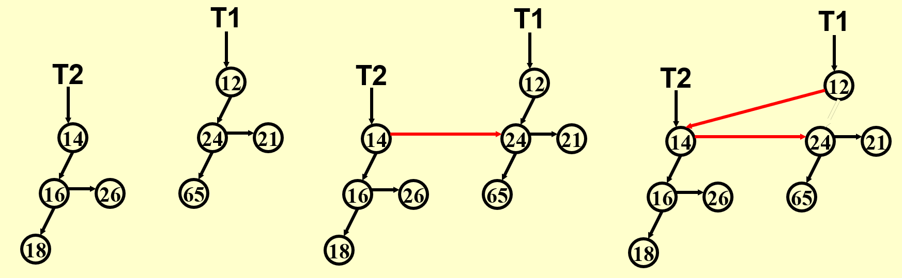
    
    3. 删除：会发现在如此的「倒序」存储方式下，对于一个堆 $H$，将其 root 删除后，剩下的二层的堆们刚好可以依次排到队列的相应位置（颅内理解一下），所以就很方便。

### Topic 7. Backtracking: Alpha-Beta 剪枝

考虑一个 Game Tree，根据博弈的规则，如果每个结点的值表示某种人为定义的「分数」，那么在搜索树上一定是 **一层取 min，一层取 max，交替进行** 的。

对于这种特殊的搜索，我们有 alpha-beta 剪枝策略。

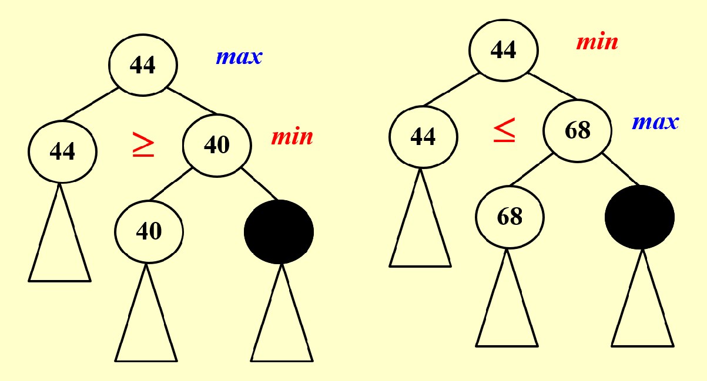

例如，对于上图的黑色节点代表的子搜索树，都是可以被剪掉的。使用 alpha-beta 剪枝的搜索复杂度为 $O(\sqrt{n})$。

### Topic 8. Master Method 主定理

先拐另外一个话题，复杂度递推。考虑式子 $T(N)=2T(\frac{N}{2})+N$，我们可以算得 $T(N)=\mathcal{O}(n \log n)$。注意右侧是非常容易犯的一个错误，可以理解为 $c$ 必须是全局的 $c$，所以这里相当于常系数变成了 $c+1$，这样累加下去是不允许的。

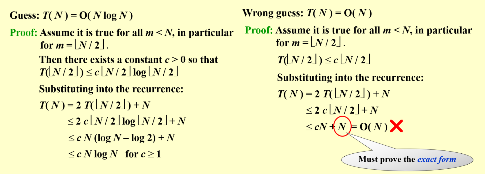

然后是主定理：

**主定理形式 1**

The recurrence $T(N) = aT(N/b) + f(N)$ can be solved as follows:

+ If $af(N/b) \le kf(N)$ for some constant $k < 1$, then $T(N) = \Theta(f(N))$

+ If $af(N/b) \ge Kf(N)$ for some constant $K > 1$, then $T(N) = \Theta(N^{\log_ba})$

+ If $af(N/b) = f(N)$, then $T(N) = \Theta(f(N) \log_bN)$

一个不严谨的证明 / 记忆方法是使用递归树：

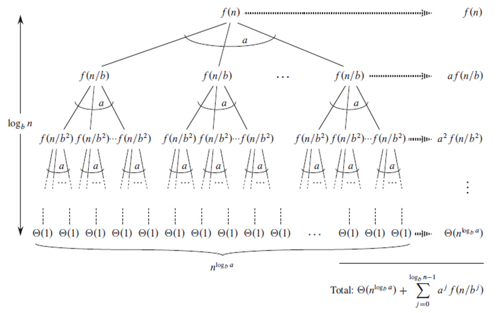

对于 Case 1 和 Case 2，很容易使用放缩然后几何级数求和可得。对于 Case 3，说明每一层的开销都一样，然后一共有 $\log_b N$ 层。

**主定理形式 2（幂函数形式）**

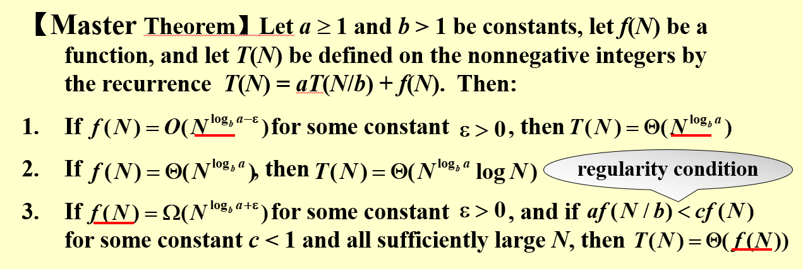

**主定理形式 3（幂函数加对数形式）**

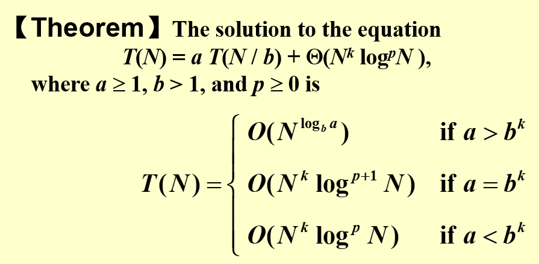

### Topic SP. Lesson from Mid-Term Exam

+ 看红黑树。至少对插入操作非常熟悉。

+ 看 B+ 树。考前手推几个 case。

+ 要不下次先做选择题？

### Topic 9. 计算理论基础

+ Turing Machine

    + 确定性图灵机 (DTM)：类似于一个状态机。根据当前状态和纸带上的字符，可以跳转到下一个状态，或者覆写当前的字符。

    + 非确定性图灵机 (NTM)：可以视作一次可以转移到多个状态的 DTM（无限并行），也可以视作一个「运气极好」的 DTM，每次转移都是转移到最好的结果。

+ P, NP, NP-Hard, NPC

    + P 问题：可在多项式时间内被 DTM 所解决（判定）的问题。

    + NP 问题：可在多项式时间内被 NTM 所解决（判定）的问题。
    
      或者说，可在多项式时间内被 DTM 验证某个解是否正确的问题。

    + NP-Hard 问题：如果一个问题可以被所有的 NP 问题归约到，那么它是 NP-Hard 问题。

    + NPC 问题：如果一个问题既是 NP-Hard，又是 NP 问题，那么称其为 NPC 问题。

+ P 与 NP

    目前只知道 $P \subseteq NP$，但究竟是 $P \subset NP$ 还是 $P=NP$ 尚无定论。似乎学界更为倾向于前者。

    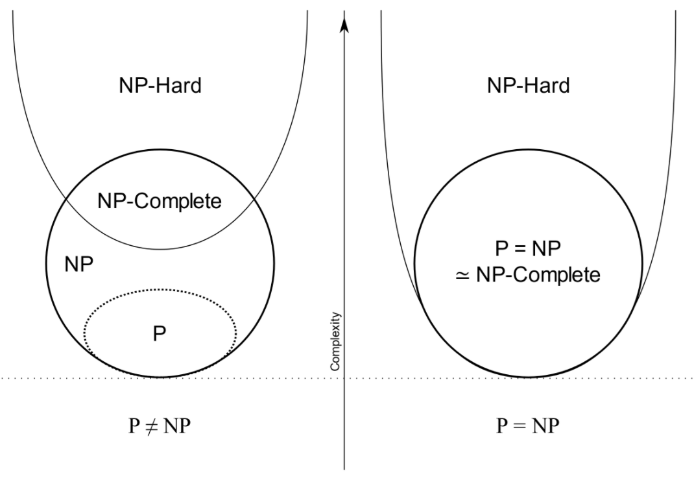

+ 证明一个问题是 NPC 的

    1. 证明它是一个 NP 问题（可在多项式时间内被 DTM 验证某个答案是否正确）

    2. 证明某个已知的 NPC 问题可以被归约到它

+ co-NP 不等于 NP

    NP 问题的反不一定是 NP 问题。例如如果问一张图中是否存在 Hamilton 回路，我们可以在多项式时间内验证某个解是否正确（因为这个解包含了一种具体的路径）；但我们无法在多项式时间内验证反问题，既「一张图中是否不存在 Hamilton 回路」，我们无法在多项式时间内验证某个解是否正确，因为只有试过所有的路径，我们才能断言不存在 Hamilton 回路。

+ 形式语言理论

    + 抽象化问题、语言

        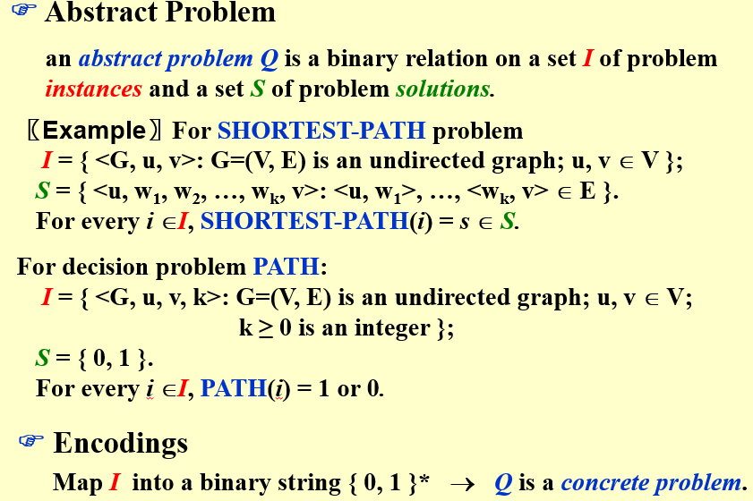

        大概是说，可以把一个求答案的问题转化为若干个 0/1 decision 问题？

        定义语言 $L = \\{x \in \Sigma^{*}: Q(x) = 1 \\}$。其中 $Q(x) = 1$ 表示某 01 字符串 $x$ 描述了某一个 decision 问题实例，并且这个问题实例有解。

    + 在形式语言理论下，我们可以更形式化地定义 P 和 NP 问题

        $$P = \\{L \subseteq \\{0,1\\}^{*}: \text{There exists an algorithm A that decides L in poly time}\\}$$

        此处 decide 意为算法 $A$ 必须要找到所有属于 $L$ 语言的 $x$（亦即 $Q(x)=1$），不重不漏。

        同时若有

        $$L = \\{x \in \\{0,1\\}^{*}: \text{There exists a certificate } y \text{ with } |y|=O(|x|^c) \text{ such that } A(x,y)=1 \\}$$

        成立，则 $L$ 描述了一个 NP 问题。注意这个不知道从哪里蹦出来的解 $y$，它本身也得是多项式规模的。

        例如，假设 $Q(x)=1$ 当且仅当 $x$ 描述了某个无向图且这个图从 $S$ 到 $T$ 的最短路小于等于 $k$，这是一个 decision 问题。确实存在一个算法 $A$，能在多项式时间内找出集合 $L$，所以这个 decision 问题是 P 的。

        再如，假设 $Q(x)=1$ 当且仅当 $x$ 语言所描述的是某个 $9 \times 9$ 数独且其有解。显然，不存在多项式算法 $A$ 来 decide 集合 $L$（因为判断单个数独是否有解无法在 poly-time 内完成），所以数独的求解不是一个 P 问题。
     
        但是对于某一个 $x \in \\{0,1\\}^{*}$，当我们给定一个特定的解 $y$ 时，此时就有了题面 $x$ 和某答案 $y$ 的组合。若我们可以在多项式时间内确定 $A(x,y) = 1$，这说明我们可以在多项式时间内验证 $L$。所以数独的求解是一个 NP 问题。

### Topic 10. Approximation

+ Packing Problem

    + 问题：若干个体积为 $[0,1]$ 的物品，装到尽量少的体积为 $1$ 的箱子里。

    + 在线估计：Next Fit（顺序瞎装，不够就开）/ First Fit（装到目前第一个能装的，不够就开）/ Best Fit（装到目前能装的且余空间最小的，不够就开）

        可以证明，无论何种在线 approximation，最坏情况答案都会达到最优解的 $\frac{5}{3}$ 倍。

        对于 Next Fit，上界是 $2$ 倍。

        对于 First Fit / Best Fit，上界是 $1.7$ 倍。

    + 离线估计：先降序排序，然后用 First Fit 或者 Best Fit。

        离线估计的 FF/BF 又称为 FFD / BFD，上界是 $1.5$ 倍。当规模大时，上界约为 $\frac{11}{9}$ 倍。

+ Knapsack Problem

    + 问题：$p_i$ 表价值，$w_i$ 表体积。01 背包。

    + 估计：可以证明，贪心算法（取 $p_i$ 贪心和 $\frac{p_i}{w_i}$ 贪心的 max 者）得到的答案一定不超过实际最优解的 2 倍。

        证明：
        
        引入另外一个问题：分数背包，每个物品可以取 $0\leq x_i\leq 1 (x_i \in \mathcal{Q})$ 个。

        $p_{max}$ 指 $p_i$ 贪心答案，$p_{dens}$ 指 $\frac{p_i}{w_i}$ 贪心答案，$p_{greedy}$ 指两者 max。

        $p_{opt}$ 指 01 背包最优解，$p_{frac}$ 指分数背包最优解。

        列举一些不等式：

        + $p_{max} \leq P_{opt} \leq P_{frac}$

        + $p_{max} \leq P_{greedy}$

        + $P_{opt} \leq P_{greedy} + p_{max}$
        
            这是因为考虑分数背包，一定是由 $\frac{p_i}{w_i}$ 贪心结果加上一个不超过 $p_{max}$ 的玩意儿构成的。

        于是有 

        $$ \frac{P_{opt}}{P_{greedy}} \leq 1 + \frac{p_{max}}{P_{greedy}} \leq 2$$

    + 传统的 01 背包算法

        正常来说 01 背包的复杂度是 $\mathcal{O}(n^2p)$（其实也可以是 $\mathcal{O}(n^2w)$，但本质上都差不多）。看似是多项式的复杂度，然而 $p$ 可以很大（若输入长度为 $l$，则可以到 $2^l$）。

        
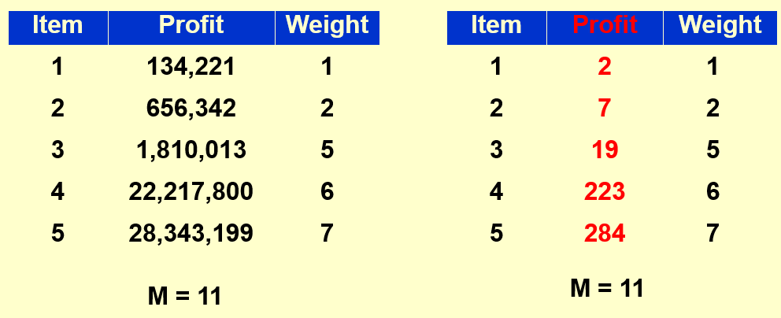

        一个可能的做法是把 $p$ 给搞小。具体地，我们令
        
        $$K=\epsilon\frac{P_{\max}}{n}, p_i'=\frac{p_i}{K}$$

        理论上可以将时间复杂度压至 $\mathcal{O}(n^3/\epsilon)$。这样得到的答案 $P_{alg}$ 满足 $(1+\epsilon)P_{alg}\ge P_{opt}$。

+ Clustering Problem

    + 问题：给定 $n$ 个点，使用 $K$ 个圆进行覆盖，最小化圆半径。

    + 估计：对于某个最优解 $r^{*}$，如果我们令 $r=2r^{*}$，则存在如下的一种次解：所有圆心都在点上。这个事情很显然，因为对于半径为 $r^{*}$ 的圆，其内所有点的两两距离都小于 $2r^{*}$。

    + 寻找圆心：
    
        可以使用二分（二分 $r=2r^{*}$ ），若需要的圆数目大于 $K$，说明接下来应扩大半径，反之尝试缩小半径。
    
        也可以每次找离当前 center 集合最远的点，如此迭代 $k$ 次直接得到答案。

        总之，用这一套方法找到的答案一定小于等于实际最优解的 2 倍。

### Topic 11. Local Search

+ 邻域搜索

    对于一个凸优化问题，直接根据当前状态往最优解靠近显然是能找到全局最优的。

    可惜有的时候问题不那么凸，所以这种靠近只能找到邻域内的最优。是为 Local Search。

+ 模拟退火

    在 Local Search 的基础上加了和温度相关的随机跳出。

+ Example: Max-Cut Problem

    + 问题：给一张图 $G$，点黑白染色，使得异色边权和最大。

    + LS 算法：对于当前图状态 $G_{cur}$，如果换某个点的颜色可以让答案更大就换，反之不换。

        首先这个算法肯定是能结束的，因为答案一直在增加，但是有上界。

        不难证明，这种 Local Search 所得答案 $w(A,B) \ge \frac{1}{2} w(A^*,B^*)$。

    + 平衡 Accuracy 和 Complexity

        上面的这种算法实际上不是多项式的。比如最坏情况下答案每次迭代就加 $1$，但是边权可以很大，可能会炸到 $\mathcal{O}(nW)$。

        如果采取这样的一种算法：换色当且仅当对答案的提升超过 $\frac{2\epsilon}{|V|} w(A,B)$，其中 $w(A,B)$ 是当前的答案。

        不难证明，在这种 trade-off 下，答案界变为 $(2+\epsilon)w(A,B) \ge w(A^*,B^*)$。

        但相应地，复杂度优化至 $\mathcal{O}(n / \epsilon \log W)$。

    + 冷知识：上述的 $w(A^*,B^*)$ 换成全图边权和 $w_{tot}$ 也是对的，因为就是这么放缩来的。

### Topic 12. Randomized Algorithm

+ Hiring Problem

    $n$ 个人依次来面试，每个人都有能力值 $q_i$。面试一个人花费 $Ci$，对一个人「签定金」花费 $Ch$。目标是 **尽可能少花费**，保证能力值最高的人被签下。需要即时决策。

    【随机初始化】将 $n$ 个人的面试顺序随机，然后一个个面。如果当前 interviewee 能力值比之前都高，就签下定金。

    第 $i$ 个人被签的概率为 $\frac{1}{i}$。所以期望花费为 $n \times Ci + \ln n \times Ch$。

+ Hiring Problem II

    前问题的基础上，要求至多签下一人。目标是 **要求签下最高能力值的人概率尽可能大**，不再考虑花费。

    【只签一人策略】前 $k$ 个人一概不签，从第 $k+1$ 个人开始遇到比之前好的就签下，然后直接结束。我们来算一下这种策略签下最高能力者的概率：

    
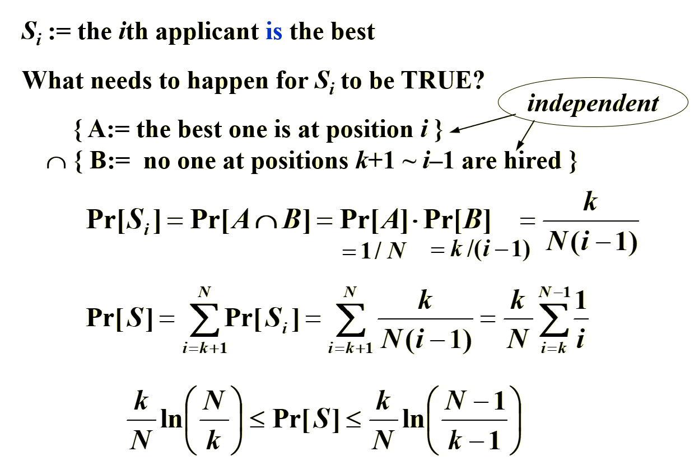

    可以发现 $\text{Pr}(S) \ge \frac{k}{N} \ln \frac{N}{k}$。根据数学知识可知 $k=N/e$ 取到最优。此时成功概率为 $\frac{1}{e}$。

+ Quick Sort

    就那个带 pivot 的排序。这个排序最差复杂度是 $\mathcal{O}(n^2)$ 的，但期望是 $\mathcal{O}(n \ln n)$ 的（证明考虑枚举两点 $i,j$，考虑这两点之间产生比较的概率为 $\frac{2}{|i-j|}$）。

    一个更稳定的方法是找到中间的 pivot（没找到就重新找，期望找寻次数为 2）。

    
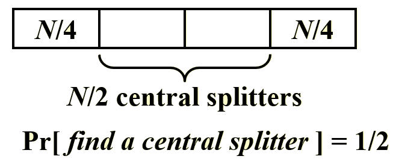

### Topic 13. Parallel Algorithm

### Topic 14. External Merge Sort

妈的，和 DBS 讲的又有点不一样。个人理解是：

+ DBS 那边没有采取多个 tapes 的概念，而是直接认为每一轮的数据都只存储在一个磁盘（一个 tape）中。这边则采用了多个磁带，磁头均是线性向前移动的，节省了大量的寻道时间。

+ 此外采取堆进行排序。所以我们认为 $k$-way merge 恰好只需要 $k$ 个单位（一个单位包含了一个堆节点）的内存即可实现（而不是 $k+1$ 个）。需要的磁带数目为 $2k$（反复使用，$k$ 个存之前，$k$ 个存之后）。进行的 pass 数目为 $1 + \lceil \log_k (N/k)\rceil$。

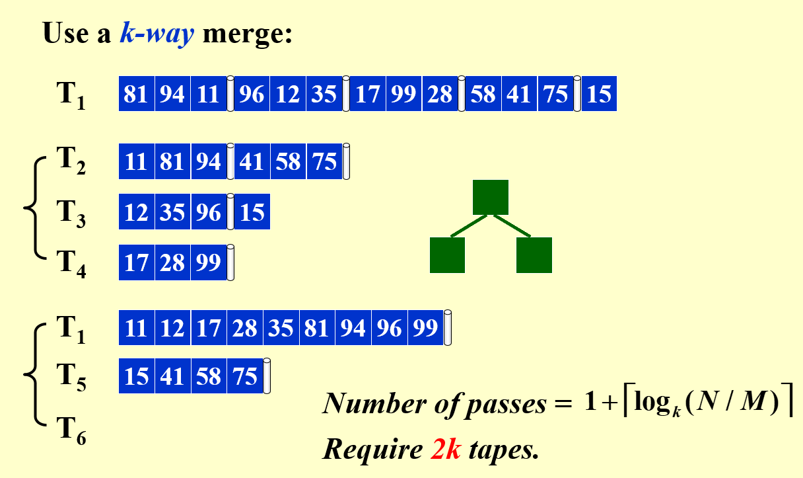

注意：归并的结果也是按照 tape 交错放置的，这是为了保证下一轮中每个 tape 包含的 run 数目尽可能平均。于是下一轮就又可以多个磁头并行开跑，完成排序。

+ Optimization 1: Reducing the Number of Tapes

    考虑如何用 3 个 tapes 来完成 2-way merge（$k=2$）:

    
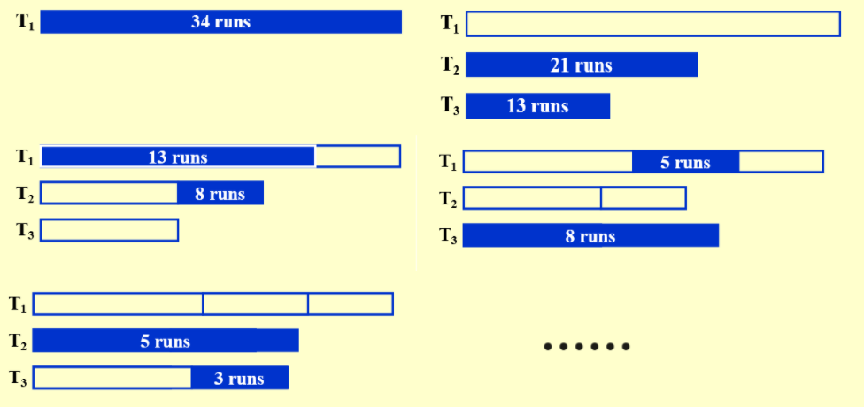

    如上图所示，注意进行归并的 run 长度可能不同。起始 run 数目需要满足「斐波拉契数列」才能完美完成。另外上图中可以认为起始 run 长度为 $2$。

    和下图这种方式的优势在于，可以省下 copy 的时间（下图将 17 runs 分裂为 9 runs + 8 runs 相当于做了一次 copy）。

    
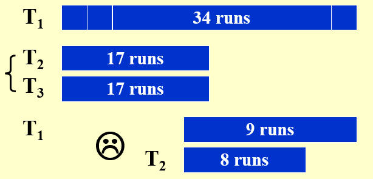

+ Optimization 2: Using Block as Unit

    和 DBS 那边一样，使用一个 block 来表示一个单位。

    如此的话，整个内存 buffer 会被拆分成 $k$ 个 input buffer 和 $1$ 个 output buffer。只有写完一个 output buffer，才会整体将该 block 写出到对应磁带中。

    
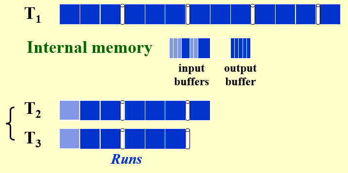

    有一个弱点是：比如对于 output buffer，必须在全部写完后才能输出，不能同时执行「写 output buffer」和「output buffer 输出」。而这两件工作本身在硬件上是不冲突的。

    所以有一个方法是把 output buffer 翻个倍，一个用来实时写入，一个实时输出。这样的话我们就需要 2 个 output buffer。对 input buffer 作同样的处理，最后需要的 buffer 总量为 $2k+2$。

+ Optimization 3: Replacement Selection

    仅考虑 initial pass: 尽可能久地利用一个堆，使得每个 run 的长度尽可能长。进而减少 run 的初始数目，以及归并的轮数。可以证明，这样弄出来的 run 初始长度期望值为 $2k$。

    
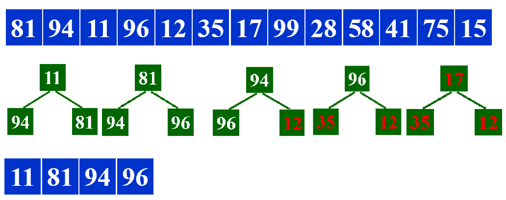
