## Chapter 4-1 Processor: Single Cycle Ver

### Introduction

基本的思路是，在之前我们学习了 C -> Assembly Language -> Machine Code 的过程。而 CPU 的工作就是执行机器码。例如，对于指令 `add x10, x11, x12`，我们要用 CPU 完成以下工作：

+ 读取 `x11` 和 `x12`

+ 计算两者的和

+ 把和写到 `x10` 中

在本门课程中，我们主要关心以下指令：

|Inst Type|Inst|
|---|---|
|R-Type|Arithmetic (`add`, `sub`, `and`, ...)|
|I-Type|Load Register (`ld`)|
|S-Type|Store Register (`sd`)|
|SB-Type|Branch Jump (`beq`)|
|UJ-Type|Unconditional Jump (`jal`)|

### The Entire Processor

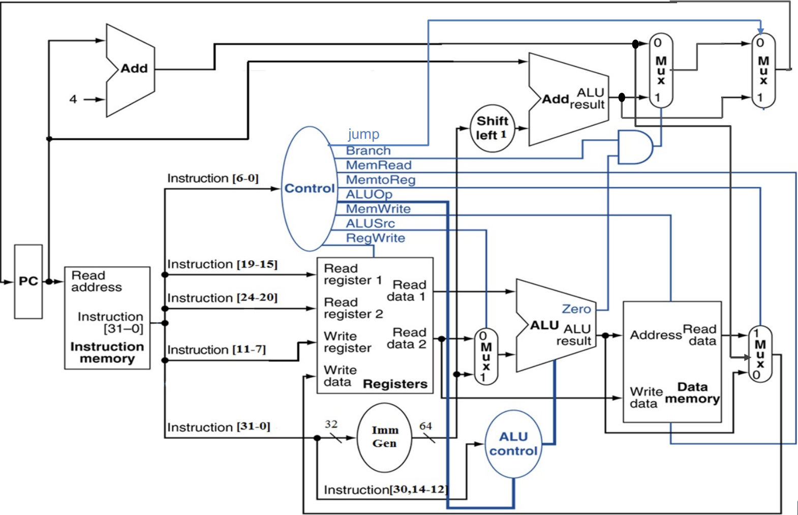

其实整个一节的关键信息就这一幅图。其中的一些关键点：

+ PC 表示当前的指令位置。

+ Instruction Memory 存放的是系列指令，可以理解为内存中的 Text 段。

+ Registers 寄存器。RISC-V 具有 32 个各 64 位的寄存器。

+ Data Memory 存放的是各种数据，可理解为内存中的 Data 段。

黑色的部分对应 CPU 的 Data Path，蓝色的部分对应 CPU 的 Control Unit。可以看到，Control 部分由 Opcode 全权完成。

接下来根据指令类型的不同，详细分析数据的走向。注意下面的图片仅作示意，不一定严谨。有的图片还有订正。

### Processor Datapath Details

#### 1. R-Type

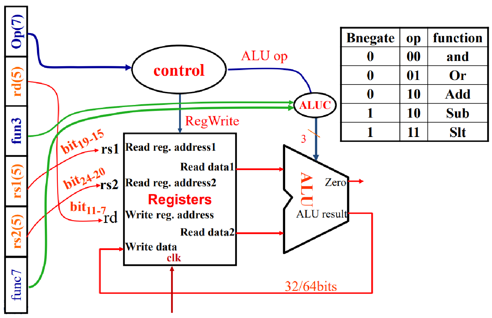

#### 2. I-Type (ONLY ld)

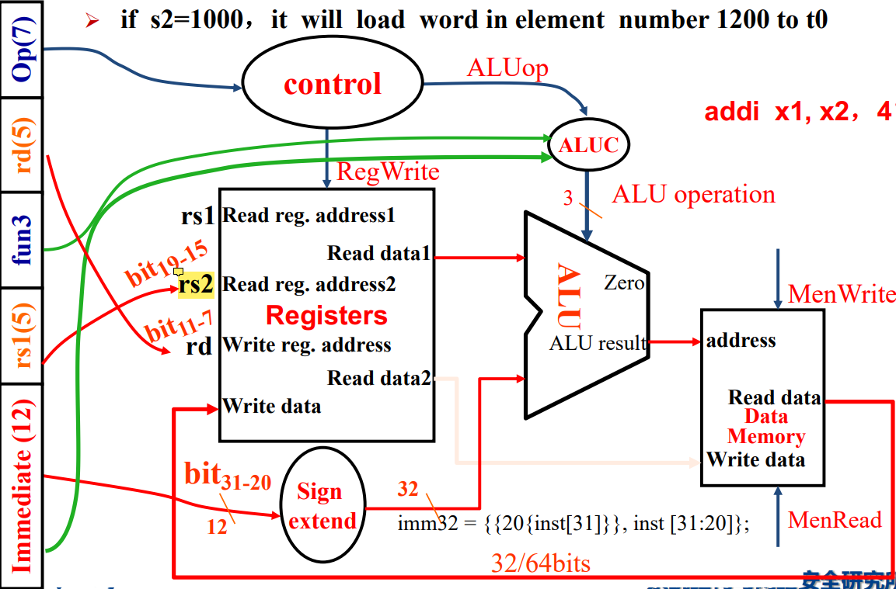

**[ATTENTION]** 图片有点问题，指令中的 `rs1` 连到寄存器的 `rs2` 上了，应当连到 `rs1` 上。

+ 其中 `20{inst[31]}` 是在做符号位拓展，因为本来也支持立即数为负的情况。

#### 3. S-Type (ONLY sd)

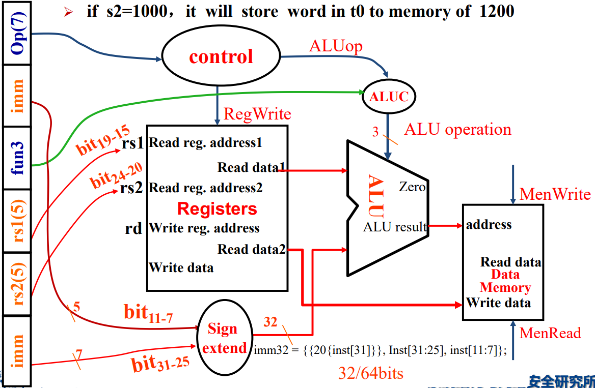

#### 4. SB-Type (ONLY beq)

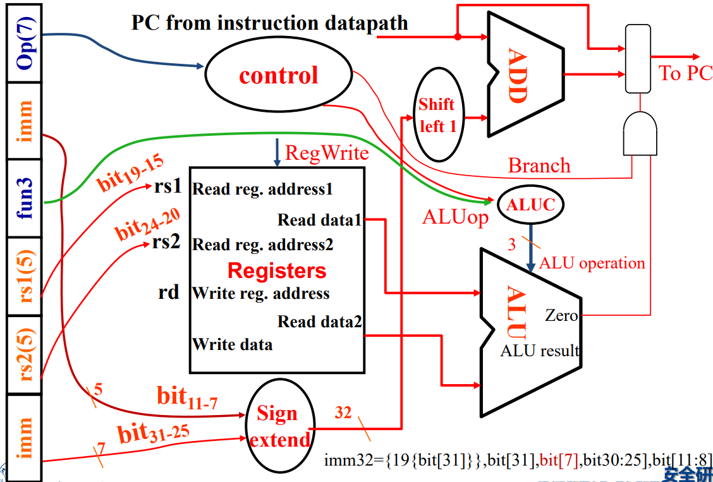

+ 这里 ALU 执行的是 sub 运算，然后根据 `zero` 判断是否相等。如果 `zero` 为 1（beq 条件满足）且 `branch` 为 1（本条指令为 beq），那么就开跳。

#### 5. UJ-Type (ONLY jal)

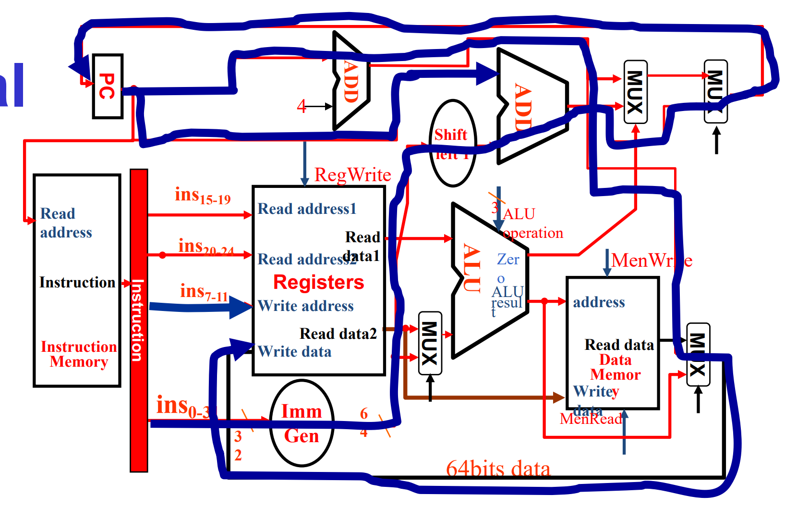

+ 注意是 PC+4 进入到 `Write Data` 中。

### Controller

回顾一开始整个单周期 CPU 的图片，我们再贴一次：


根据 Opcode，我们需要通过 Controller 给出以下 8 个具体信号：

+ R/W - RegWrite (0/1): 控制是否向寄存器里面写入。
+ R/W - MemRead (0/1): 控制是否从内存读取。
+ R/W - MemWrite (0/1): 控制是否向内存中写入数据。
+ MUX - ALUSrc (0/1): 控制 ALU 下侧的数据来源，0 表示 rs2，1 表示 ImmGen。
+ MUX - Branch (0/1): 表示当前指令是否为 branch jumping，用于控制下一个 PC。0 表示不为 branch，1 表示为 branch。结合 Zero 进行食用。
+ MUX - Jump (0/1): 控制 PC 是否进行无条件跳转。例如当前指令为 `jal` 时该值为 1。
+ MUX - MemtoReg (2 bits): 控制返回到 write address 中的数据来源。分别表示 PC+4，内存读出数据，ALU 计算结果。
+ ALU op (2 bits): 用于指导 ALU 进行的运算类型。后续会过一次 ALU Control。

**接下来专门讲一下 ALU 的具体控制**。可以看到，ALU 的控制可以视为「两级」：

+ 第一级：根据 ALU op 将不同类别的指令进行基础区分。

+ 第二级：相同 ALU op 的基础上，再根据 funct3 和 funct7 对不同运算的指令进行区分（这部分 funct 从上图的 `inst[30,14:12]` 线钻进去）。

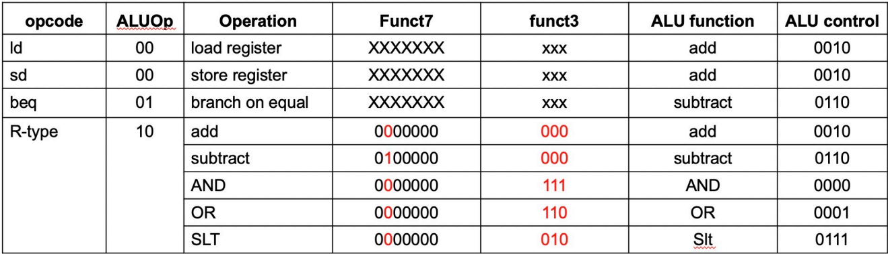

或许可以回顾一下 ALU：

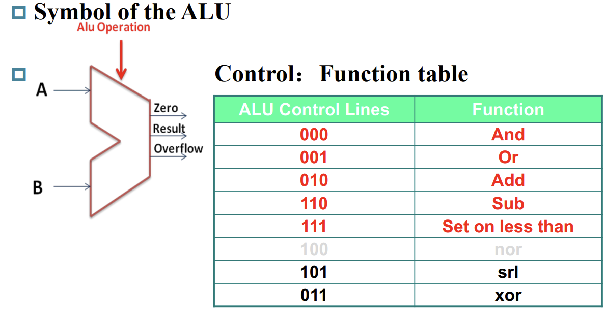


## Chapter 4-2 Processor: Pipeline Ver

### Intro

+ 不同指令耗时不一

    例如在下图中，假设各部分的操作时长为：Memory Access, 200ps; ALU, 200ps; RegFile Access, 100ps。
    
    那么执行一次 `ld` 指令耗时为 800ps。执行一次 `sd` 指令耗时为 700ps。

    <p>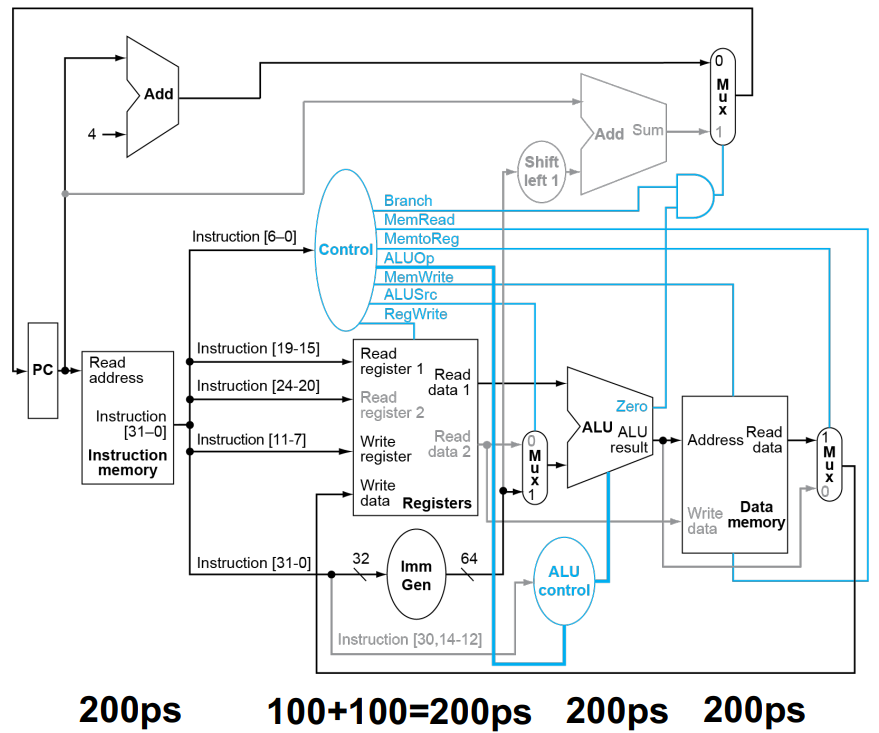</p>

+ Pipelining Analogy

    一种优化思路是从瓶颈（例如 `ld`）下手。然而我们还有另外一种优化思路——将【单周期 CPU】改为【流水线 CPU】。所谓流水线，可以参照这幅图：

    <p>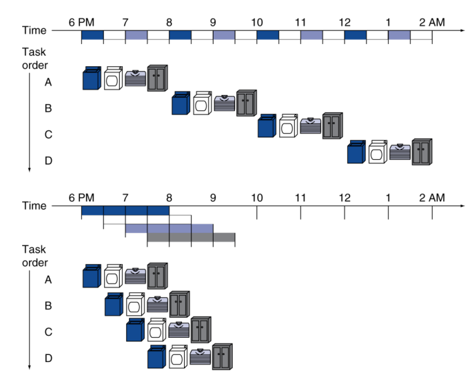</p>

    对应到 CPU 中，我们可以尝试把其分为若干个区域（或步骤），让每个区域同时工作，实现整体的流水线工作。

### RISC-V Pipeline Intro

RISC-V CPU 可以划分为以下五个阶段：

1. **IF**: Instruction fetch from memory
2. **ID**: Instruction decode & read from register
3. **EX**: Execute operation or calculate address (ALU Part)
4. **MEM**: Access memory operand
5. **WB**: Write result back to register

然后，一种简单的思路就是，我让五个阶段「流水线式」地工作，下图地两张图生动地说明了这一原理：

<p>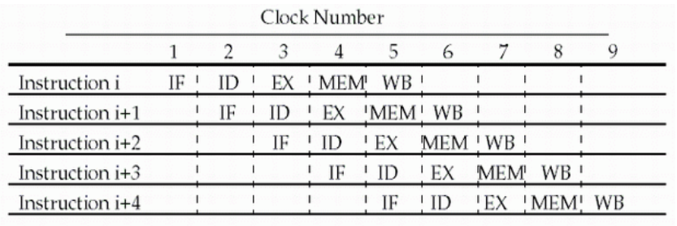</p>

<p>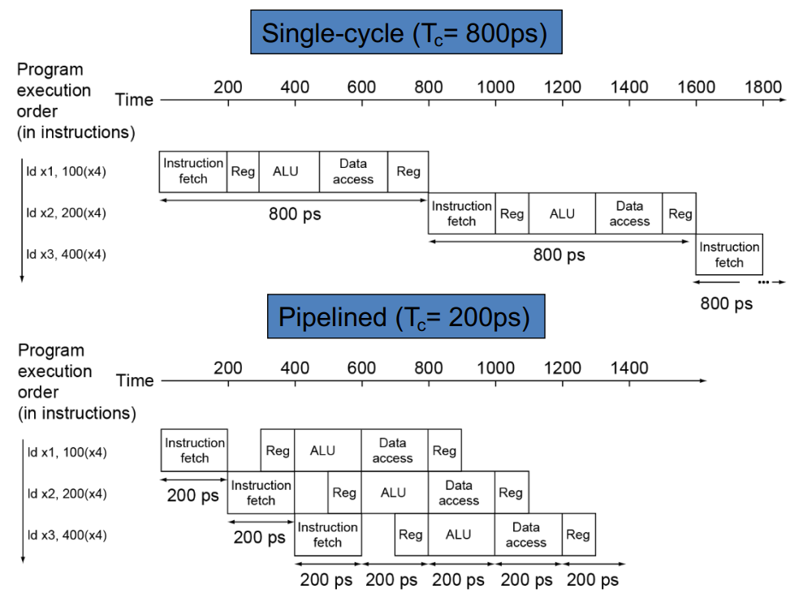</p>

理想情况下，这一转变将让 CPU 提速 5 倍（因为有 5 个阶段，当然实际不会到达这个数值，看上图的下半部分可以理解；而且后面还有各种 hazards）。

### Hazards

中文意为「冒险」，表示流水线 CPU 实现中可能遇到的各种容易出问题的情况。

#### 1. Structure Hazard

可以想象，如果 data memory 和 instruction memory 是在同一部分的话，在 pipeline 的情形下，有的周期会调用同一块内存，这将产生冲突。

好在 RISC-V 的设计将 data memory 和 instruction memory 分隔开，所以我们几乎不用考虑 Structure Hazard。

#### 2. Data Hazard

+ Problem: Data Hazard

    有的时候执行某一个指令，要求前一个指令完成数据写入。考虑这样的两个相邻指令：

    ```ass
    add x19, x0, x1
    sub x2, x19, x3
    ```

    <p>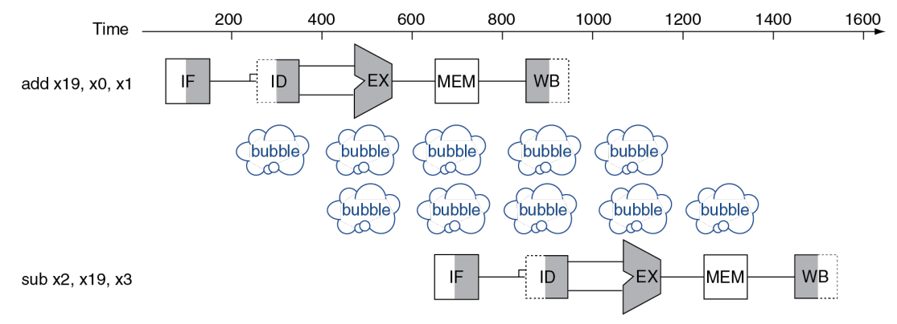</p>

    add 指令的 WB 必须要在 sub 指令的 ID 之前执行（原因显然），所以两个指令之间无法再「紧密地排列在流水线上」，中间需要隔两个 bubble。

    【OBSERVATION】观察上上张图，WB 的写 reg 是在上半 cycle，ID 的读 reg 是在下半 cycle。这种设计的缘由其实在这里有所体现。

+ Solution: Forwarding

    解决这种情况的一种方案是 Forwarding。大概思路是有的时候我们不必等待一个数据被写入 reg，然后才再次使用；而是可以直接用某种 extra connection 来直接高效地使用。下图演示了 Forwarding 的解决方案。

    <p>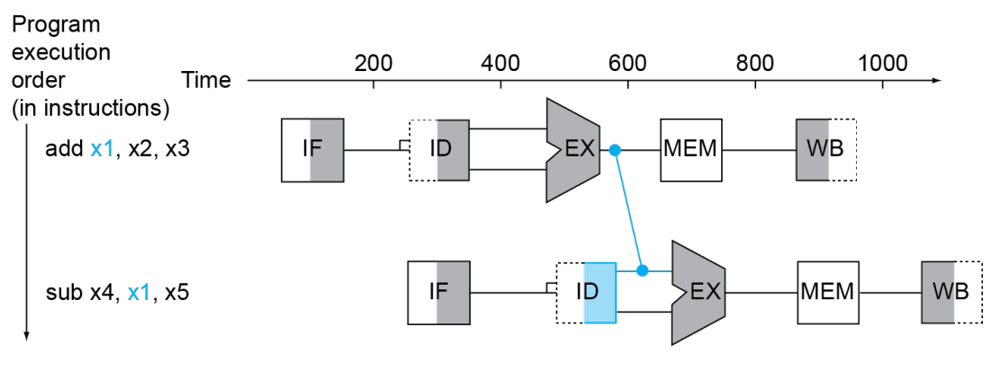</p>

    然而，并非所有 Data Hazard 都可以用 Forwarding 解决。考虑这样的情形：

    <p>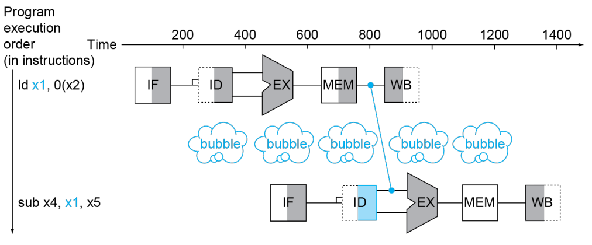</p>

    显然 sub 已经没办法再提前一个 cycle 了，不然 sub 的 EX 和 ld 的 MEM 将处在同一 cycle，而 sub 的 EX 需要 ld 的 MEM 提供前提数据。

    不过，也可以通过修改汇编代码来规避这一问题——

    <p>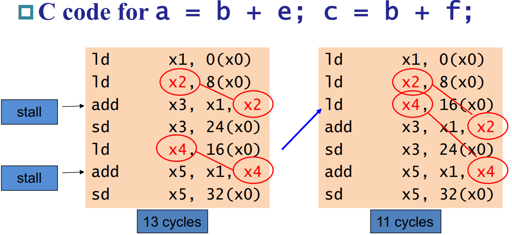</p>

#### 3. Control Hazard

+ Problem: Stall on Branch

    <p>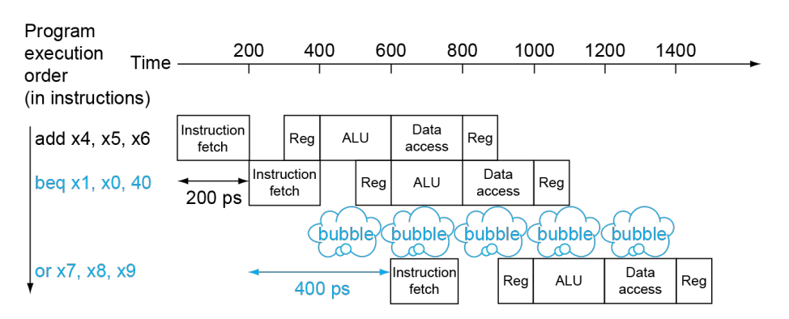</p>

    类似于这种 Branch Jumping 带来的停顿。上图有点问题，按理来说应当是两行 bubble。

+ Solution: Branch Prediction

    字面意思，提前预测 branch 的结果。一般可以分为静态预测 (Static branch prediction) 和动态预测 (Dynamic branch prediction)。

    静态预测一般是在软件层面上，根据普遍的 branch 选择结果进行预测。

    动态预测一般是在硬件层面上，比如可以基于上一次 branch 的选择结果进行预测（考虑循环的情形，这种预测应当是成功率较高的）。

### RISC-V Pipelined Datapath

在解决这一系列 hazards 之前，我们需要对 CPU 的结构进行修改。总的图形如下：

<p>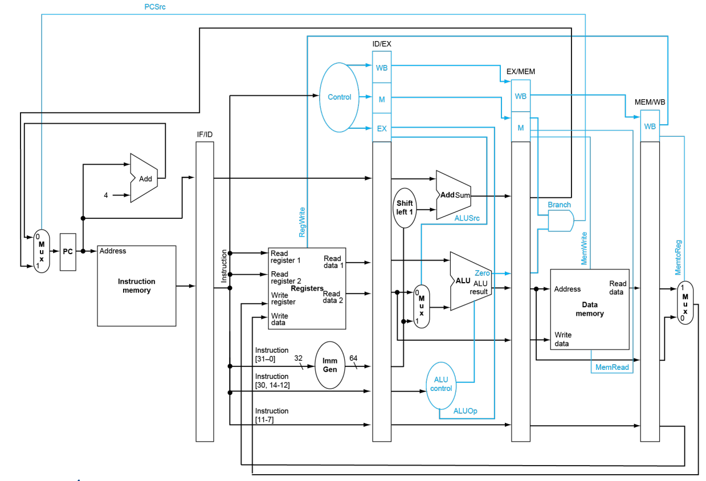</p>

+ 四个中间寄存器：`IF/ID`，`ID/EX`，`EX/MEM` 以及 `MEM/WB`。

    字面意思表明了其所处位置。引入寄存器的目的是显而易见的，是为了使得在流水线上，每个周期的指令依然能正确读取数据。比如观察 Reg 的 Write Data 输入，肯定得引入 `MEM/WB` 的值，而不是当前 Instruction Memory 的值。它们之间差了有 3 个 CC。

    注意这个改变只是最基本的，保证 pipeline 能正常运作的。它还没有解决 hazards 的问题。

+ Control 信号：`EX`，`MEM(M)` 以及 `WB`。

    回顾单周期 CPU，除去 `jal` 使用的 jump 信号，Controller 一共给出 7 个信号。根据其作用阶段的不同，将其分为

    1. EX (作用于 EX 阶段)：包含 `ALUop`，`ALUsrc`。

    2. MEM (作用于 MEM 阶段)：包含 `Branch`，`MemRead`，`MemWrite`。

    3. WB (作用于 WB 阶段)：包含 `MemToReg`，`RegWrite`。

    可以看到，在流水线上 Controller 对应的寄存器的大小是越来越小的，这一点也很好理解，毕竟到后面的 stage 某些 control signal 就不再起作用了。


### Data Hazard Solution

#### 1. R-R Case

情景：考虑以下的 RISC-V 指令：

```asm
sub x2, x1, x3
and x12, x2, x5
or x13, x6, x2
add x14, x2, x2
sd x15, 100(x2)
```

<p>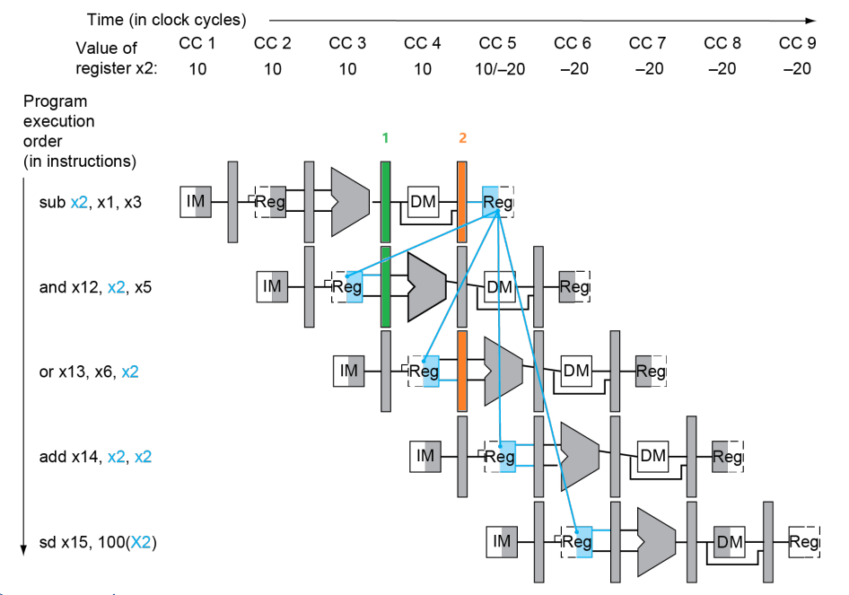</p>

从上图可以看出，Data Hazard 发生当且仅当

+ 前序指令的 `rd` 和后序指令的 `rs1/rs2` 重合，即

    1a. `EX/MEM.RegisterRd` = `ID/EX.RegisterRs1`

    1b. `EX/MEM.RegisterRd` = `ID/EX.RegisterRs2`

    2a. `MEM/WB.RegisterRd` = `ID/EX.RegisterRs1`

    2b. `MEM/WB.RegisterRd` = `ID/EX.RegisterRs2`

    四条中有一条满足即可。

+ 执行写入操作

    `EX/MEM.Controller.RegWrite` $= 1$

    `MEM/WB.Controller.RegWrite` $= 1$

    要求哪条满足主要是看上面选的是 1 还是 2。

+ 不是虚空写入

    `EX/MEM.RegisterRd` $\neq 0$

    `MEM/WB.RegisterRd` $\neq 0$

    要求哪条满足主要是看上面选的是 1 还是 2。

所以，我们可以加入这样的逻辑来完成 Forwarding：

<p>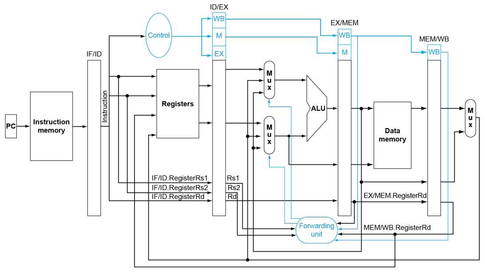</p>


#### 2. Load-R Case

情景：考虑以下的 RISC-V 指令：

```asm
ld x2, 20(x1)
and x4, x2, x5
or x8, x2, x6
add x9, x4, x2
```

<p>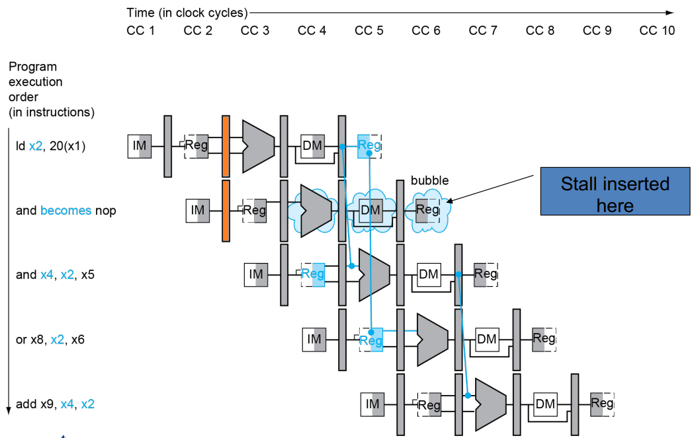</p>

可以发现，第二行的指令无论如何都没有机会执行了，所以 `add x4, x2, x5` 必然会推后一个 CC。对于这一情况的判断，我们可以在上图橙色处完成。判断条件为

+ 前序指令的 `rd` 和后序指令的 `rs1/rs2` 重合，即

    a. `ID/EX.RegisterRd = IF/ID.RegisterRs1`

    b. `ID/EX.RegisterRd = IF/ID.RegisterRs2`

    两条中有一条满足即可。注意上面条件的两侧不要搞反。

+ 执行 Load 操作

    `ID/EX.Controller.MemRead` $= 1$

如果条件满足，我们首先要进行 Stall（熄火）。操作为

1. 将当前指令（也就是下一个 CC 的 ID/EX）寄存器全部归零。

2. 再次读取 PC，即不调到 PC+4。

Stall 后，我们再执行 Forwarding 来保证指令的正常运行。这一部分的 Forwarding 操作和 R-R Case 几乎一致，唯一的区别是 Forwarding 的执行是在判断生效的两个 CC 后。

下图展示了考虑 Load-R Case 的 Pipeline。可以看到主要区别是加入了 Stall 的考量。

<p>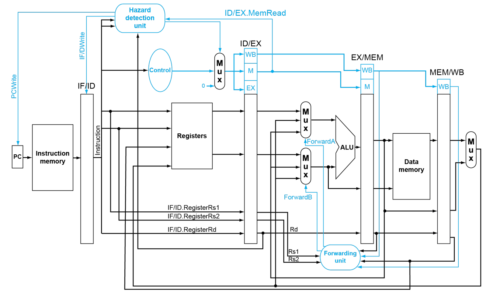</p>

### Branch Hazard Solution