## Chapter 5 Memory Hierarchy

### Introduction

#### Transistor 晶体管

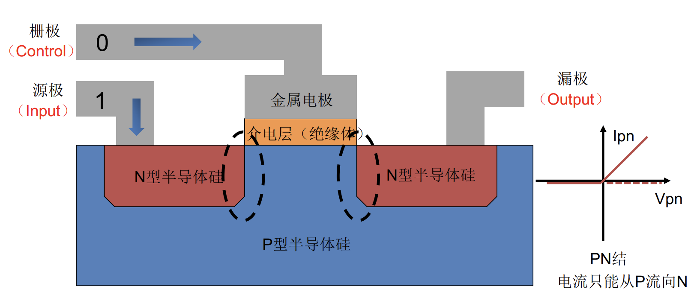

类似于一个开关。栅极为 1 时两侧的 N 型半导体硅连通，input 连接到 output。

#### Basic Memory Types

+ SRAM (Static Random Access Memory)

    六个晶体管。static 是指这种存储器只需要保持通电，里面的数据就可以永远保持。但是当断点之后，里面的数据仍然会丢失。
    
    SRAM 速度较快，但是成本更高，占用的空间更多。所以像诸如 CPU 的高速缓存，才会采用 SRAM。

    
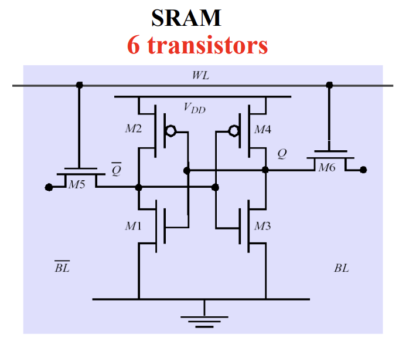

+ DRAM (Dynamic Random Access Memory)

    一个电容加一个晶体管。由于 DRAM 使用电容存储，所以必须隔一段时间 refresh 一次，否则因为不断的微小漏电可能导致数据丢失。
    
    DRAM 速度较慢，但是成本更低。所以可以用于作为 main memory。

    
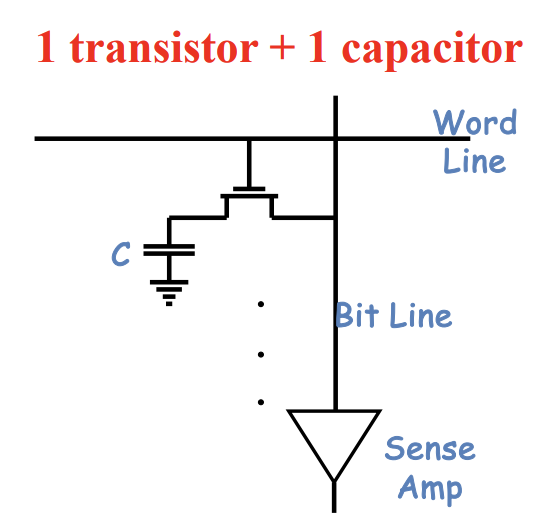

+ Flash Storage

    中文为闪存。我们熟知的 SSD（固态硬盘）一般就使用闪存存储数据。

+ Disk Storage

    
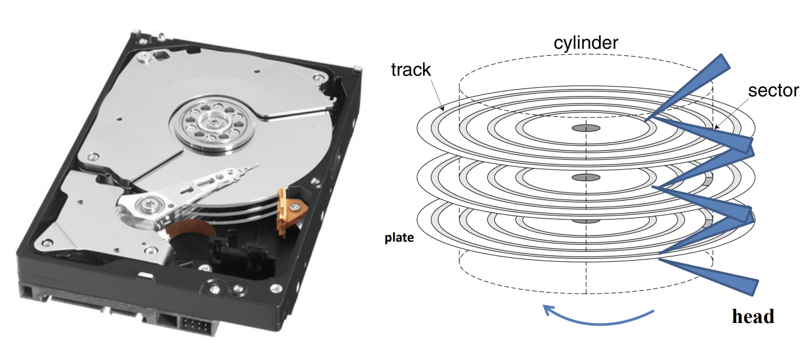

    计算 disk 的读取时间 - 例题：

    Given: 512B sector, 15,000 rpm, 4ms average seek time, 100MB/s transfer rate, 0.2ms controller overhead.

    Calculate: Average read time
    
    + **4ms** seek time
    + $\frac{1}{2} \times \frac{15000}{60}$ = **2ms** rotational latency（1/2 表示期望）
    + $\frac{512B}{100MB/s}$ = **0.005ms** transfer time
    + **0.2ms** controller delay
    + Total: **6.2ms**

#### Memory Hierarchy

Hierarchies bases on memories of different speeds and size.

金字塔越往上，memory 更 expensive / small / fast。

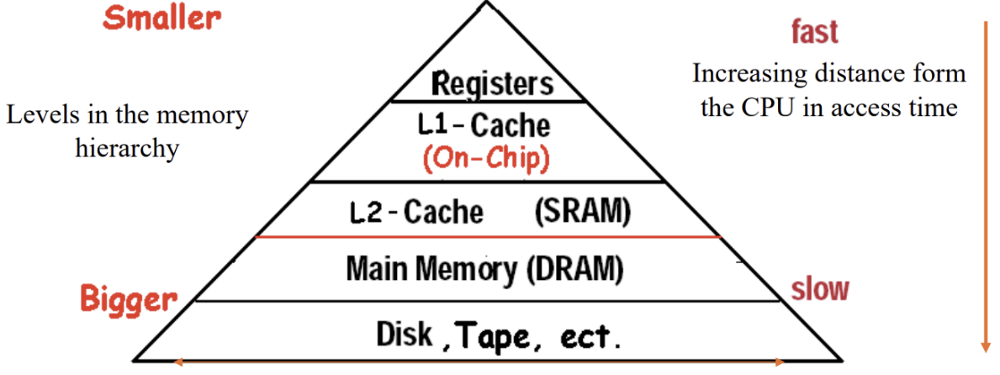

### Cache Basics

#### Cache Intro - Direct Mapped Cache

+ 基本思路

    
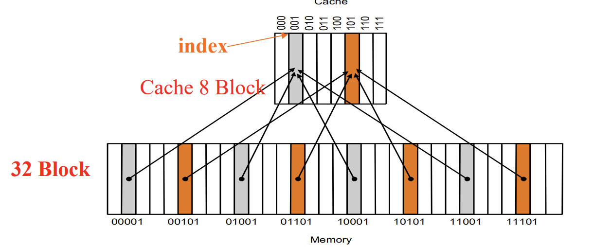

    **(Cache Block Address)** = **(Memory Block Address)** mod (Number of blocks in the cache)

    注意，一个 block 中不是一个 byte。RISC-V 中我们默认一个 block 的 **最小大小** 为 word (4 byte)。

    为了得知一个 cache block 中究竟存的是哪一个 memory block 的数据（例如上图中，一个灰色块可以对应 8 个灰色块），cache block 还会存下「其所存储的数据」对应的 memory block 地址的「高若干位」。具体地，一个 DMC 的结构如下所示：

+ DMC 的结构

    
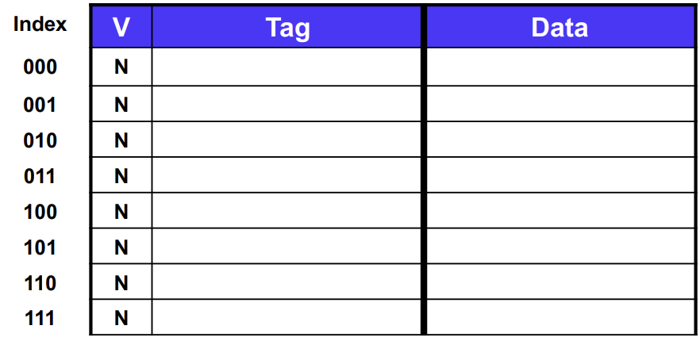

    1. V 表示 Valid bit，表示是否启用。启用为 1，反之为 0。

    2. Tag 即为刚刚所说的，「其所存储的数据」对应的 memory block 地址的「高若干位」。例如，对于上图例 Memory 中的最左边的灰色块，它的数据在 Cache 中存储在 001 的 Data 段，Tag 段对应为 00。

    3. Data 存储的就是数据。如果一个 block 的大小为 1 word，那么 Data 段的长度就是 32 位。

+ DMC 的寻址

    考虑一个情景，CPU 希望从内存中抓一个地址（记得是按 Byte 寻址哦）。这个 64 位的地址将会被分为 TAG / Index / Byte offset。其中 {Tag, Index} 联称 Memory Block Address。

    注意，当一个 block 包含 1 word 时，byte offset 占 2 位；但有时候一个 block 也可以占更多的字（比如 4 word），此时 byte offset 会占更多位（比如 4 位）。

    
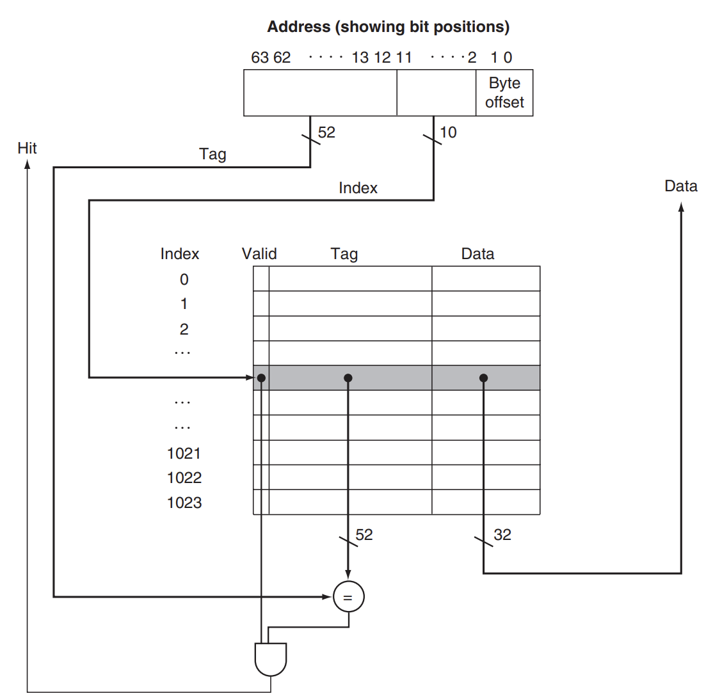

#### Cache Topic 1 - Block Placement

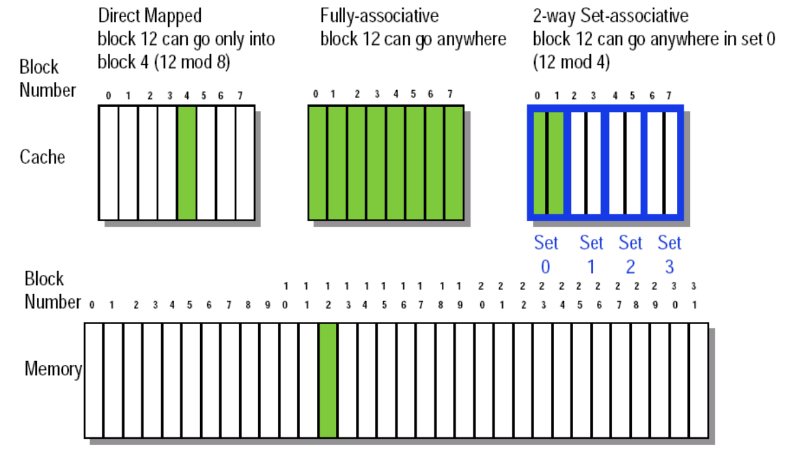

除了 Direct Mapped，还有两种常见的映射策略：

+ Fully Associative

    内存中的 block 可以对到 cache 中的任何 block。好处是提高了 cache 的利用率，但是寻址会很麻烦。

+ Set Associative

    介于 Direct Mapped 和 Fully Associative 之间。内存中的 block 可以对到 cache 中 **某个 set** 的任何 block。对于 Set Associative，一个 set 如果包含 $k$ blocks，那么这个 cache 又被称为 $k$-way set associative。

    DM 和 FA 可以视作特殊的 SA。比如 DM 就是 $1$-way SA，FA 就是 $m$-way SA（其中 $m$ 表示 block 数目）。

#### Cache Topic 2 - Block Identification

基本思路就是按照 Direct Mapped 那样。

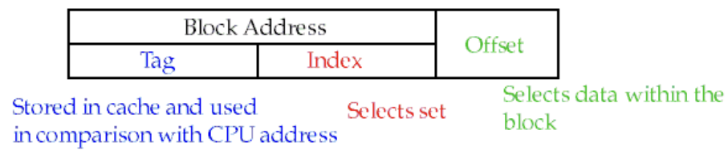

Direct Mapped 的具体寻址方式之前已经介绍。

对于 Fully Associative，寻址方式如下：

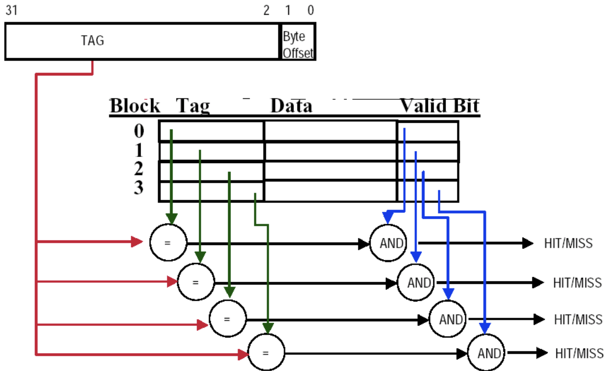

对于 Set Associative，寻址方式如下：

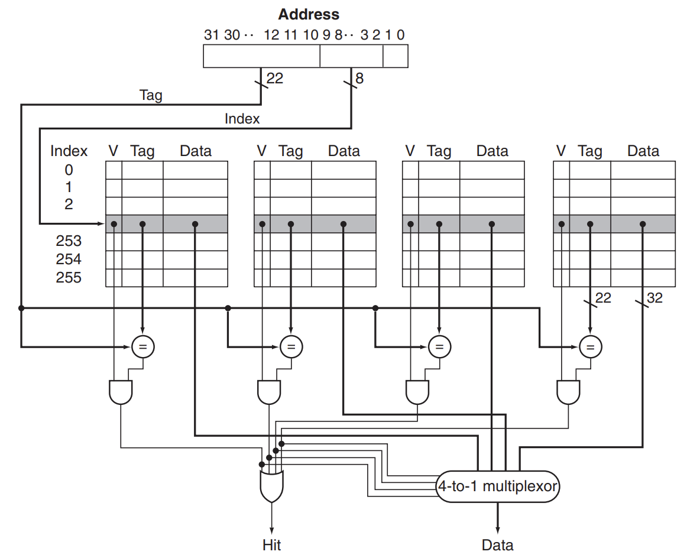

#### Cache Topic 3 - Block Replacement

如果一个 cache 满了，再从内存往里面放东西的话（例如 read miss），我们需要对其中的数据进行替代。

+ 对于 Direct Mapped，没有这方面的担心。因为映射是多对一的，每次要么换要么不换。

+ 对于 Fully Associative 和 Set Associative，则需要考虑换掉哪个 block。一般有如下的策略：

    1. Random replacement 字面意思，随机替换。

    2. Least-recently used (LRU) 最长时间没用的替换掉。

    3. First in, first out (FIFO) 队列思想，最早引入 cache 的替换掉。注意这和 LRU 不一样。

#### Cache Topic 4 - Read and Write Strategy

+ Read Strategy

    + 如果 Read hits，无事发生，这很好。

    + 如果 Read misses，我们需要执行一系列措施。实际上，Read misses 分为 instruction cache miss 和 data cache miss。以 instruction cache miss 为例：

        1. 将目前的 PC 值告诉 Memory，意思是我接下来要读 PC 对应的指令了，但是我在 Cache 部分没找到，所以要去 Memory 部分找。

        2. Memory access 到对应的 32 位指令。

        3. 将对应的指令写进 instruction cache。其中 data 段放入指令本身，tag 段放入高位地址（ALU 来计算高位），valid bit 要设为 1。

        4. 重启 PC 指令的 fetching，这次我们可以在 instruction cache 读取到它。

+ Write Strategy

    + Write Hit Strategy

        1. Write-back 只向缓存中写入数据，回头找个合适的时机写入内存。好处是很快，但是会导致数据的 inconsistent。

            此外，Write-back 不能直接丢弃 cached data（例如由 read miss 引起的替换），这是因为其中的值可能并未被同步到 memory。故而 cache 的 control bit 需要使用两位：valid bit【依然和原来一样，表示是否数据有效】和 dirty bit【表示是否同步到 memory 中，未同步则为 0】。如果替换时发现被替换者 dirty bit 为 0，则需要先将被替换者写入内存。

        2. Write-through 则同时向缓存和内存写入数据。好处是可以保证数据的 consistency，但是速度会较慢。

            对于 Write-through，我们可以放心地丢弃 cached data，因为其中的值和 memory 始终保持同步。此类 cache 的 control bit 只有 valid bit 一位。

    + Write Stall and Write Buffers

        **Write stall** 指的是在 Write-through 中，CPU 必须等待 write to memory 完成所导致的 bubble。

        **Write buffer** 如下图所示。对于 Write-through 的策略，由于理论上我们需要时刻把 cache 和 memory 保持同步，而这会耗费大量的时间。所以考虑 cache 同步到 memory 时，我们先把它写到一个 buffer 里面（这很快），写完后 CPU 继续干自己的活，buffer 则慢慢地把数据同步到 memory 中。

        
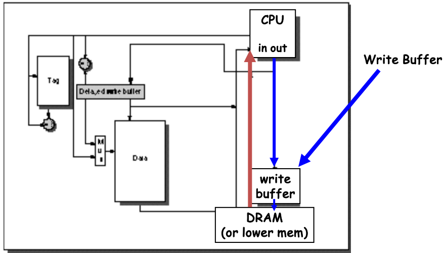

    + Write Miss Strategy

        1. 若 Write Hit Strategy 采取 Write-back，则 miss 时采取 Write allocate 策略。

            即：**如果 Write misses，先把对应的内存数据读到缓存中**，转换为 Write hits 的情况再后续处理。
            
            注意，由于一个 block 可能包含若干个 word，所以我们也有必要这样做。考虑情景：本来一个 block 对应的 4 words 分别为 [A B C D]，考虑只写其中的一个 word。如果 write miss 发生，cache 中的对应 block 变为 [X E X X]（其中 [X X X X] 是对应 cache entry 的原始值），后面写到内存中，变为 [X E X X]，但实际上应该是 [A E C D]。

        2. 若 Write Hit Strategy 采取 Write-through，则 miss 时采取 Write around 策略。

            即：**如果 Write misses**，直接绕过 cache 把对应的数据写入 memory。想来确实也可以这么干。

#### Cache-Memory Data Transfer

之前提到，如果发生 read miss 或者 write miss，则需要在 cache 与 memory 之间进行数据传输。对于不同的 Cache-Memory 结构，其传输效率也不一。

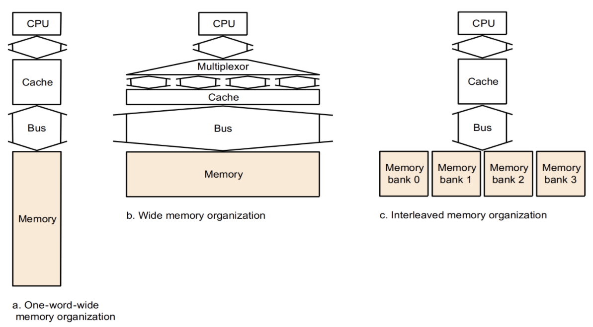

假设耗时（假设 Block size 为 4 words）：

|Work|CC Cost|
|---|---|
|send the address|1|
|DRAM access initiated|15|
|transfer a word of data|1|
|send the address|1|

1. One-word-wide memory organization

    最基本的架构。在以上假设下，读取一个 block 的耗时为 $1 + 4 \times (1+15)=65$ CC

2. Wide memory organization

    更宽的总线和内存。在以上假设下，读取一个 block 的耗时为 $1 + (1+15)=17$ CC

    然而，随之而来的代价是硬件设计的要求提高（最直观的，占空间变多了）

3. Interleaved memory organization

    内存分成几个 bank，这样一来内存部分可以同步进行 initialize。在以上假设下，读取一个 block 的耗时为 $1 + 4 \times 1 + 15=20$ CC

### Measure and Improve Cache Performance

#### 一些指标

+ Average Memory Assess Time (AMAT)

    = hit time + miss time

    = hit time + miss rate $\times$ miss penalty

+ CPU Time (更新定义)
    
    = CPU execution clock cycles + Memory-stall clock cycles

+ Memory-stall clock cycles 

    = Number of instructions $\times$ miss rate $\times$ miss penalty

    (Also can be written as) = Read-stall cycles + Write-stall cycles

+ Read-stall cycles 

    = number of read instructions $\times$ read miss rate $\times$ read miss penalty

+ Write-stall cycles **(For Write-through strategy)**

    = number of write instructions $\times$ write miss rate $\times$ write miss penalty + write buffer stalls

+ 如果忽略 write buffer stalls，Read-stall cycles 和 Write-stall cycles 理论上可以合并。统一为

    Memory-stall clock cycles ＝ Memory access instructions $\times$ Miss rate $\times$ Miss penalty

#### Example Quiz

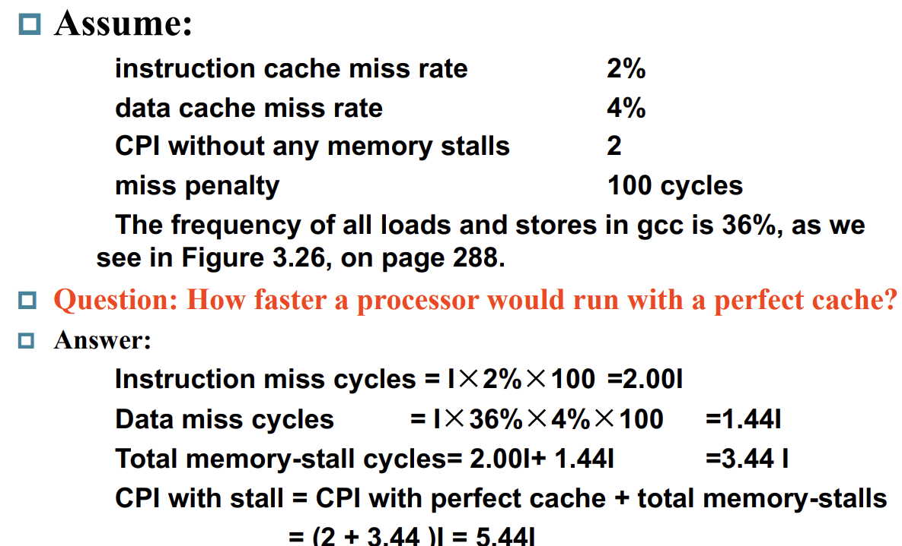
