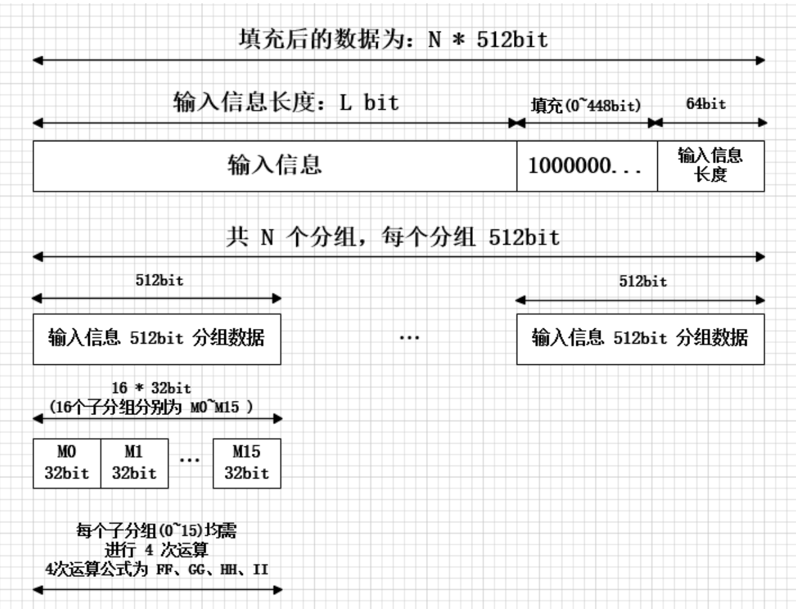
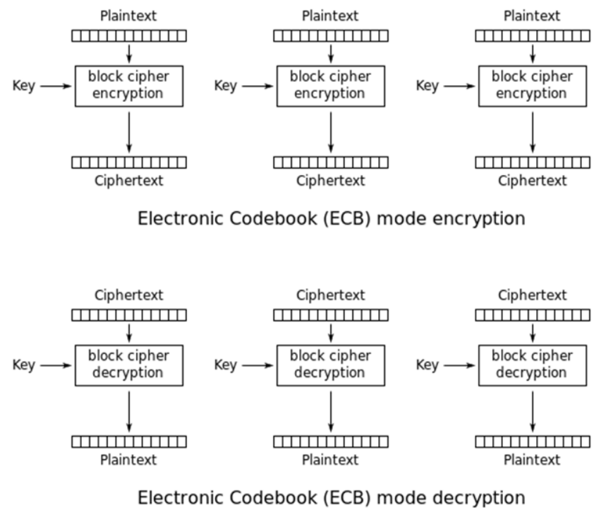
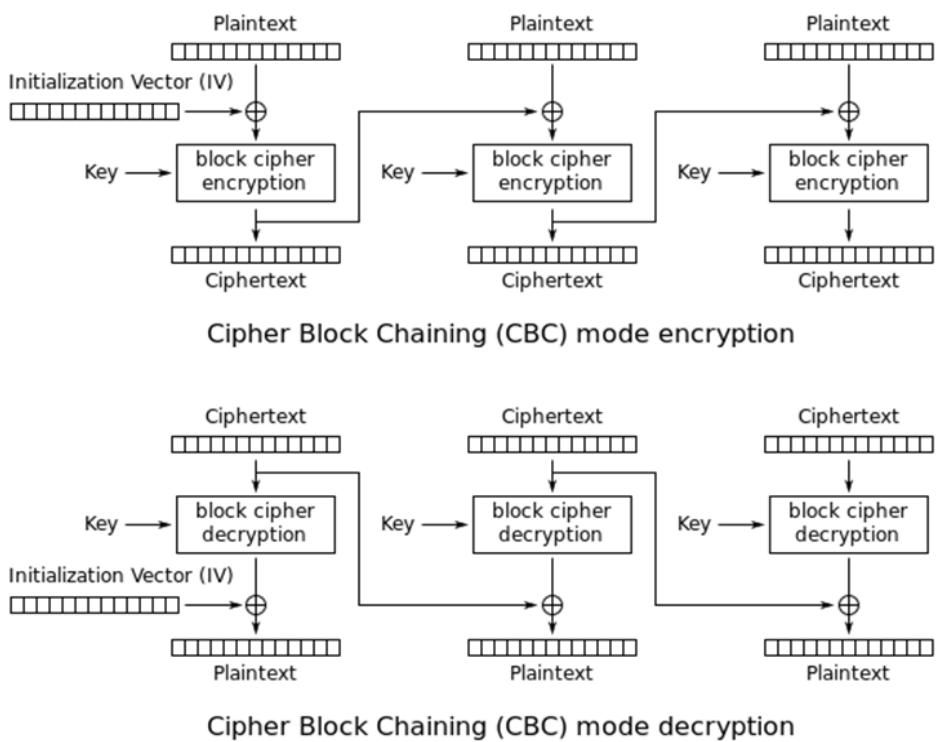
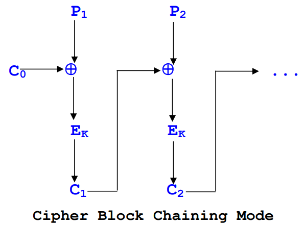
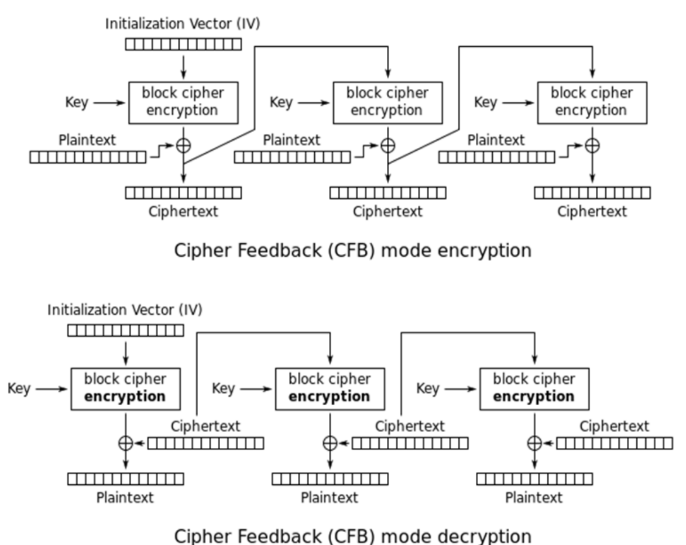
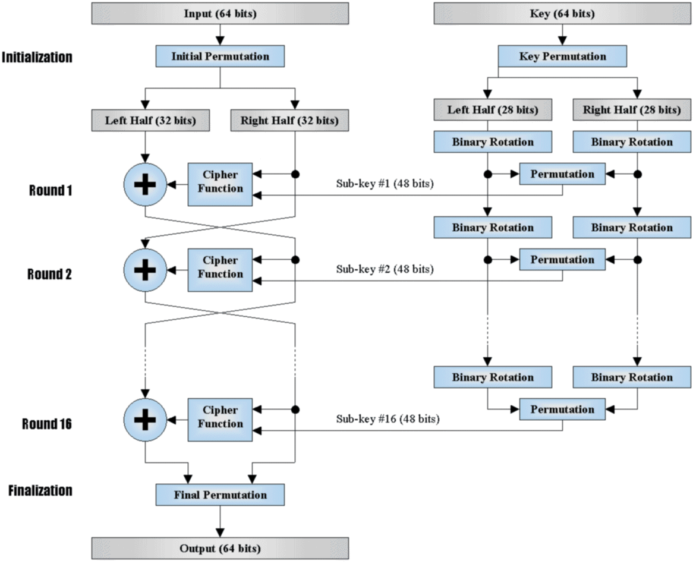

### Introduction

+ Brief Intro

    + DES AES 对称密码学算法（加密的密钥和解密的密钥一致）

    + RSA ECC 非对称密码学算法（加密的密钥和解密的密钥不一致）


### Enigma

+ Enigma 加密

    + 密钥：五选三齿轮、齿轮初始状态、接线板

    + 加密：

        1. 首先字母 $c$ 通过接线板进行字母对换，若存在无序接线对 $(c,c_0)$，得到 $c_0$（若不存在则依然为 $c$）；
        2. 分别通过三张齿轮对应的表 Rotor I, II, III, 得到 $c_0 \to c_1 \to c_2 \to c_3$；
        3. $c_3$ 通过反射板 Reflector 得到 $c_3'$； 
        4. 逆序通过三张齿轮对应的表 Rotor III, II, I, 得到 $c_3' \to c_2' \to c_1' \to c_0'$；
        5. $c_0'$ 通过接线板进行字母对换，得到 $c'$。$c'$ 即为加密结果。

    + Rotor 和 Reflector 均可视为一一对应的字母表，例如 "ABCDE ~ EBCAD" 这种。

    + 关于齿轮

        每个齿轮具有两个参数：Message Key / Ring Setting。Ring Setting 可视作齿轮的固有性质且在某次密码箱的使用过程中不发生改变；Message Key 则在一次加密 / 解密时具有一个初始状态，且 **每输入一个字母** 后会发生一次转动（Message Key 自增 1）。

        这两个参数使得加密关系更为复杂，且整个系统不再是简单的单表对应关系。例如，在 $c_0$ 进入 Rotor I 之前，需要先计算 $\Delta= \text{Message Key} - \text{Ring Setting}$，并将 $c_0 + \Delta$ 放进 Rotor I 的单表中进行查询，将查询结果再减去 $\Delta$，得到 $c_1$。

        加密中反向的时候，依然是进齿轮前加 $\Delta$，查表，减去 $\Delta$。Rotor II 和 Rotor III 同理进行修改。

        注意：每次加密时，Message Key 采取的是转动后的结果。假如某刻齿轮为 `ABC`，此时输入字母 $c$ 时，$c$ 实际上是被 Message Key = "ABD" 加密。

        + 齿轮的进位：1~5 号齿轮的进位位置分别为 `QEVJZ`。当 Rotor X 到达进位位置时，再输入一次字母将导致 Rotor X+1 也自增 1（但是 Rotor X 也会自增 1，这和字面意思的进位不同）。例如，Rotor III/II/I 分别采取 3/2/1 号齿轮，某刻 Message Key 为 `AAQ`，那么输入一次字母后 Message Key 将变为 `ABR`。

        + Double Stepping 现象：这个看起来像是由 Enigma 加密箱内部结构导致的一个 bug（feature）。依然假设 Rotor III/II/I 分别采取 3/2/1 号齿轮，某刻 Message Key 为 `ADQ`，输入一次字母后变为 `AER`，再输入一次后字母变为 `BFS`（即使此时 Rotor I 是 R，并不在进位位 Q 上）。

    + 可逆性

        加密和解密是 **完全可逆的**。也就是说只要密码箱的初始配置相同，明文加密后为密文，密文加密后即可还原出明文。证明不难。

### MD5


MD5 加密实现了将任意长度的明文（message）加密为 16 bytes 的密文（digest）。其加密过程如下。

1. padding 填充

    对于一个二进制文件 A，对其进行一系列填充使其大小为 64 bytes 整数倍。填充遵循以下规则：

    + 考虑最后一个 64 字节块 A。若 A 的长度小于 56 字节，在后面填充 `100...00` (0x80 0x00 0x00 ... 0x00) 至 56 字节。若 A 的长度大于等于 56 字节，在后面填充 `100...00` (0x80 0x00 0x00 ... 0x00) 至 **下一个字节块** 的第 56 字节。

    + 最后剩下的 8 个字节，填充 message 的位（bit）数。注意填写方式是小端的。例如 message 有一个字符，那么应当填充 0x08 0x00 0x00 0x00 0x00 0x00 0x00 0x00。

2. 块、子块

    

    考虑 64 个字节为一块。每个块下再分 16 个小块（每小块占 4 字节）。

3. 块内加密

    MD5 时刻维护四个 32 位变量 $A,B,C,D$，它们的初始值由上一个 64 字节块加密后的结果决定。如果这是第一个块，则

    ```
    A = 0x67452301
    B = 0xefcdab89
    C = 0x98badcfe
    D = 0x10325476
    ```

    接下来块内的这 16 个小块去「处理」$A,B,C,D$。每个小块实际上都会恰好参与 4 次改变变量的运算。

    ```
    a = FF(a, b, c, d, M0, 7, 0xd76aa478L);
    d = FF(d, a, b, c, M1, 12, 0xe8c7b756L);
    c = FF(c, d, a, b, M2, 17, 0x242070dbL);
    b = FF(b, c, d, a, M3, 22, 0xc1bdceeeL);
    a = FF(a, b, c, d, M4, 7, 0xf57c0fafL);
    d = FF(d, a, b, c, M5, 12, 0x4787c62aL);
    c = FF(c, d, a, b, M6, 17, 0xa8304613L);
    b = FF(b, c, d, a, M7, 22, 0xfd469501L);
    a = FF(a, b, c, d, M8, 7, 0x698098d8L); 
    d = FF(d, a, b, c, M9, 12, 0x8b44f7afL);
    c = FF(c, d, a, b, M10, 17, 0xffff5bb1L);
    b = FF(b, c, d, a, M11, 22, 0x895cd7beL);
    a = FF(a, b, c, d, M12, 7, 0x6b901122L);
    d = FF(d, a, b, c, M13, 12, 0xfd987193L);
    c = FF(c, d, a, b, M14, 17, 0xa679438eL);
    b = FF(b, c, d, a, M15, 22, 0x49b40821L);

    // 第二轮运算GG
    a = GG(a, b, c, d, M1, 5, 0xf61e2562L);
    d = GG(d, a, b, c, M6, 9, 0xc040b340L);
    c = GG(c, d, a, b, M11, 14, 0x265e5a51L);
    b = GG(b, c, d, a, M0, 20, 0xe9b6c7aaL);
    a = GG(a, b, c, d, M5, 5, 0xd62f105dL);
    d = GG(d, a, b, c, M10, 9, 0x2441453L);
    c = GG(c, d, a, b, M15, 14, 0xd8a1e681L);
    b = GG(b, c, d, a, M4, 20, 0xe7d3fbc8L);
    a = GG(a, b, c, d, M9, 5, 0x21e1cde6L);
    d = GG(d, a, b, c, M14, 9, 0xc33707d6L);
    c = GG(c, d, a, b, M3, 14, 0xf4d50d87L);
    b = GG(b, c, d, a, M8, 20, 0x455a14edL);
    a = GG(a, b, c, d, M13, 5, 0xa9e3e905L);
    d = GG(d, a, b, c, M2, 9, 0xfcefa3f8L);
    c = GG(c, d, a, b, M7, 14, 0x676f02d9L);
    b = GG(b, c, d, a, M12, 20, 0x8d2a4c8aL);

    // 第三轮运算HH
    a = HH(a, b, c, d, M5, 4, 0xfffa3942L);
    d = HH(d, a, b, c, M8, 11, 0x8771f681L);
    c = HH(c, d, a, b, M11, 16, 0x6d9d6122L);
    b = HH(b, c, d, a, M14, 23, 0xfde5380cL);
    a = HH(a, b, c, d, M1, 4, 0xa4beea44L);
    d = HH(d, a, b, c, M4, 11, 0x4bdecfa9L);
    c = HH(c, d, a, b, M7, 16, 0xf6bb4b60L);
    b = HH(b, c, d, a, M10, 23, 0xbebfbc70L);
    a = HH(a, b, c, d, M13, 4, 0x289b7ec6L);
    d = HH(d, a, b, c, M0, 11, 0xeaa127faL);
    c = HH(c, d, a, b, M3, 16, 0xd4ef3085L);
    b = HH(b, c, d, a, M6, 23, 0x4881d05L);
    a = HH(a, b, c, d, M9, 4, 0xd9d4d039L);
    d = HH(d, a, b, c, M12, 11, 0xe6db99e5L);
    c = HH(c, d, a, b, M15, 16, 0x1fa27cf8L);
    b = HH(b, c, d, a, M2, 23, 0xc4ac5665L);

    // 第四轮运算II
    a = II(a, b, c, d, M0, 6, 0xf4292244L);
    d = II(d, a, b, c, M7, 10, 0x432aff97L);
    c = II(c, d, a, b, M14, 15, 0xab9423a7L);
    b = II(b, c, d, a, M5, 21, 0xfc93a039L);
    a = II(a, b, c, d, M12, 6, 0x655b59c3L);
    d = II(d, a, b, c, M3, 10, 0x8f0ccc92L);
    c = II(c, d, a, b, M10, 15, 0xffeff47dL);
    b = II(b, c, d, a, M1, 21, 0x85845dd1L);
    a = II(a, b, c, d, M8, 6, 0x6fa87e4fL);
    d = II(d, a, b, c, M15, 10, 0xfe2ce6e0L);
    c = II(c, d, a, b, M6, 15, 0xa3014314L);
    b = II(b, c, d, a, M13, 21, 0x4e0811a1L);
    a = II(a, b, c, d, M4, 6, 0xf7537e82L);
    d = II(d, a, b, c, M11, 10, 0xbd3af235L);
    c = II(c, d, a, b, M2, 15, 0x2ad7d2bbL);
    b = II(b, c, d, a, M9, 21, 0xeb86d391L);
    ```

    完成上述 64 条指令后，本块加密即结束。假设 $A,B,C,D$ 变成了 $A',B',C',D'$。最后令

    ```
    A = A + A'
    B = B + B'
    C = C + C'
    D = D + D'
    ```

    即得到本块的输出 $A,B,C,D$。

4. 块间加密

    显然源文件可能不止一个 64 字节块。多块的情况其实就像一个「流水线」运作：$A,B,C,D$ 首先取得他们的初始值（第 3 条中已叙述），接下来通过一个又一个的 64 字节块，进去一套 $A,B,C,D$，输出一套 $A,B,C,D$，随后又把这个 $A,B,C,D$ 作为下一个 64 字节块的加密初始值。循环往复。

    最后一个 64 字节块输出的 $A,B,C,D$ 即为 md5 的加密最终结果。

md5 目前已有碰撞方法。即有办法给出一组 $a,b$，使得 $md5(a)=md5(b)$。但给定 $a$ 找到一组 md5 结果相同的 $b$ 目前仍无法做到。

+ Rainbow Table 碰撞 MD5

    
    ```
    TODO
    ```  

### SHA-1

咕咕咕

### 分组密码 (ECB, CBC, CFB)

1. ECB（电子密码簿模式）

    

    ECB 加密过程：$C_j = E_k(P_j)$；
    
    ECB 解密过程：$P_j = D_k(C_j)$。
    
    电子密码簿模式的弱点是：对于相同内容的明文段，加密后得到的密文块是相同的。电子密码簿模式的优点是：加密和解密过程均可以并行处理。

2. CBC（密码块链接模式）

    

    <p></p>

    CBC 加密过程：$C_j = E_k(P_j \oplus C_{j-1})$；
    
    CBC 解密过程：$P_j = D_k(C_j) \oplus C_{j-1}$。

    CBC 模式的特点是：当前块的密文与前一块的密文有关、加密过程只能串行处理、解密过程可以并行处理。

3. CFB（密文反馈模式）

    

    初始时分成 8 位一块：$P = [P_1, P_2, \cdots]$。

    加密规则：
    
    $C_j = P_j \oplus L_8(E_k(X_j))$，其中 $X_1$ 是一个 $64$ 位种子。
    
    $X_{j+1} = R_{56}(X_j) || C_j$，其中 || 表示自然连接。

    可以看到，每过一块，种子 $X$ 就会左移 8 位，然后低 8 位用 $C_j$ 替代。

    解密方法很简单，毕竟异或可以直接反过来：
    
    $P_j = C_j \oplus L_8(E_k(X_j))$，$X_{j+1} = R_{56}(X_j) || C_j$。

    + CFB 的加密只能串行处理，但解密可以并行处理。

    + CFB 的一个优势是 **可以从密文传输的错误中恢复**。考虑传输密文 $C_1, C_2, \cdots, C_k$，但其中 $C_1$ 的传输发送错误（假设错成 $C_1'$）。但是这种错误的影响至多只会到 $X_9$（不断左移），从 $X_{10}$ 开始 $X$ 值又恢复正确，进而 $P$ 也恢复正确。


### 流密码 (RC4)


```
TODO
```  

### DES

<p></p>

DES 全称 Data Encryption Standard。[这篇文章](https://www.ruanx.net/des/) 写的非常好。下面补充一些文章中没有详细说明的问题：

1. DES 为何是对称的

    首先这种对称不是「绝对的」对称。假设从 plain 到 cipher 使用的 subkey 序号为 $1, 2, \cdots, 16$，那么要进行解密则需要将 cipher 喂入，并将 subkey 序号倒置为 $16,15,\cdots,1$ 才能成功解出 plain。

    注意 IP 和 FP 是互逆的重排列。类似于把加密和解密的框图「上下拼在一起」，然后从中间开始向上下两侧地进行消除。全部消完之后发现两个框图之后出来就是 plain。

2. 差分密码破解

    差分密码分析最初是针对 DES 提出的一种攻击方法。它的目标是 **已知明文和对应密文的情况下破解密钥**。它虽然未能破译 16 轮的 DES，但是破译轮数低的 DES 是很成功的。接下来将以三轮为例。

    考虑三轮 DES，假定最后一轮不换（回顾上图）。

    

    ```
    TODO
    ```   

3. 三重 DES

    普通的 DES 可以使用 Meet in Middle 攻击：

    ```
    TODO
    ```   

    所以引出三重 DES：$p$ 表示明文，$c$ 表示密文。
    
    ```
    c = E(D(E(p, k1), k2), k3); 
    p = D(E(D(c, k3), k2), k1); 
    ```

4. 代码细节分析
    
    ```
    TODO
    ```  


### AES

```
TODO
```

### RSA

+ RSA

    【欧拉定理】若 $\gcd(a,m) = 1$，$a^{\varphi(m)} \equiv 1 (\bmod m)$。

    选取两个大素数 $p,q$，令 $n=pq$。由欧拉函数的积性可知 $\varphi(n)=(p-1)(q-1)$。

    随机选择加密密钥 $e$，计算其在模 $(p-1)(q-1)$（亦即 $\varphi(n)$）意义下的逆元 $d$。

    于是就有了如下密钥对：

    + 加密：若明文为 $m$，则 $c = m^e (\bmod n)$。

    + 解密：若密文为 $c$，则 $m = c^d (\bmod n)$。

    这是显然的。因为解密后的结果
    
    $$m' = c^d = (m^e)^d = m^{de}=m^{(de \bmod \varphi(n))}=m$$

    一般而言，公钥和 $n$ 是可以公开的；私钥是不能公开的。当然 $p,q$ 也是不能公开的。

+ 加密传输

    假设 A 要发一封信 $L$ 给 B。假设私钥 $d$，公钥 $e$。
    
    1. B 告知 A $e,n$。加密方法为 $L' = RSA(L, e)$。
    2. B 用 $L = RSA(L',d)$ 完成解密。

+ 数字签名

    RSA 除了可以用于加密传输，还可以用于数字签名。在这种情况下，使用路径是相反的。

    假设 A 具有一个私钥 $d$，公钥 $e$。现在 A 要传给 B 一个数据包 $P$，则数字签名：

    $$M' = RSA(MD5(P),d)$$

    接收方接收到数据包 $P$ 及数字签名 $M'$，用以下方法验证：

    + 比较 $MD5(P)$ 和 $RSA(M',e)$。

    这样的话中间攻击者即使篡改了 $P$，也无法找到一个合适的数字签名替代 $M'_{fake}$。因为他们不具有私钥。

+ OpenSSL 调库注意事项

    1. 每次用完 RSA Decrypt/Encrypt 后都要重置 `prsa`。原因未知。
    2. `RSA_PKCS1_PADDING` 有 type 1 / type 2 两种。