## Lecture 2. Relation Model

+ Definition of Relation

    设有集合 $D_1, D_2, \cdots, D_n$，则关系 $r$ 定义为 $D_i$ 笛卡尔积的子集。

    例如，$r=\\{(Bob,17),(Alice,18),(Gino,21)\\}$。
    
    其中 $D_1=\\{Alice,Bob,Gino\\}, D_2 = \\{1,2,\cdots,100\\}$。

    注意这里的「关系」和离散数学中的「关系」没有关系。

+ Relation Schema & Relation Instance

    Relation Schema 可理解为表头，是所有 attributes 的集合。

    Relation Instance 可理解为实例，包含了某个时刻的实际表数据。

    设 $A_1, A_2, \cdots, A_n$ 是所有的 attributes，那么记 Relation Schema $R=(A_1, A_2, \cdots, A_n)$，记 Relation $r = r(R) = r(A_1, A_2, \cdots, A_n)$。

    Relation Schema 和 Relation 一般是大小写对应的，例如关系 $s = s(S)$。

+ 关系的直观表示方法：Table

    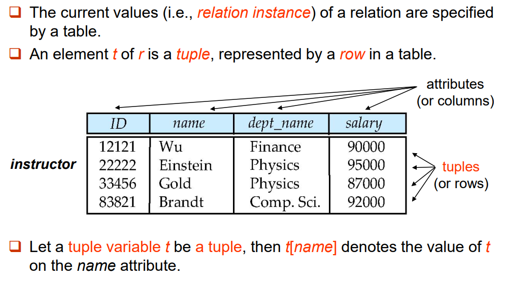

+ Key

    + Let $K \subset R$.  Where $R$ refers to the schema. 注意 $K$ 应当是一个集合，也可能是包含单元素的集合。
    
    + $K$ is a superkey (超码) of $R$ if values for $K$ are sufficient to identify a unique tuple of each possible relation $r(R)$.

      E.g. Both {ID} and {ID, name} are superkeys of the relation instructor. 
    
    + $K$ is a candidate key (候选码) if $K$ is minimal superkey. 
    
      E.g. {ID} is a candidate key for the relation instructor, since it is a superkey and no any subset. 
    
    + $K$ is a primary key (主码), if $K$ is a candidate key and is defined by user explicitly (用户明确进行的定义). Primary key is usually marked by underline. Elements in primary key cannot be NULL.
    
+ Foreign Key

    Foreign Key 是一个表中的一个 Attribute（或为 **Attribute Set**），它引用另一个表中的 Primary Key。**注意一个表里面的 Primary Key 也可以同时是 Foreign Key**。

    被引用的表（具有 Primary Key 的一方）称「被参照关系」，引用对方 Primary Key 的一方称「参照关系」。
    
    注意：**参照关系中外码的值必须在被参照关系中实际存在，或为 NULL。** 换句话说，根据这组「参照 $\to$ 被参照」关系，我们在参照关系中随意选择一个非 NULL 元组 $t_2$，一定可以在被参照关系中唯一地确定一个对应元组 $t_1$。

    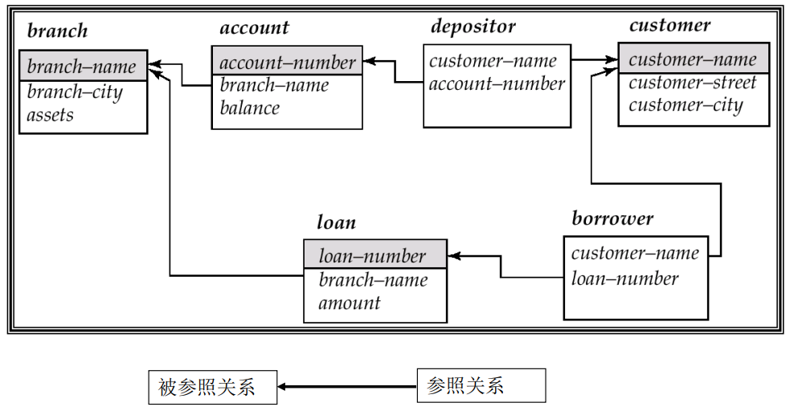

+ 关系的运算 I：六个基本运算

    + Select 选择 $\sigma_\rho(r)$

      其中 $\rho$ 表选择条件，$r$ 表关系。

      其实就是选择若干行出来。

    + Projection 投影 $\Pi_{A_1,A_2,\cdots,A_k}(r)$

      其中 $A_1,A_2,\cdots,A_k$ 表示投影的属性。
      
      其实就是选择若干列出来。

    + Union $\cup$ / Difference $-$ 不再赘述。

    + Cartesian-Product 笛卡尔积

      $r \times s = \\{ \\{tq \\} \ | \ t \in r \land  q \in s \\}$

    + Rename 改名

      $\rho_X(E)$ 将关系 $E$（$E$ 也可能是一个表达式）改名为 $X$。

      $\rho_{X(A_1,A_2,\cdots,A_N)}(E)$ 将关系 $E$（$E$ 也可能是一个表达式）改名为 $X$，同时将其 attributes 也重新命名。

+ 关系的运算 II：其它二级运算

    + Intersection 交

        不再赘述。

    + Natural Join 自然连接

      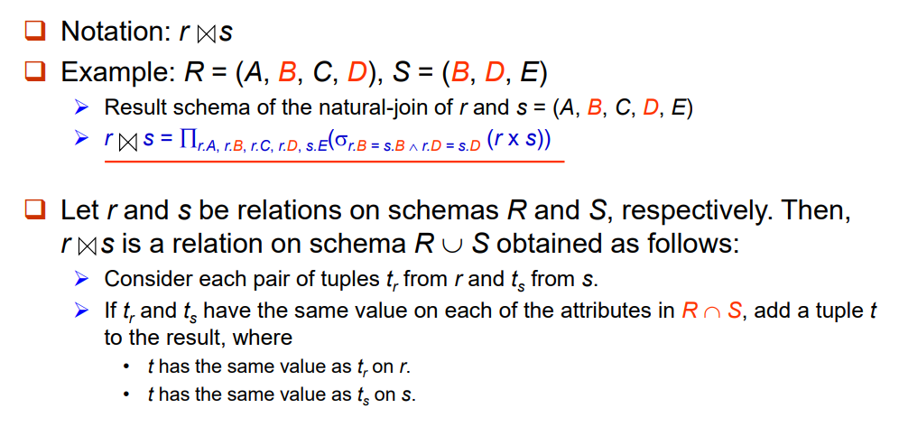

        注意必须全部匹配才能够连接。比如在上图的例子中，$r.B=s.B$ 但 $r.D \neq s.D$ 是不能够连接的。

        同时在上图中，连接后的结果应当基于 $ABCDE$ 去重，而不是仅仅基于 $BD$ 进行去重。

    + Division 除

      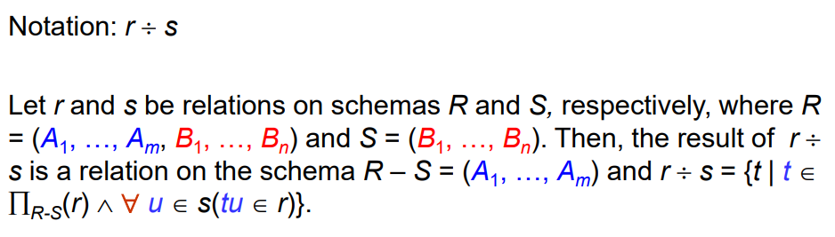
      
      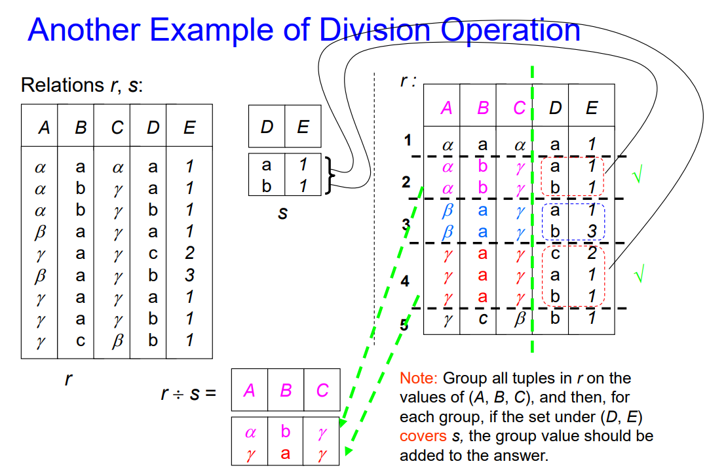

    + Assignment 赋值

      就是把一个关系赋给另一个关系。例如 $r \leftarrow s$。

+ 关系的运算 III：扩展运算

    + Generalized Projection 广义投影

      $\Pi_{F_1,F_2,\cdots,F_k}(r)$

      其中 $F_1,F_2,\cdots,F_k$ 表示投影的属性。与狭义投影不同的是，此处 $F$ 可以是一个函数关系式，例如 $F_1=A_1+A_2,F_2=A_1-A_2$。
      
      比如，对于一个关系 `credit(name, limit, balance)`，用 $\Pi_{name,limit-balance}(credit)$ 描述用户可以使用的剩余额度。

    + Aggregate Functions 聚合函数

      如果说广义投影是在列维度上整花活，聚合函数可以看成在行维度上整花活。

      聚合函数可以看成 $_{G_1,G_2,\cdots,G_n} g_{F_1(A_1),F_2(A_2),\cdots, F_n(A_n)}(E)$。

      其中 $E$ 表示一个关系（也可以是关系的表达式），$G_i$ 是要分组的属性列表(可为空)，$F_i$ 表示一个聚合函数，$A_i$ 是被聚合的属性名称。

      一个直观的例子如下：

      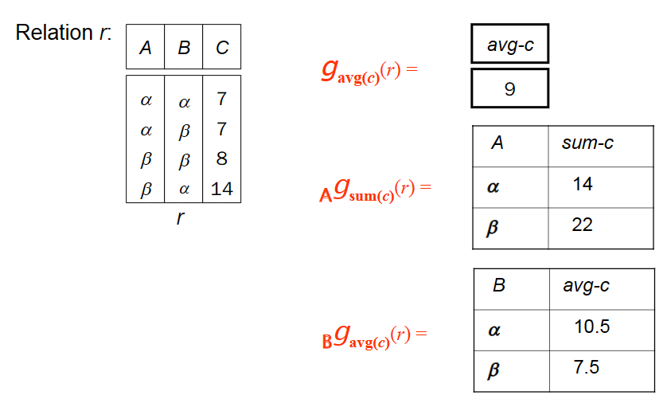

      聚合函数含有 avg, min, max, sum, count。注意一个属性被聚合之后都只剩下一个值。

+ Modification of Database

  |Modification|Relation Algebra|Meaning|
  |---|---|---|
  |Deletion|$r \leftarrow r - E$| $r$ 去除 $E$ 的部分|
  |Insertion|$r \leftarrow r \cup E$| $r$ 加上 $E$ 的部分|
  |Update|$r \leftarrow \Pi_{F_1,F_2,\cdots,F_k}(r)$|例如，$F_1=1.05a_1$，表示某一列全部乘以 $1.05$|


## Lecture 3. SQL Introduction

+ SQL includes several parts...

  + Data-Definition Language (DDL): create table, alter table, drop table, create index, drop index...

  + Data-Manipulation Language (DML): select ... from, insert, delete, update...

  + Data-Control Language (DCL): grant, revoke...

+ Data Definition 基本定义语句

  1. CREATE 语句

      CREATE 语句用于创建一张表实例。其格式如下：

      ```sql
      CREATE TABLE r (A1 D1, A2 D2, ..., An Dn, 
      (integrity constraint1), 
      ..., 
      (integrity constraintk));
      ```

      其中 $A_1, A_2,\cdots, A_n$ 表示属性名，$D_1,D_2,\cdots,D_n$ 表示域，integrity constraint 表示限制条件。

      例子：

      ```sql
      CREATE TABLE branch
      ( branch_name char(15) not null, 
      branch_city varchar(30), 
      assets numeric(8, 2), 
      primary key (branch_name));
      ```

      除了 `primary key ()` 这种，还有 `check(attr >= 0)` 这种约束。

  2. DROP 语句

      ```sql
      DROP TABLE r;
      ```

      直接删表跑路。

  3. ALTER 语句

      ```sql
      ALTER TABLE r ADD (A1 D1, A2 D2, ..., An Dn);
      ALTER TABLE r DROP A;
      ALTER TABLE r RENAME A TO B;
      ```
      分别表示加 attr，删去 attr，对 attr 改名。

  4. INDEX 索引

      ```sql
      CREATE INDEX <i-name> ON <table-name> (<attribute-list>);
      CREATE UNIQUE INDEX <i-name> ON <table-name> (<attribute-list>); 
      DROP INDEX <i-name>;
      ```
      分别表示创建索引、创建 unique 的索引、删除索引。

      其中，unique 索引中的 attr-list 必须是一组 superkey（能唯一确定一行）。

      索引不会外显出什么性质，它表示数据库的索引标准。换句话说，如果创建了一组合适的索引，你会发现数据库的查询等操作会变快。

+ SELECT 选择语句

  选择语句的基本格式为

  ```sql
  SELECT <[DISTINCT] c1, c2, …> 
  FROM <r1, …> 
  [WHERE <condition>] 
  [GROUP BY <c1, c2, …> [HAVING <cond2>]] 
  [ORDER BY <c1 [DESC] [, c2 [DESC|ASC], …]>]
  ```

  其顺序为 FROM $\to$ WHERE $\to$ GROUP BY (aggregate) $\to$ HAVING $\to$ SELECT $\to$ DISTINCT $\to$ ORDER BY。

  1. FROM 笛卡尔积

      `FROM r1, r2, r3` 表示关系模型中的 $r_1 \times r_2 \times r_3$，接下来的操作都基于这一笛卡尔积。

  2. WHERE 选择条件 I（聚合前选择）

      `WHERE condition` 表示接下来会 **遍历** 上一步（例如 $r_1 \times r_2 \times r_3$）中的每一行，满足 `condition` 的行才会留下。

  3. GROUP BY 分组聚合

      `GROUP BY c1, c2` 表示具有相同的 $c_1, c_2$ 行会被归为一组。这种操作几乎全部用于聚合函数。
  
  4. HAVING 选择条件 II（聚合后选择）

      `HAVING condition2` 会再次进行一次行选择。不过这次选择都是基于聚合函数的选择。

  5. SELECT 投影

      `SELECT c1, c2` 会将列 $c_1,c_2$ 留下，即关系模型的投影操作。`DISTINCT` 表示要求去重，`DUPLICATES` 表示允许重复。默认是允许重复的。

  6. ORDER BY 排序。

      `ORDER BY c1 DESC` 表示按照 $c_1$ 的值对 SELECT 后的结果降序排序。

  接下来举一个例子。
  
  > Q: Find the names of all branches located in city Brooklyn where the average account balance is more than $1,200. 

  表 1 / `branch(branch-name, branch-city, assets)`

  表 2 / `account(account-number, branch-name, balance) `
  
  ```sql
  SELECT A.branch_name, avg(balance) 
  FROM account A, branch B 
  WHERE A.branch_name = B.branch_name AND 
  branch_city = ‘Brooklyn’ 
  GROUP BY A.branch_name 
  HAVING avg(balance) > 1200
  ```

  + 关于集合操作 (Set Operations)

      常用的有 `UNION` `INTERSECT` `EXCEPT`。分别表示并、交、差。

      默认是不重的。例如，A 表中有 5 个行 $r_0$，B 表中有 2 个行 $r_0$。A-B 之后将不再剩下行 $r_0$。

      如果想要允许重数，则使用 `UNION ALL` `INTERSECT ALL` `EXCEPT ALL`。在上述例子中，使用 `EXCEPT ALL` 将剩下 3 个行 $r_0$。

  + 关于聚合函数 (Aggregate Functions)

      已有的聚合函数：avg, min, max, sum, count。

      使用 GROUP BY 来分组。使用 HAVING 来在聚合之后再次选择。

  + 关于空值 (NULL)

      Null is a special marker used in SQL.

      The result of any arithmetic expression involving ‘null’ is null.

      Any comparison with null returns "unknown".

      关于 NULL 的逻辑运算：

      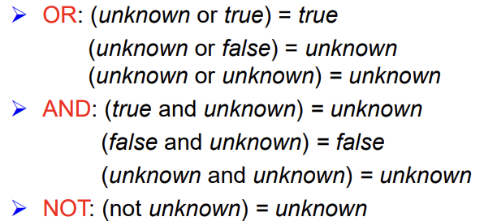

+ Nested Queries 嵌套询问

    例子 1：

    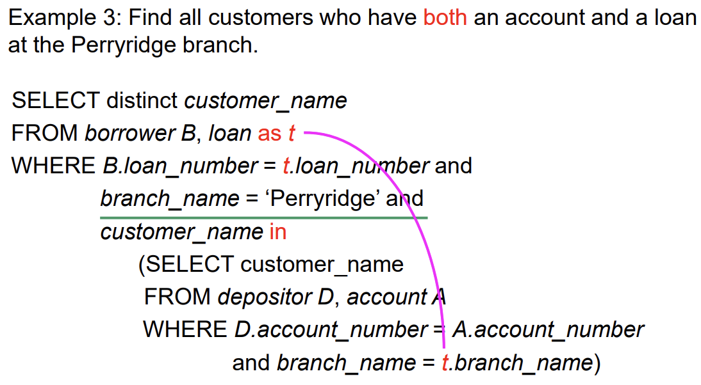

    例子 2：

    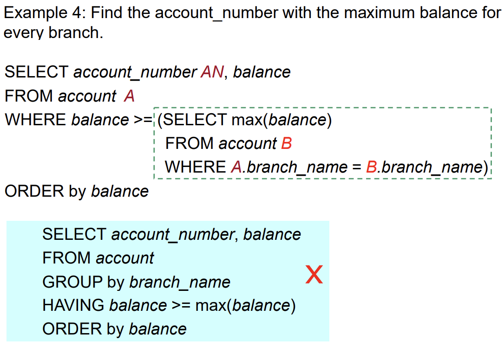

    注意此处 FROM 的执行是「遍历式」的。即绿框里面的内容会被执行多次。另外，当遍历地执行嵌套语句（绿框）时，A 的值是 **固定的**。所以才能实现找每个 branch 最大值的功能。

    注意 A 必须 rename，因为在遍历嵌套语句的时候默认 `branch_name` 是嵌套的部分的 `branch_name`。所以其实 B 那里不一定要 rename。

    + Set Comparison

        数字本来无法与集合相比较。但 SQL 提供了关键字 ALL / SOME 来实现比较。

        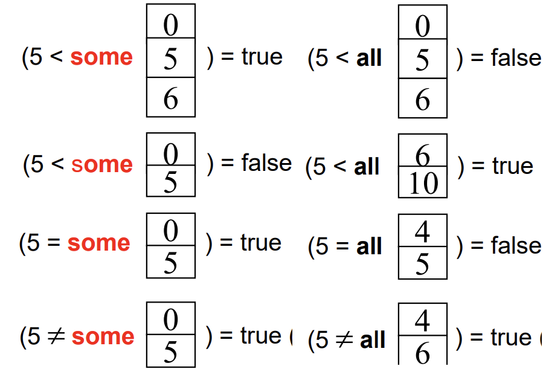

        一个例子如下。

        > Q: Find the names of all branches that have greater assets than all branches located in Brooklyn. 

        ```sql
        SELECT branch_name 
        FROM branch 
        WHERE assets > ALL 
            (SELECT assets 
            FROM branch 
            WHERE branch_city = ‘Brooklyn’)
        ```

    + Test for Empty Relation

        使用 EXISTS / NOT EXISTS 来检查一个 relation 是否非空 / 为空。

        **可以通过 NOT EXISTS 和 EXCEPT 的组合来表示包含关系。**

    + Test for Absence of Duplicate Tuples

        使用 UNIQUE 来检查一个 relation 是否具有重复行。

        > Example Q: Find all customers who have at most one account at the Perryridge branch.  

        ```
        account([account-number], branch-name, balance) 
        depositor([customer-name], [account-number])
        > [] stands for Primary Key
        ```

        ```sql
        SELECT customer_name 
        FROM depositor as T 
        WHERE UNIQUE
            (SELECT R.customer_name 
            FROM account, depositor as R 
            WHERE T.customer_name = R.customer_name AND
            R.account_number = account.account_number AND
            account.branch_name = ‘Perryridge’) 
        ```
+ Views 视图

    视图层。不同的用户可能能看到的视图也有所差别。使用下列命令创建视图

    ```sql
    CREATE VIEW <v_name> AS
    SELECT c1, c2, … From …
    ```

    实际上就是把 SELECT 后的结果给某人看。例如：

    > Example Q: Create a view consisting of branches and their customer names. 

    ```sql
    CREAT view all_customer AS
    ((SELECT branch_name, customer_name 
    FROM depositor, account 
    WHERE depositor.account_number = account.account_number) 
    UNION
    (SELECT branch_name, customer_name 
    FROM borrower, loan 
    WHERE borrower.loan_number = loan.loan_number))
    ```

    + WITH clause

      WITH 子句允许创建一个类「视图」的玩意儿，但是是临时给 query 用的，query 结束后随即销毁。

      > Example Q: Find all accounts with the maximum balance. 

      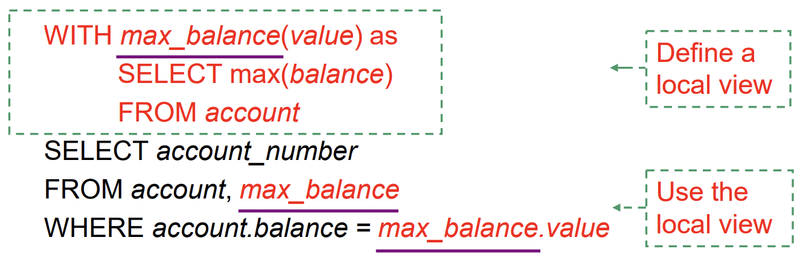

      注意这个例子 **没有发生** SELECT 的嵌套。

+ Modification 修改

    1. 删除行 (DELETE)

        ```sql
        DELETE FROM <table | view> 
        [WHERE <condition>]
        ```
        一个删除的例子：

        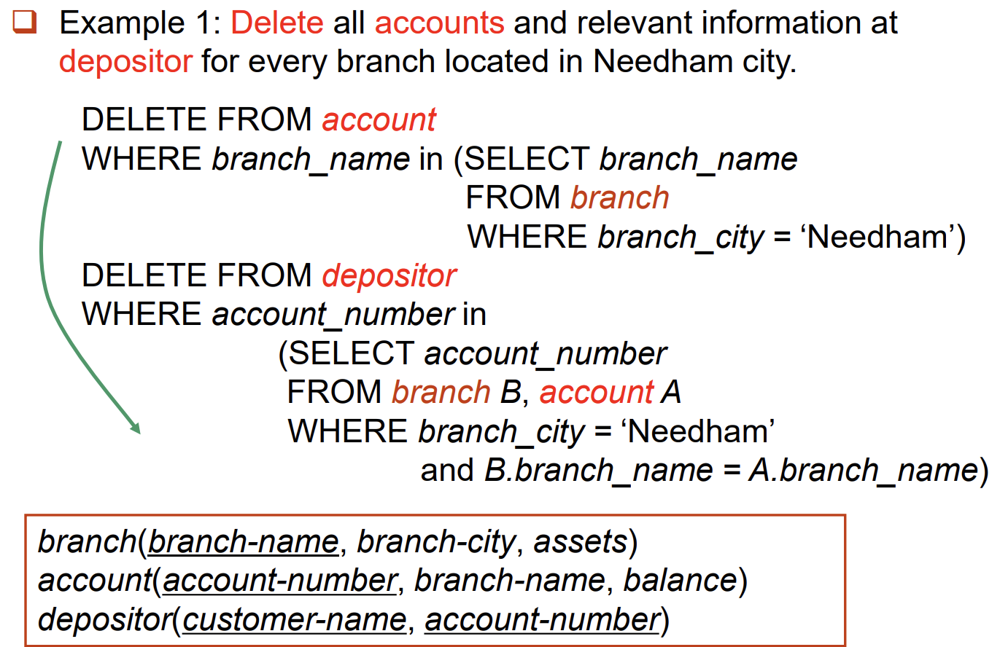

    2. 增加行 (INSERT)
        
        ```sql
        INSERT INTO <table|view> [(c1, c2,…)] 
        VALUES (e1, e2, …)  

        INSERT INTO <table|view> [(c1, c2,…)]
        SELECT e1, e2, … 
        FROM …
        ```

        第一种从字面意思上很好理解。第二种实际上就是把 `SELECT FROM` 的结果（本质也是若干行对吧）给当成 VALUES 完成 INSERT。

    3. 更新 (UPDATE)

        ```SQL
        UPDATE <table | view> 
        SET <c1 = e1 [, c2 = e2, …]> [WHERE <condition>] 
        ```

        例如，对 balance 大于 $10000$ 的全部再乘以 $1.06$：

        ```sql
        UPDATE account 
        SET balance = balance ∗ 1.06 
        WHERE balance > 10000
        ```

        有的时候你甚至可以使用「选择语句」……

        ```sql
        UPDATE account 
        SET balance = case
        when balance <= 10000 
        then balance * 1.05 
        else balance * 1.06 
        end 
        ```

+ MySQL Transactions 事务

    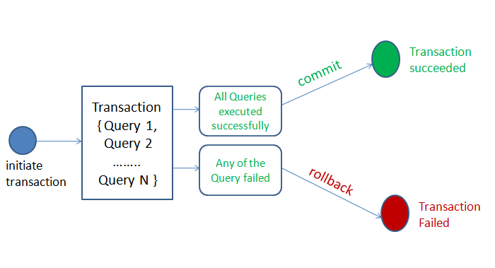

    MySQL 事务主要用于处理操作量大，复杂度高的数据。比如说，在人员管理系统中，删除一个人员，既需要删除人员的基本资料、也要删除和该人员相关的信息，如信箱，文章等等。这些数据库操作语句构成一个事务 (Transaction)。

    在 MySQL 中，事务是一组 SQL 语句的执行，它们被视为一个单独的工作单元。

    Transaction 必须满足四个条件：
    
    + 原子性 (Atomicity)：一个事务中的所有操作，要么全部完成，要么全部不完成。

    + 持久性 (Durability)：事务处理结束后，对数据的修改就是永久的。

    + 一致性 (Consistency)：在事务开始之前和事务结束以后，数据库的完整性没有被破坏。

    + 隔离性 (Isolation)：数据库允许多个并发事务同时对其数据进行读写和修改的能力，隔离性可以防止多个事务并发执行时由于交叉执行而导致数据的不一致。

+ Joined Relation 表的连接

    之前讲过自然连接 (Natural Join)。这部分其实就是包括自然连接在内的各种连接。

    + Join Types: `inner join` / `left outer join` / `right outer join` / `full outer join`

        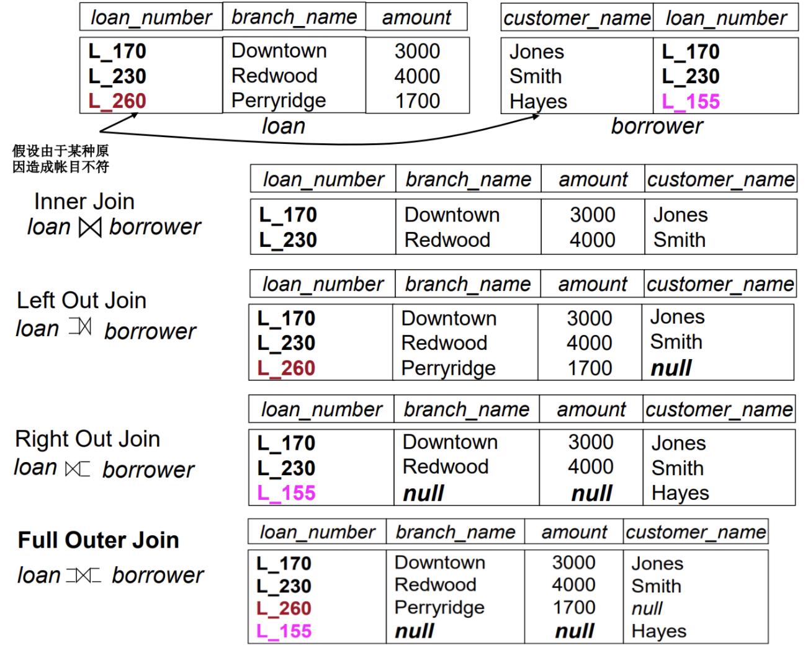

    + Join Conditions: `natural`, `on <predicate>`, `using`

        自然连接 (Natural Join) 是一种 **特殊的等值连接**，它要求两个关系表中进行连接的必须是相同的属性列（名字相同），无须添加连接条件，并且在结果中消除重复的属性列。

        如果没有添加参数 `natural`，则需要使用 `on` 来约束连接方式。例如

        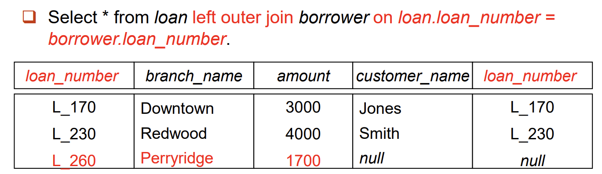

        事实上，非自然连接还可以做到不同名的连接（毕竟 `on` 后面的 predicate 是你自己写）。此外，注意 **非自然连接不消除同名属性**，这一点从上边的例子已经可以看出。

        使用 `using` 的连接类似于 natural 连接，但仅以 using 列出的公共属性为连接条件。例如

        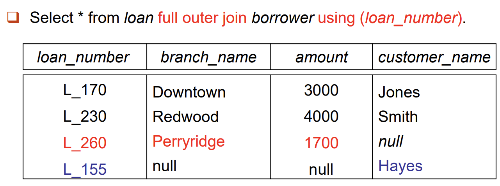