+++
title = '【笔记】数据库系统 (Part II)'
date = 2024-01-01T07:07:07+01:00
+++

## Lecture 4. Advanced SQL

### SQL Data Types and Schemas

之前提到 SQL 的关系模式（表头）schemas $R=(A_1, A_2, \cdots, A_n)$。其中属性 $A_i$ 具有定义域 $D_i$。

+ 自定义 domain

    ```sql
    CREATE new domain 
    CREATE domain Dollars AS numeric(12, 2) NOT NULL; 
    CREATE domain Pounds AS numeric(12,2); 
    CREATE TABLE employee 
    (eno char(10) primary key, 
    ename varchar(15), 
    job varchar(10), 
    salary Dollars, 
    comm Pounds);
    ```
 
+ Object types as domain

    + **blob**: binary large object -- object is a large collection of uninterpreted binary data (whose interpretation is left to an application outside of the database system) 

    + **clob**: character large object -- object is a large collection of character data

    + Example

        ```sql
        CREATE TABLE students 
        (sid char(10) primary key, 
        name varchar(10), 
        gender char(1), 
        photo blob(20MB), 
        cv clob(10KB))
        ```

### Integrity Constraints

+ Domain Constraints

    对于单个 Relation 的常见约束：`Not null`, `Primary key`, `Unique`, `Check (P)` (where P is a predicate). 

+ Referential Integrity

    事实上，这种约束也可以「跨表」。回顾我们之前提及的 Foreign Key：

    其中 $r_1(R_1)$ 是被参照关系，$r_2(R_2)$ 是参照关系。

    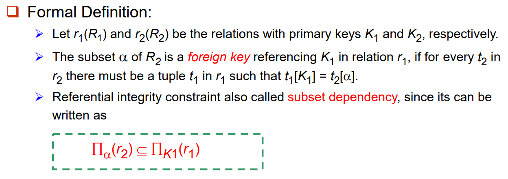

    + Checking Referential Integrity on Database Modification

        假设我们有 $r_2(R_2) \to r_1(R_1)$ 的参照与被参照关系，为了保证此关系的始终合法，在对 $r_1(R_1)$ 或 $r_2(R_2)$ 进行修改操作时，必须同时关心另一方是否需要变动以维持该关系。

        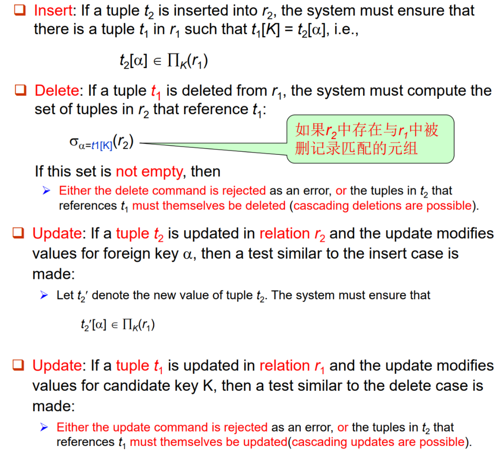

    + Referential Integrity in SQL

        在 SQL 语言中，我们也可以描述这种参照与被参照关系。回顾之前的 Banking Example：

        

        可以使用如下的 SQL 语言来描述 foreign keys：

        ```sql
        Create table account 
        (account-number char(10), 
        branch-name char(15), 
        balance integer, 
        primary key (account-number), 
        foreign key (branch-name) references branch); 

        Create table depositor 
        (customer-name char(20), 
        account-number char(10), 
        primary key (customer-name, account-number), 
        foreign key (account-number) references account, 
        foreign key (customer-name) references customer);
        ```

        （btw，depositor 的 primary key 包含两个 attr）

    + Cascading Actions in SQL

        ```SQL
        Create table account ( 
            ...
        foreign key (branch-name) references branch
        [ on delete cascade ] 
        [ on update cascade ] 
        ... );
        ```

        使用 `[on delete cascade]` 允许级联删除，使用 `[on update cascade]` 允许级联更新。

        之前提及，如果两表 $r_2,r_1$ 具有「参照 $\to$ 被参照」关系，当 $r_1$ 发生删除 / 更新操作时，我们可能需要相应地修改 $r_2$ 来维持此关系。

        如果存在一条「参照 $\to$ 被参照」关系链，一个表的更改可能会导致链式反应。如果系统发现无法维护所有关系，它会取消本次 transaction。

    + Alternative to Cascading
    
        除了使用级联，我们还可以这样操作：

        + `[on delete set null]`
        + `[on delete set default]` 

        这样，当被参照关系中某个 tuple 被删除时，参照关系不会随之删除，而是设置某项为 NULL。

        Null values in foreign key attributes complicate SQL referential integrity semantics, and are best prevented using not null. If any attribute of a foreign key is null, the tuple is defined to satisfy the foreign key constraint!

    + Referential Integrity Example

        ```sql
        Create table Person
        (id char(10) primary key, 
        name varchar(12) not null, 
        age int, 
        gender char(1), 
        spouse char(10), 
        foreign key(spouse) references Person
        on update cascade on delete set NULL, 
        Check(gender in {‘f’, ‘m’}); 
        ```

        `foreign key(spouse) references Person on update cascade on delete set NULL` 是一个外键约束，指定 spouse 字段引用表内部同一表的 id 字段。
        
        这意味着 spouse 必须是表中另一条记录的 id。如果某人的配偶的记录被更新（比如配偶的 id 发生变化），那么这个人的配偶信息也会相应更新（`on update cascade`）。如果某人的配偶被删除，那么这个人的配偶信息会被设置为 NULL（`on delete set NULL`），而不是删除这条记录。

+ Assertion

    An assertion is a predicate expressing a condition that we wish the database always to satisfy, usually for complex check condition on several relations.
    
    SQL 格式：

    ```sql
    CREATE ASSERTION <assertion-name>
        CHECK <predicate>;
    ```

    When an assertion is made, the system tests it for validity **on every update** that may violate the assertion. (when the predicate is true, it is OK, otherwise report error)

    例如，对于之前的 Banking Example，要求每个分行满足其 load 总和不超过其 balance 总和。

    ```sql
    CREATE ASSERTION sum-constraint CHECK 
        (not exists (select * from branch B 
            where (select sum(amount) from loan 
            where loan.branch-name = B.branch-name) 
            > 
            (select sum(balance) from account 
            where account.branch-name = B.branch-name)))
    ```

+ Triggers（此部分和讲义不同，按照 MySQL 的语法）

    A trigger is a statement that is executed automatically by the system as a side-effect of a modification to the database.

    例子：在 Banking Example 中，如果一个用户的 balance 低于 0，则为其创建 loan 账户，并将 balance 的负值设置为 amount。

    ```sql
    CREATE TRIGGER overdraftTrigger BEFORE UPDATE ON account
        FOR EACH ROW
        BEGIN
            IF NEW.balance < 0 THEN
                INSERT INTO borrower
                (SELECT customer_name, account_number FROM depositor
                WHERE NEW.account_number = depositor.account_number);
                
                INSERT INTO loan VALUES
                (NEW.account_number, NEW.branch_name, -NEW.balance);
                
                SET NEW.balance = 0;
            END IF;
        END;
    ```

    ```
    loan(loan-number, branch-name, amount) 
    borrower(customer-name, loan-number) 
    account(account-number, branch-name, balance) 
    depositor(customer-name, account-number)
    ```

    + Trigger 触发条件

        可以选用 `insert` / `delete` / `update`。上一个例子用的 `update`。

        你也可以使用 `of` 来规定某些 attr 被修改时才触发。例如

        ```sql
        Create trigger overdraft-trigger 
            after update of balance on account …
        ```

    + AFTER vs. BEFORE

        `AFTER` 使得 trigger 里面的内容在修改生效之后进行。
        
        `BEFORE` 使得 trigger 里面的内容在修改生效之前进行。

    + FOR EACH ROW

        可理解为遍历每一个被修改的行。

    + 【FLAG】和讲义不同的点

        `REFERENCING` 语法，包括 new / old + row / table。

### Authorization

+ Basic Authorization Types

    Forms of authorization on parts of the **database**: （单表而言）
    
    1. **Read authorization** - allows reading, but not modification of data. 
    2. **Insert authorization** - allows insertion of new data, but not modification of 
    existing data. 
    3. **Update authorization** - allows modification, but not deletion of data. 
    4. **Delete authorization** - allows deletion of data.
    
    Forms of authorization to modify the **database schema**:（整个 schema 而言）

    1. **Index authorization** - allows creation and deletion of indices. 
    2. **Resources authorization** - allows creation of new relations. 
    3. **Alteration authorization** - allows addition or modifying of attributes in a relation. 
    4. **Drop authorization** - allows deletion of relations. 


+ Authorization and Views

    可以通过 Views 来限制一个用户的权限。例如，一个 clerk 只能知道每个 branch 顾客的名字，我们可以使用如下的 View：

    ```sql
    CREATE VIEW cust-loan as 
    SELECT branchname, customer-name 
    FROM borrower, loan 
    WHERE borrower.loan-number = loan.loan-number 
    ```

    同时，clerk 应当具有 `SELECT` 该视图的权限。clerk 通过以下命令获取信息：

    ```sql
    SELECT * 
    FROM cust-loan
    ```

    Creation of view does not require **resources authorization** since no real relation is being created. 

    The creator of a view gets only those privileges that provide no additional authorization beyond that he already had. E.g., If creator of view cust-loan had only read authorization on borrower and loan, he gets only read authorization on cust-loan.

+ Authorization Grant Graph

    The nodes of this graph are the users. The root of the graph is the database administrator. 

    Consider graph for update authorization on loan, then an edge $U_i \to U_j$ indicates that user $U_i$ has granted update authorization on loan to $U_j$.

    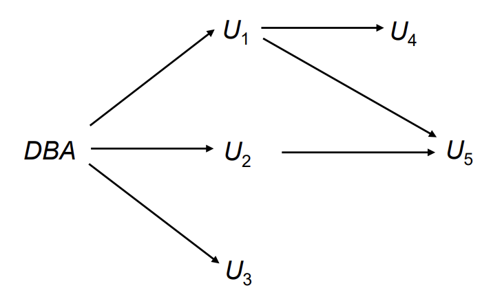

    Must prevent cycles of grants with no path from the root.

    **EXAMPLE:** If DBA revokes grant from U1: 
    
    + Grant must be revoked from U4 since U1 no longer has authorization. 
    
    + Grant must not be revoked from U5, since U5 has another authorization path from DBA through U2. 

+ Security Specification in SQL

    接下来讲解具体在 SQL 语言中如何体现权限管理。

    1. 使用 GRANT 语句来赋予权限

        ```sql
        GRANT <privilege list> ON <table | view> 
        TO <user list>
        ```

        例如，`GRANT select, insert ON branch TO U1, U2, U3;` 赋予了 U1, U2, U3 对于 branch 这张表的 select, insert 权限。注意 `ON` 后面也可以是一个视图。

    2. 使用 REVOKE 语句来收回权限

        ```sql
        REVOKE <privilege list> ON <table | view> 
        FROM <user list> [restrict | cascade]
        ```

        About Restrict / Cascade: Revocation of a privilege from a user may cause other users also to lose that privilege, which is referred to as **cascading** of the revoke. With **restrict**, the revoke command fails if cascading revokes are required.

        `<privilege-list>` may be `ALL`, to revoke all privileges the revokee may hold. 
        
        If `<revokee-list>` includes `PUBLIC`, all users lose the privilege except those granted it explicitly. 
    
    3. WITH GRANT OPTION 传递权限

        例如，

        ```sql
        grant select on branch to U1 with grant option;
        ```

        赋予了 U1 对于 branch 的 select 权限，同时 U1 也可以对其它用户赋予该权限。

+ ROLES: Permitting common privileges for a class of users

    例如，

    ```sql
    Create role teller;
    Create role manager;
    Grant select on branch to teller;
    Grant update (balance) on account to teller;
    Grant all privileges on account to manager;
    Grant teller to manager;
    Grant teller to alice, bob; 
    Grant manager to avi;
    ```

    `GRANT BY CURRENT ROLE`：之前说到，用户之间可以传递权限。这个命令可以使得权限的传递是以 role 形式完成的。也就是说，如果 A 给 B 了某个权限（且没有其它人给 B 这个权限），在 A 失去权限之后 B 也会失去权限；但如果 A 是以 `GRANT BY CURRENT ROLE` 方法给出的权限，那么 B 将依然保留此权限。

+ Limitations of SQL Authorization

    1. SQL does not support authorization at a tuple level.

    2. The task of authorization in above cases falls on the application program, with no support from SQL.

    3. With the growth in Web access to databases, database accesses come primarily from application servers.

### Embedded SQL（嵌入式 SQL）

A language in which SQL queries are embedded is referred to as a **Host language (宿主语言)**, and the SQL structures permitted in the host language comprise embedded SQL.

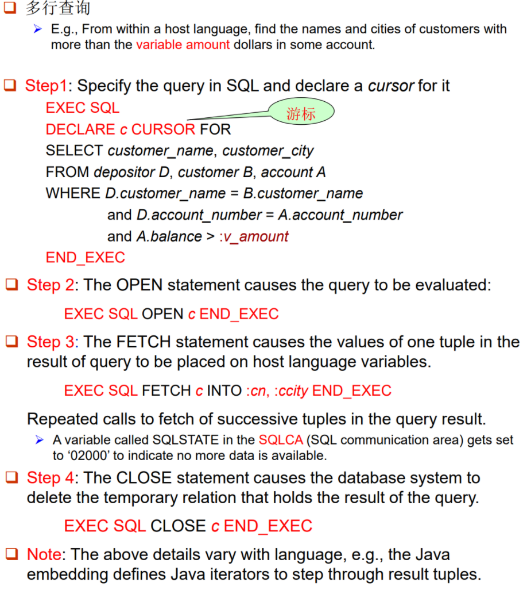

+ 使用 `EXEC SQL` 和 `END_EXEC` 来标注嵌入的部分。

+ 游标 (cursor) 的作用类似于一个类。

+ `:X` 是宿主变量，可在宿主语言程序中赋值，从而将值带入 SQL。宿主变量在宿主语言中使用时不加 `:` 号。


---


## Lecture 5. E-R Model

### Introduction

+ E-R Model vs. Relation Model

    顾名思义，E-R Model 引入了「实体」的概念，将部分表格归入「描述实体」的范畴。回顾之前一张 Relation Model 用过的图：

    

    比如对于 borrower 表格，在 Relation Model 中它对应一个关系，在 E-R Model 中它也对应一个关系；但对于 customer 表格，在 Relation Model 中它对应一个关系，在 E-R Model 中它则对应一个实体。

    E-R Model 更为符合语义上的直觉。~~其实感觉都挺迷惑的。~~

+ Entities 实体

    一个实体具有一些 Attributes，而 Attributes 可以如下分类：

    + Simple Attributes vs. Composite Attributes (简单和复合属性)

        <p>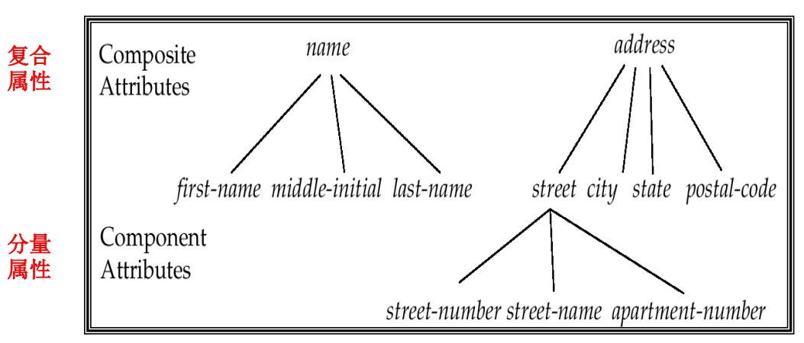</p>

       如上图，复合属性可以被拆成若干个子属性。例如 sex 是简单属性，而 name 是复合属性。
 
    + Single-valued vs. multi-valued attributes (单值和多值属性)
    
        例如，phone-numbers 可以是多值属性。

    + Derived Attributes (派生属性)

        派生属性指的是一个属性可以被其他 **已存在的属性计算得出**。例如，当 birth date 已知，则 age 为派生属性。

+ Relationship Set 联系集

    一个联系集表示二个或多个实体集之间的关联。
    
    正式定义：对于超过 $n \ge 2$ 个实体集，我们定义一个它们之间的一个联系集为

    $$rs = \\{(e_1,e_2,\cdots,e_n) \text{ where } e_1 \in E_1, e_2 \in E_2, \cdots, e_n \in E_n \\}$$

    其中 $(e_1, e_2, \cdots, e_n)$ 称作一个 relationship, $E_i$ 是实体集。

    定义一个联系集的度数 (degree) 为其链接的实体集数目。

### E-R Diagram

接下来通过 E-R Diagram 来更深刻地认识 E-R 模型。

0. 基本表示方法

    椭圆表示属性、矩形表示实体、菱形表示关系。

1. E-R Diagram and Attributes

    对于一个实体，我们通过下图来列举其属性。下划线表示主键。

    <p>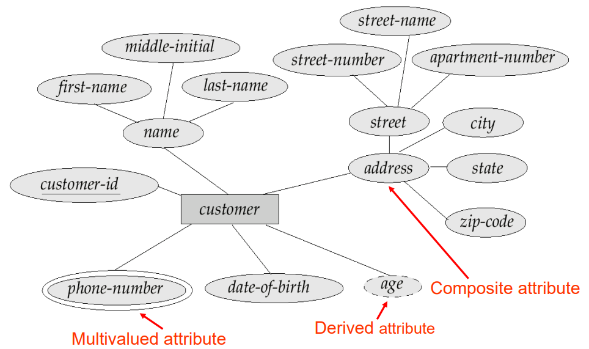</p>

    对于一个关系，有的时候它会牵一个属性。我们使用下图方式表示：

    <p>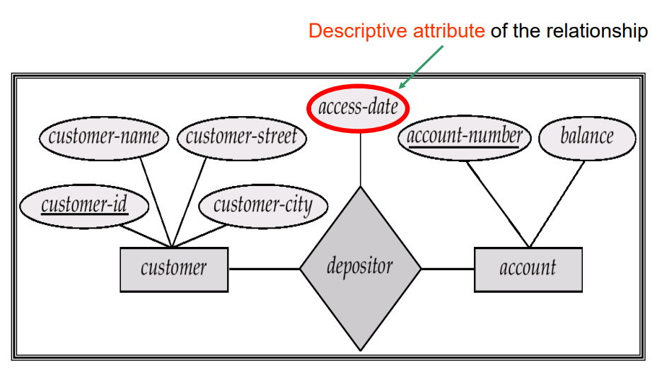</p>

2. E-R Diagram and Relationship Set

    + 自环联系集：

        在具有特殊意义时，一个实体集可以和自身产生关系。

        <p>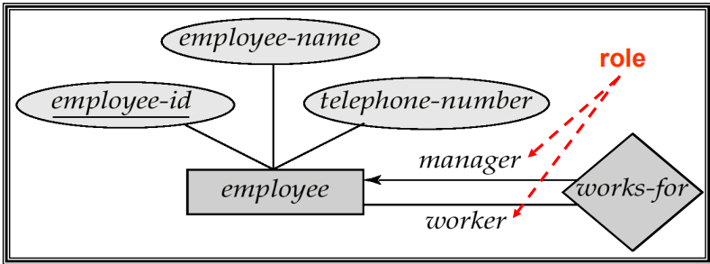</p>

    + 考虑映射数目（一对一 / 一对多 / 多对多）：

        <p>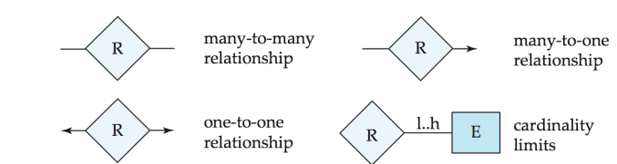</p>

    + 全参与和部分参与：

        全参与说明对应的那一侧都在 Relationship Set 中至少出现过一次。部分参与则无此限制。

        <p>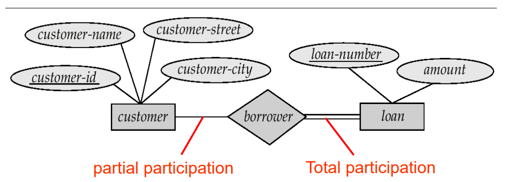</p>

    + Tips | Converting Non-Binary Relationships to Binary Form

        有的时候，非三连接联系集可以拆成若干个双连接联系集。当然大多数时候没有对错之分。

        <p>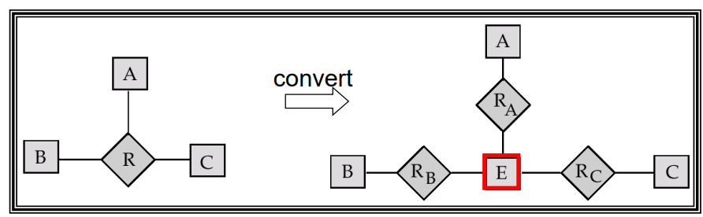</p>

### Weak Entity Sets

基本定义：没有主键的实体集称作 **弱实体集**。它需要依赖于其它实体集存在。

例如，下图中 section 是一个弱实体集。其中画下划虚线的称作 Discriminator (or Partial Key)，当 Discriminator 和其所依赖的实体集的 Primary Key 发生组合时，将可以在弱实体集中进行唯一的区分（发挥主键作用）。同时，弱实体集和其依赖的实体集之间的关系菱形需要用双实线包围。

<p>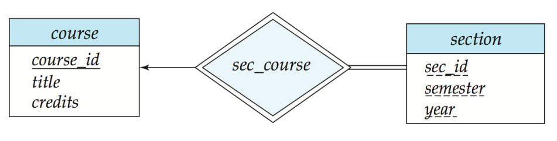</p>

section 被作为弱实体是因为它可能重复。例如，COD 课和 DBS 课都在 2024 春学期开课，同时分别具有 2 / 3 个 Section。那么在 section 中就会同时具有如下实体：

```
(1, spring, 2024)
(2, spring, 2024)
(1, spring, 2024)
(2, spring, 2024)
(3, spring, 2024)
```

必须要和 `course_id` 发生组合后，才能唯一区分：

```
(COD, 1, spring, 2024)
(COD, 2, spring, 2024)
(DBS, 1, spring, 2024)
(DBS, 2, spring, 2024)
(DBS, 3, spring, 2024)
```

可能的疑惑 1：为什么 section 中不直接存 `(1, spring, 2024)`，`(2, spring, 2024)` 和 `(3, spring, 2024)`？这是因为 section 中的实体有其 **意义**（品一下，结合 `course_id + section`），如果删去重复部分的话则会失去对应的意义，也难以恢复和 course 实体的组合（比如就不确定 COD 有几个 section 了）。

可能的疑惑 2：为什么不直接把 section 存在 course 里面？这是因为 course 表格也有其意义，比如我只希望调用课程信息，两实体合在一起会产生很多的信息冗余。


### An E-R Example

<p>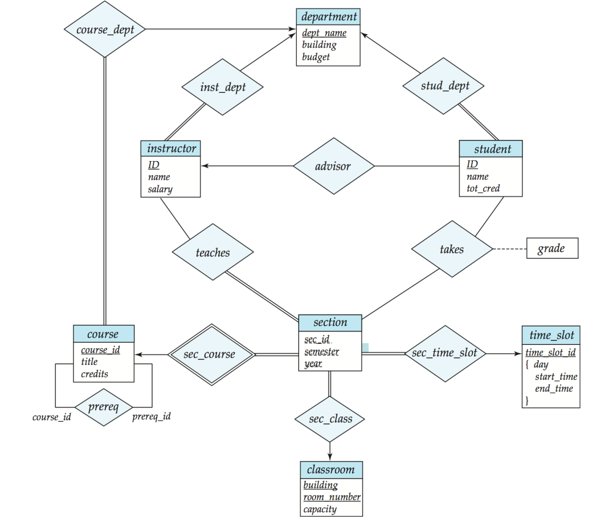</p>

### 扩展 E-R 模型性质

1. Specialization

    类似父类和子类。

    <p>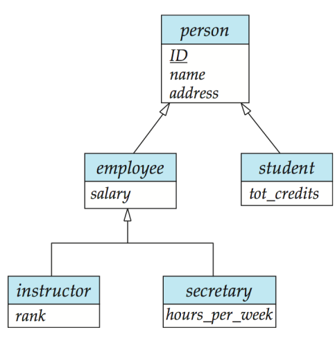</p>

    注意右上那种箭头表示一个人可以同时是 employee & student；左下那种箭头表示一个 employee 不能同时作为 instructor / secretary 存在。

    此外还有完全泛化 / 部分泛化的定义。字面意思很好理解。

    <p>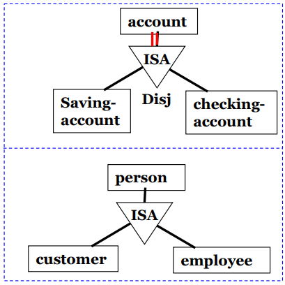</p>

2. Aggregation

    左边 manager 同时 manages 三个，太麻烦了。所以搞成右边的格式——

    <p>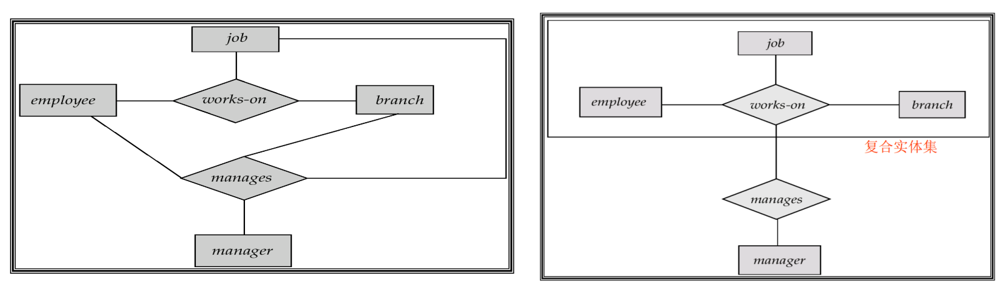</p>


### 将 E-R 模型转化为表格

+ 基本方法

    实体转表格，联系集转表格。

    实体的属性有的是复合 / 多值的，这些都需要展开。不过，另外一种处理方法是用多个表格描述一个实体。

    联系集则只需要把 attrs 设置成所联系的实体集的主键。此外还要记得带上那些绑定在联系集上面的属性。

+ 处理弱实体

    弱实体也需要出一张表格，将其所依赖的强实体的 Primary Key 和弱实体的 Discriminator 联合一下作为 attrs 即可。

+ 缩表

    1. 对 1-n 联系，可将联系所对应的表，合并到对应「多」端实体的表中。

        <p>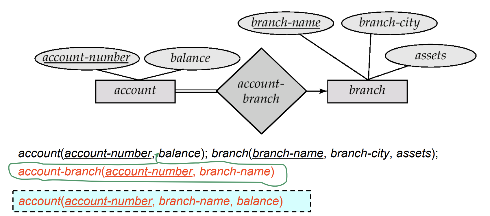</p>

        当然，对 1-1 联系，合并到哪一侧都是可以的。

    2. 联系弱实体集及其标识性实体集的联系集对应的表是冗余的，即对应 identifying relationship 的表是多余的。

        <p>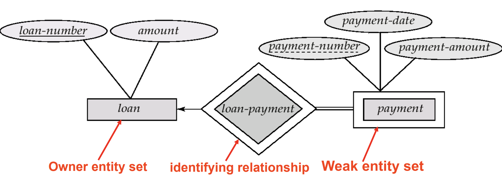</p>

+ 处理泛化

    <p>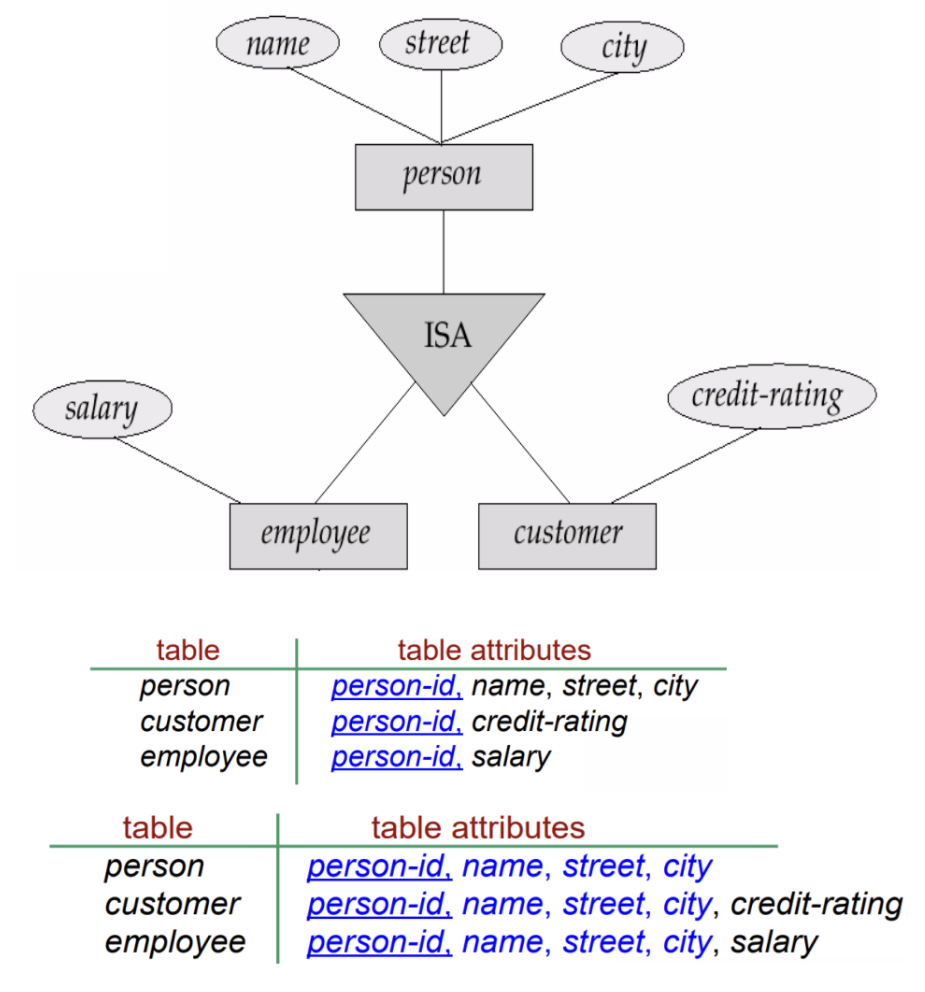</p>

    两种处理方式都是允许的。上面的信息更简洁，下面的话在特定情况查询更方便。