+++
title = '【笔记】数据库系统 (Part III)'
date = 2024-05-01T07:07:07+01:00
+++

## Lecture 8. Storage and File Structure

### Global Overview


### Overview of Physical Storage Media

感觉这部分和计组重了。

<p>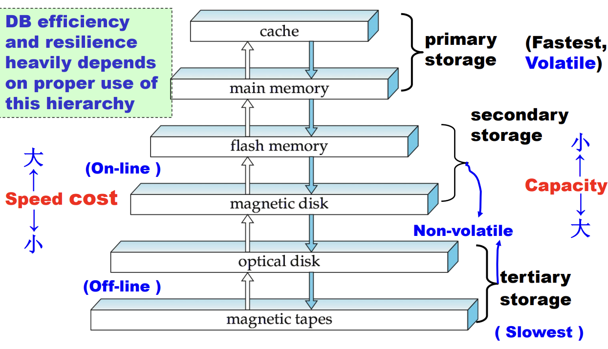</p>

**Primary storage**: Fastest but volatile

**Secondary storage** (辅助存储器，联机存储器): non-volatile, moderately fast access time

**Tertiary storage** (三级存储器，脱机存储器): non-volatile, slow access time

计算机本身基本上只考虑了上两级。

第三级就类似于磁带、CD-ROM 这种玩意儿，所以叫「脱机存储器」。

### Magnetic Disks

<p>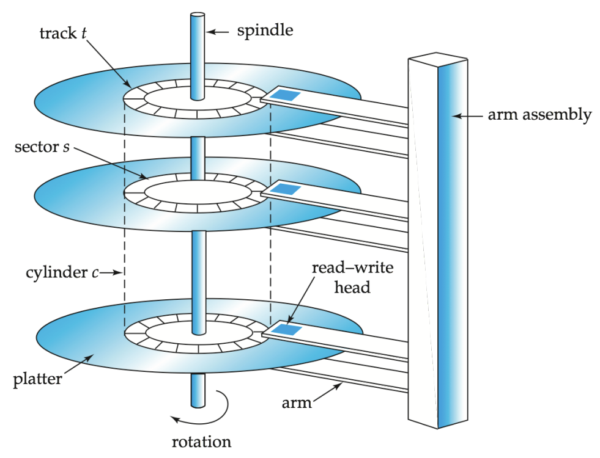</p>

+ Structure

    + **Platter** 盘子。一个磁盘一般有 4-16 个盘子。

    + **Track** 轨道。对应图上不同半径的环。

    + **Sector** 扇区。每个 track 又被分割为若干 sectors。

    + **Cylinder** 所有 platter 同一半径的 track 集合。

    + **Read-write head** 读写头。

+ Measure Performance of Disks

    + Seek time (寻道时间)
        
        工作：arm 找到正确的 track

    + Rotational latency time (旋转等待时间)
    
        工作：磁盘旋转使得正确的 sector 出现在 head 下

    + Data-transfer time (数据传输时间)

        工作：数据传输。

    + Mean time to failure (MTTF, 平均故障时间)

+ Optimization of Disk-Block Access

    1. Block 读取

        一次读取整块数据（不止是精确索要的数据），方便后续 Memory 快速使用邻近数据。

    2. 磁盘臂调度算法

        【电梯算法】考虑读写头在 inner track 和 outer track 之间移动的情景。读写头应当尽可能减小更改方向的次数。同方向先处理，要掉头的话先把当前方向处理完了再说。


### RAID

+ RAID, RAID 0, RAID 1, 拆分方式

    RAID: Redundant Arrays of Independent Disks (独立磁盘冗余阵列) 

    <p>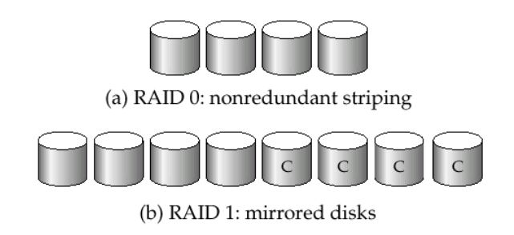</p>

    相比一个单独的 disk，RAID 同时具有

    + 更高速度：多硬盘并行。比如 RAID 0 中 4 个硬盘可以并行读取数据。理论读时间变为 1/4。

    + 更高可靠：采取冗余设计。比如 RAID 1 中同样的数据存两份。

    拆分方式：

    + Bit-level striping (比特级拆分)

        拆的非常细。一个 byte 拆成 8 个 bit，分别存到 8 个 disk 中。虽然相比单个 disk 读取速度快了 8 倍，但是寻道实际上是慢了的。

    + Block-level striping (块级拆分)

        拆分单位不再是一个 bit，而是若干个 byte 的集合（统称一个 block）。如果有 $n$ 个硬盘，第 $i$ 块会被存储在第 $(i \bmod n) + 1$ 个硬盘中。

+ 其他类型 RAID

    + RAID 2

        <p>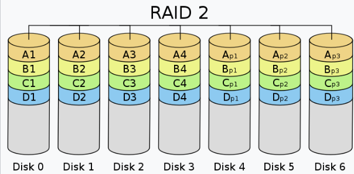</p>

        采用比特级拆分。Disk 4/5/6 存储的是 Hamming Code 校验码，并非单纯的数据备份。

    + RAID 3

        <p>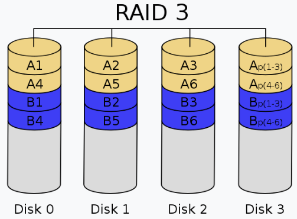</p>

        采用 byte 级拆分。最后一个 disk 存储的是奇偶校验码（异或）。如果一个 disk 里面的数据爆了，直接把剩下的几个对应位置异或即可恢复。

    + RAID 4

        <p>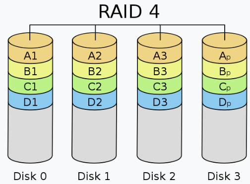</p>

        采用 block 级拆分。最后一个 disk 存储的是奇偶校验码（异或）。如果一个 disk 里面的数据爆了，直接把剩下的几个对应位置异或即可恢复。

        【RAID 3 vs. RAID 4】RAID 3 更擅长长序列读取，RAID 4 更擅长随机的小范围读取。


    + RAID 5

        <p>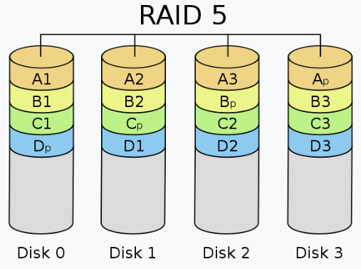</p>

        采用 block 级拆分。和 RAID 4 的差异在于奇偶校验码采取分布式存储。

    + RAID 6

        <p>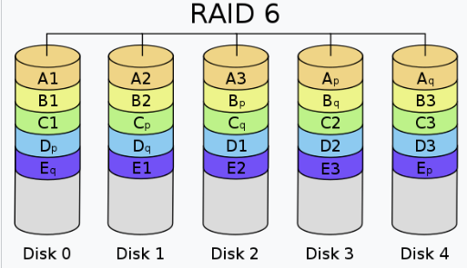</p>

        和 RAID 5 类似：block 级拆分、奇偶校验码分布存储。唯一的区别在于使用更多的空间来存储奇偶位，通过更冗余的设计保证更高的可靠性。

    RAID 1 和 RAID 5 是目前最为常用的。


### Storage Access

【知识迁移】类比计组同时期学习的 memory-cache 调度策略，数据库这里讲的是 disk-memory 调度策略。很多方面是类似的，但也有细微的不同。

+ Buffer Concepts

    <p>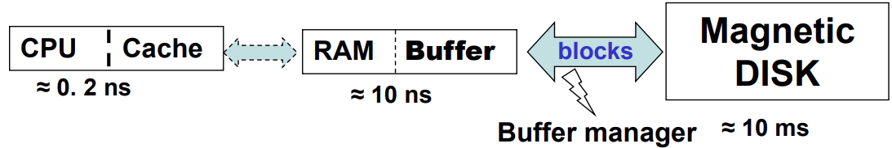</p>

    <p>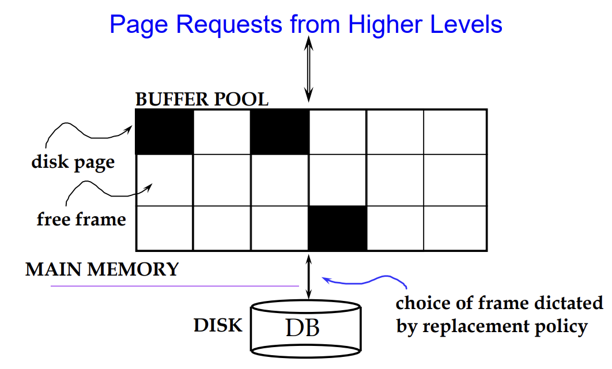</p>

    一些定义：
    
    + block: 一块连续的硬盘空间
    
    + page: 一个 block 在 buffer 中的体现

    + frame: 一单位的 buffer pool

+ Buffer Management

    从 buffer 中读取信息。如果发现 block 已在，则直接读取；反之则需要将数据从硬盘转移到 buffer 中。

    若 buffer 中没有空间存储这个新的 page，则需要进行覆盖。如果被覆盖的旧块被修改过，则需要先写回硬盘再覆盖；反之则可以直接覆盖。

    关于覆盖：

    + Buffer Replacement Strategies

        LRU：覆盖最近一段时间用的最少的块。在某些情况下可能不优，比如 natural join。

        <p>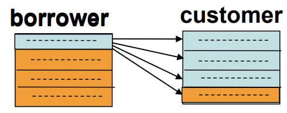</p>

        MRU：覆盖最近一段时间用的最多的块。看起来比较扯淡，但是适合用于一个 block 短期内只用一次的情景。

    + 辅助策略 | Pinned Block

        如果一个 block 正在被某个事务使用，则将其钉住 (pinned)，不允许删除。

    + 辅助策略 | Toss-immediate

        用后立即丢弃：某些 block 我们用完之后直接从 buffer 中删除。

### Record & File Organization

首先是 record 的存储方式。我们讨论定长和不定长两种情况。

+ Fixed-length Records

    所有数据在硬盘里都是固定长度的。在这种存储方式下 access 会更为便捷。

    一个比较大的问题是删除。我们不大可能删除了一行之后把所有后面的行向前平移 1 个单位。一个解决方案是 free list:

    <p>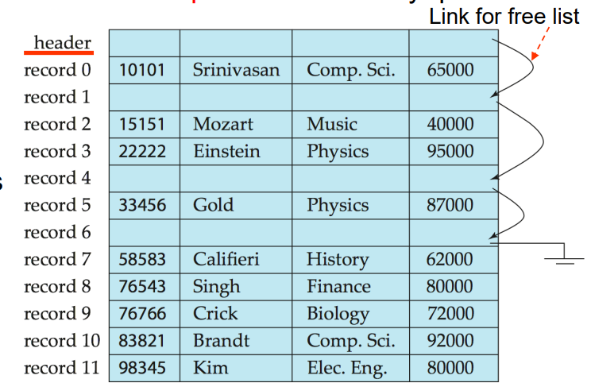</p>

    这样重新利用被删除的行就会比较方便。

+ Variable-Length Records

    采取可变长度方式来存储 records 时，我们将一个 record 分为两部分：前面的 fixed-length info 部分和后面的 variable-length info 部分。如下图所示。

    对于一个长度固定的属性（例如 int, char, date），它的实际值直接存储在 record 的前半部分；对于一个长度不固定的属性（例如 string），他的实际值存储在 record 的后半部分，但我们在前半部分建立了长度为 4 byte 的 (offset, length) 数值对来对其进行定位。两部分之间用一个 Null bitmap 分隔。

    <p>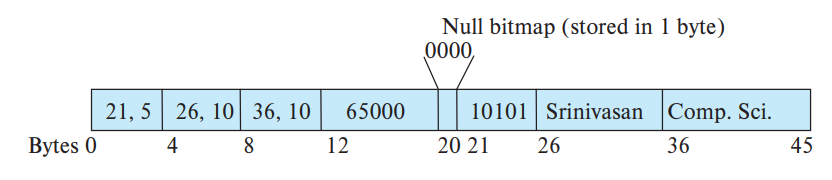</p>

    当然这只是一个 record 的存储。考虑表格中的多个 records，由于各个 records 长度不尽相同，我们采取下图所示的方法存储。即前面存 (size, pointer)，后面存实际数据，两头向中间靠拢地存储。

    <p>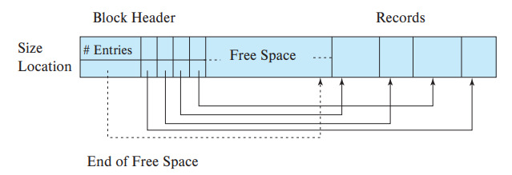</p>

接下来考虑一个更大的角度，即整个文件（或者说 records 之间）是如何存储的。

+ Sequential File Organization

    字面意思的顺序存储……

    <p>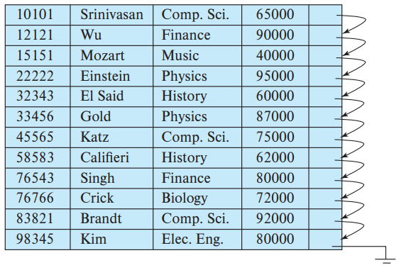</p>

+ Multi-table Clustering File Organization

    像这样把左边的两个表聚合成右边的一个表。这样做的好处在于大大简化了 natural join 时的工作量。

    <p>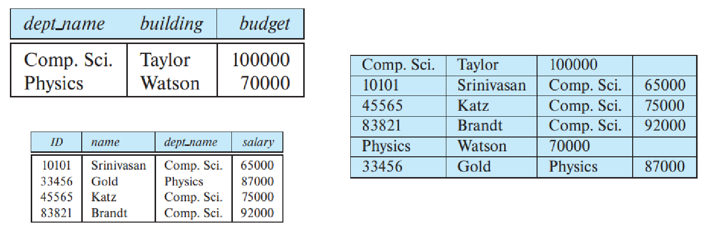</p>

    但是如果我要访问一个单表，可能会有点麻烦。例如，如果要访问 department 表格，开销比原来的表格要大。一个解决方案是搞个指针：

    <p>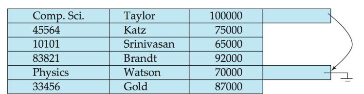</p>

+ B+ / Hashing File Organization

    具体参照 Lecture 9。


### Column-Oriented Storage

按列存储。

<p>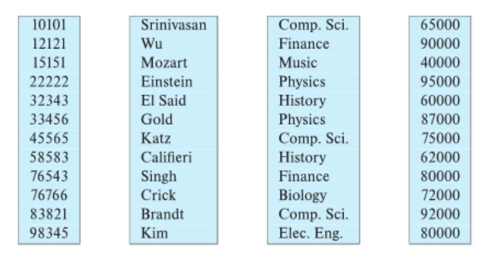</p>

Benefits:

+ Reduced IO if only some attributes are accessed
+ Improved CPU cache performance 
+ Vector processing on modern CPU architectures

Drawbacks:
+ Cost of tuple reconstruction
+ Cost of tuple deletion and update

甚至可以行列混合存储：

<p>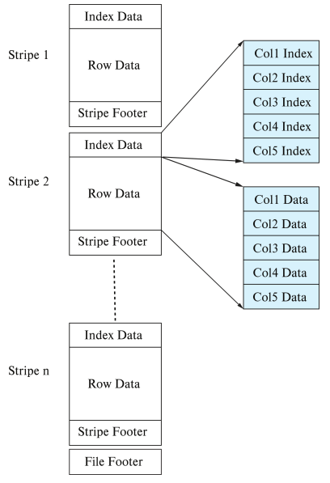</p>

Stripe $i$ 相当于对行进行划分，而每个 stripe 内部其实又是按列存储的。


## Lecture 9. Indexing and Hashing

### Indexing Intro

+ Index 基本结构：search-key + pointer

    前者是索引的键值，后者指向数据库中的某个存储空间。

+ Index 基本分类

    + 顺序索引 (ordered indices): 索引中 search keys 按某种顺序排列好。

    + 哈希索引 (hash indices): 索引中 search keys 遍布于各个 hash buckets 中，查询时通过某个哈希函数定位到具体的 bucket。

### Ordered Indices

+ Basic Concepts

    1. sequentially ordered file (顺序排序文件)：

        这个概念是相对于某个 search key 而言的。如果整张表格对于某个 search key 是顺序排列的，则称其为相应的顺序排序文件。

    2. primary index (主索引):

        又称 clustering index。与对应的数据文件本身的排列顺序相同的索引称为主索引。显然，此时整个文件是相对于 primary index 的顺序排序文件。

        主索引的搜索键通常是，**但不一定是** primary key。

    3. secondary index (辅助索引):

        一个表格当然可以有多个索引。那些不是主索引的索引就称为辅助索引。

        注意：
        
        + 辅助索引不能使用稀疏索引，这意味着每条记录都必须有指针指向。不然这个索引显然会失去意义。

        + 如果一个索引存在重复项，则需要使用 bucket 结构。

          <p>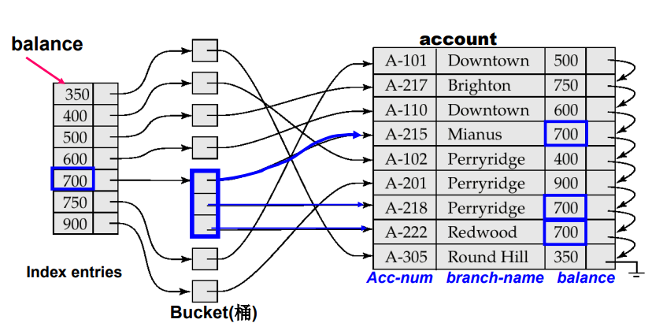</p>

    4. dense index (稠密索引):

        <p>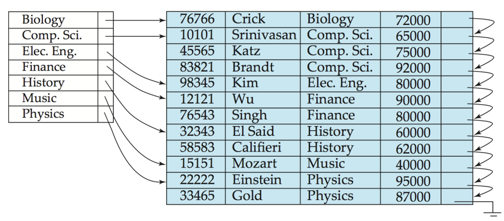</p>

       稠密索引：对于表格中相关属性的每个键值，都在索引中有所出现。

    5. sparse index (稀疏索引):

        <p>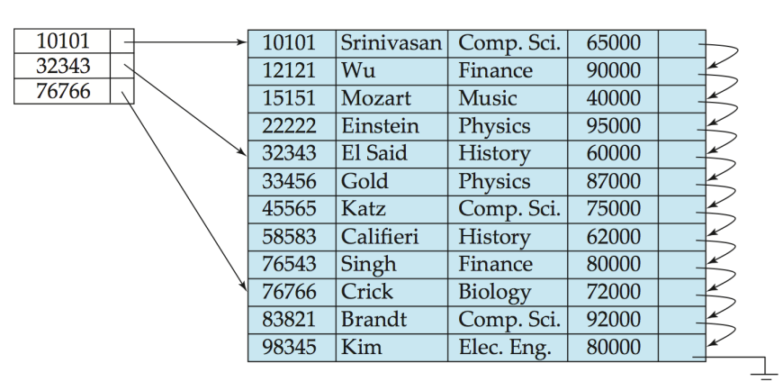</p>

        稀疏索引：对于表格中相关属性的每个键值，不一定索引中有所出现。

        如果目前有一个稀疏索引，想要找到对应的 tuple，则可以先根据稀疏索引找到一个大致的位置，然后往后一点一点搜索。

        注意：

        + 为了提高效率，设计时一般 sparse index 中一个值就指向一整个 block。

        + Sparse index 只能用于对应的顺序排序文件（不然没法找）；当然 dense index 则可以用于顺序和非顺序文件。

    6. multi-level index (多级索引):

        <p>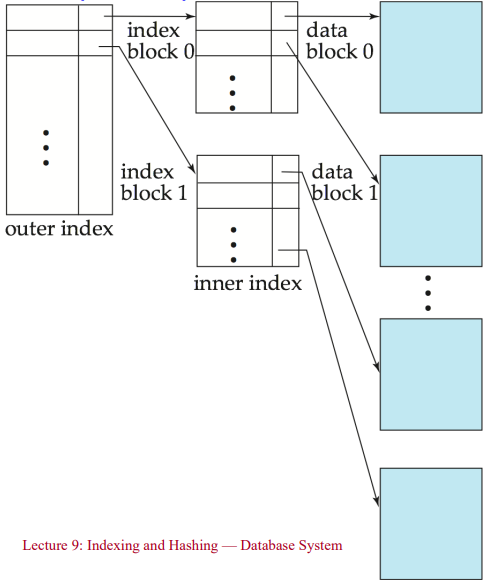</p>

+ Index Modification

    + Deletion

        考虑删除某条 record $R$ 并维护索引 $I$。
        
        如果 $I$ 是稠密索引：假设 $R$ 对应索引中的 $I_k$ 项。

        1. 假设 $I_k$ 只指向 $R$ 一个 record，删除 $I_k$ 及 $I_k \to R$。

        2. 假设 $I_k$ 指向包含 $R$ 在内的多个 record，且 $I$ 是辅助索引，则删除 $I_k \to R$ 这一指针。

        3. 假设 $I_k$ 指向包含 $R$ 在内的多个 record，且 $I$ 是主索引（此时未采取 bucket 处理重复！毕竟是主索引所以不怎么需要。），则不需要执行任何索引删除操作。除非 $R$ 对应了 $I_k$ 指向的第一个 record，此时 $I_k$ 需要指向下一个 record。

        如果 $I$ 是稀疏索引（当然只能是主索引）：

        1. 假设 $R$ 并未对应索引中的任何项，则直接删掉对应 record 后无事发生。

        2. 假设 $R$ 对应到了索引中的 $I_k$ 项，则把 $I_k$ 指向相邻的下一条 record。特别地，如果下一条 record 已经对应了索引中的 $I_{k+1}$ 项，则直接删除 $I_k \to R$ 的指针。

    + Insertion

        类似推一下？注意由于 index 是存在硬盘中的「block 单位」中的，有的时候一个 block 存不下当前的所有 index，就会开一个新的 block。此时称这个新声明的 block 为 overflow。随着时间的推移，可能会有一些 block 碎片产生（类似于磁盘碎片），所以需要定期整理这些存储 index 的 block。


### B+ Indexing Tree

<p>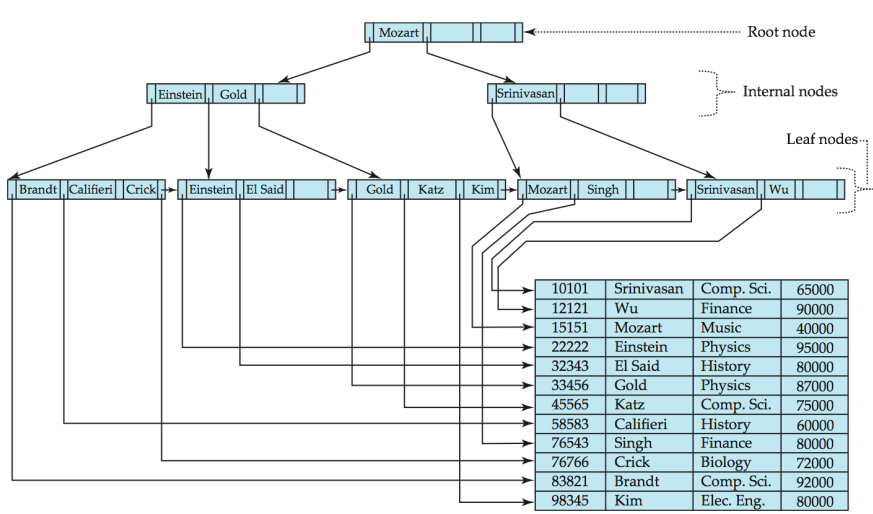</p>

熟练掌握 B+ 树的插入和删除！具体算法略去。

注意，对于一个 $n$ 阶的 B+ 树，非叶节点儿子数目应在 $\lceil\frac{n}{2}\rceil \sim n$ 之间；叶子所存放的值数量应在 $\lceil\frac{n-1}{2}\rceil \sim n-1$ 之间（此部分与 Wikipedia 定义一致）。

通过归纳可知，B+ 树的叶子节点一定深度相等。

为了提高效率，设计时一般让一个 B+ 树节点就对应一个 disk block（一般 4KB）。这种假设下一般 $n \approx 100$。

### Hashing Indices

+ Static Hashing

    <p>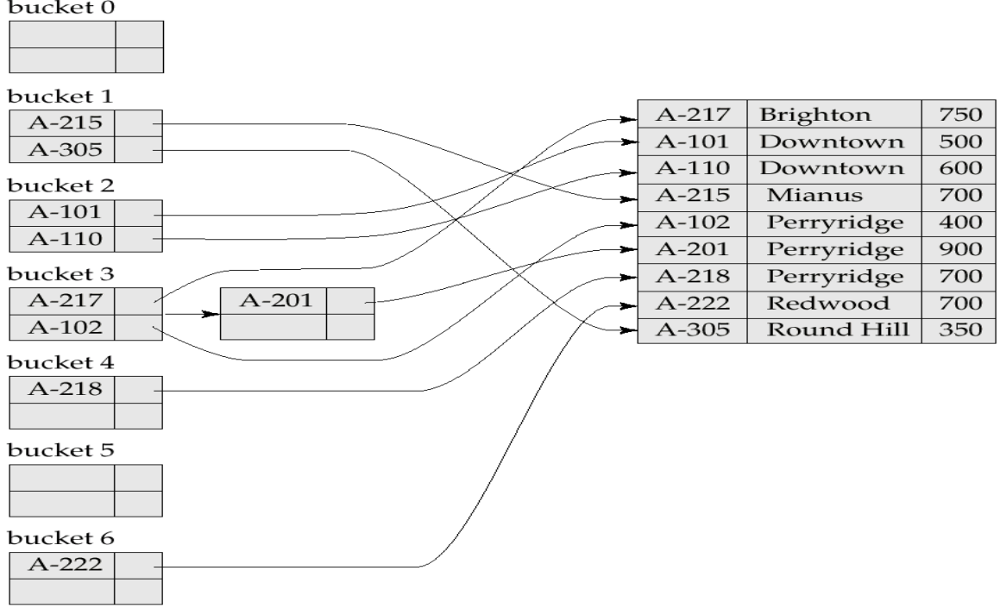</p>

    使用 bucket 来应对哈希冲突。

    偶尔，一个 bucket 可能还不够用（如上图 bucket 3）。bucket overflow 的时候则需要增加新的 bucket。
    
### Write-optimized Indices: LSM Tree

<p>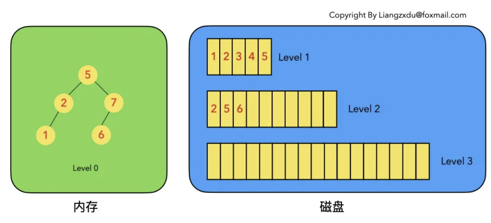</p>

参见 [知乎文章](https://zhuanlan.zhihu.com/p/415799237) 动态演示。基本思路是：

+ update 主要在内存里面捣腾，同时使用类似于 lazy tag 的机制来避免硬盘操作，内存修改积累到一定程度后，再写回到硬盘。

+ query 的话则比较暴力，先在内存里面找，找不到再去硬盘里面找（所以 LSM 适用于多写少查的场景）。

### Multiple-Key Access

考虑这样一个情景，我们希望根据多个 attributes 进行选择：

```sql
select account-number
from account
where branch-name = "Perryridge" and balance = 100
```

+ Using Indices on Single Attributes

    如果使用的仍然是基于单属性的索引，有两种思路完成多属性联合查询：
    
    1. 根据其中的一个属性索引查，然后一个个测试是否满足另外一个属性

    2. 使用两个属性索引查，查完之后存下来，最后求交

+ Using Indices on Multiple Attributes

    当然也有可能使用基于多属性的索引，在上面的例子中，即为 `(branch-name, balance)`。

    在查询 `branch-name = "Perryridge" and balance < 100` 时，这个索引依然会保持较高效率。

    但在查询 `branch-name < "Perryridge" and balance = 100` 时，这个索引的查询效率则会较低（更多的索引查找次数、由于调用 block 可能会访问更多的无关项）。

+ Bitmap Indices

    使用 bitmap 存储索引，类似于 one-hot 码：

    <p>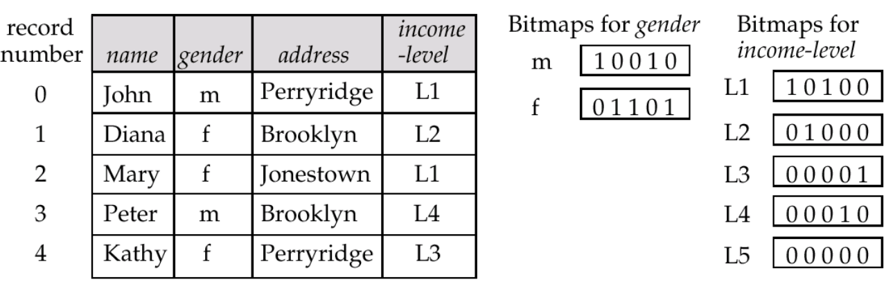</p>

    适用于 domain 较小的情况。查询时位运算即可。


## Lecture 10. Query Processing


### Overview

+ Basic Steps of Querying

    <p>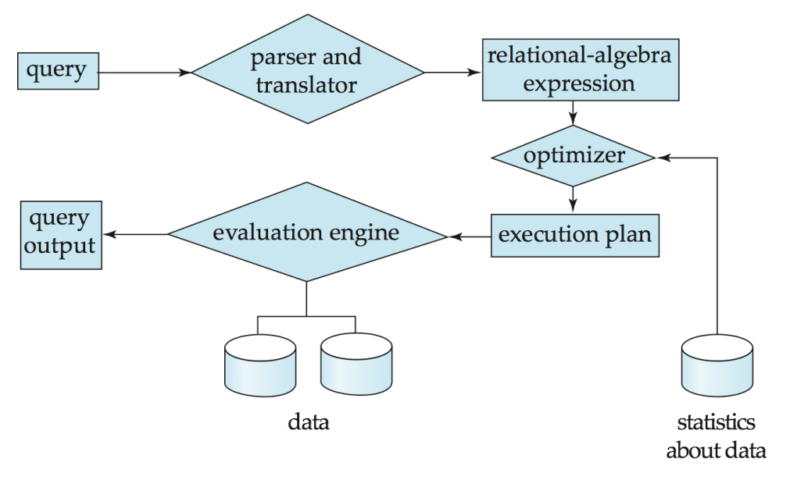</p>

    Execution plan 定义了「具体的查询方式、算法」，比如：

    <p>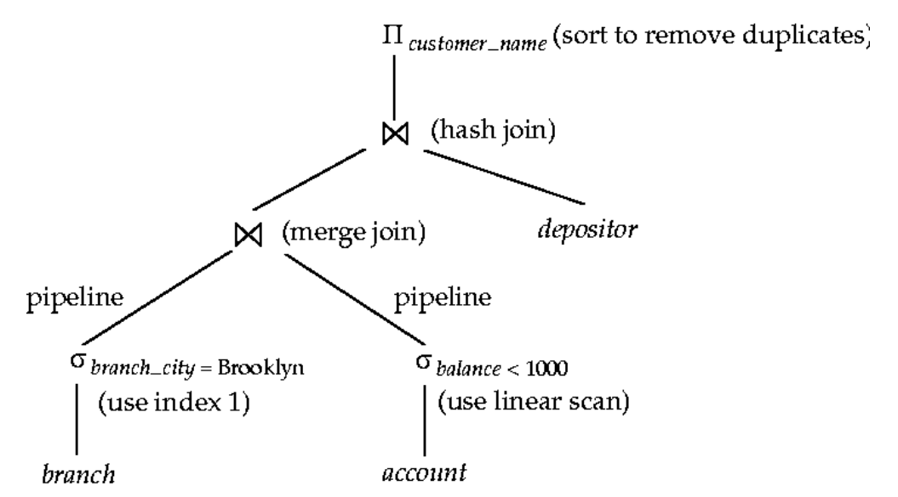</p>

    Optimizer 则意在优化某些查询操作。

    

### Query Efficiency Measurement

### Selection Operation

#### Basic Algorithms

+ A1. Linear Search

+ A2. Binary Search

#### Selections Using Indices and Equality

+ A3. Clustering Index, Equality on Key

    $\text{Cost} = (h_i+1)(t_T+t_S)$，其中 $h_i$ 表示索引树高。

+ A4. Index Scan [search key = primary index && search key is not candidate key]

    $\text{Cost} = h_i(t_T+t_S) +t_S +bt_T$，其中 $h_i$ 表示索引树高，$b=\lceil \frac{sc(A,r)}{f_r}\rceil$ 表示抽取出来的 block 数目。

+ A5.