+++
title = '【笔记】数据库系统 (Part IV)'
date = 2024-05-01T07:07:07+01:00
+++

## Lecture 12. Transaction

### 12.1 Transaction Basics

+ Transaction 是不可再分的数据库操作

    ACID 原则：Atomicity / Consistency / Isolation / Durability

+ Transaction 执行状态

    <p>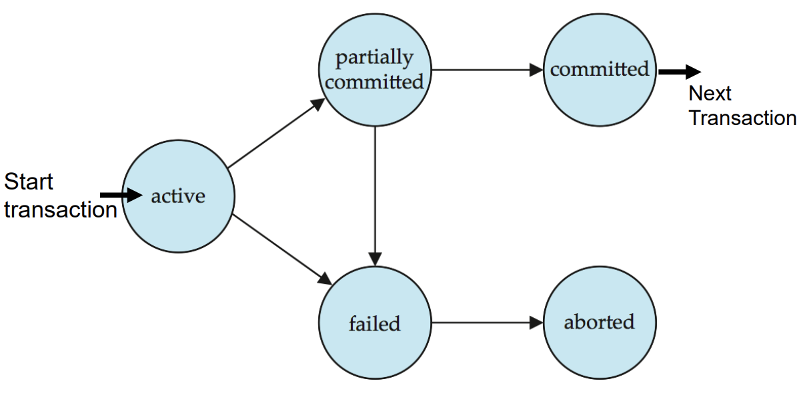</p>

+ 介绍一种非常笨重的 ACID 维持方法：Shadow-Database Scheme

    每次 transaction 之前都先拷一整个出来。

    <p>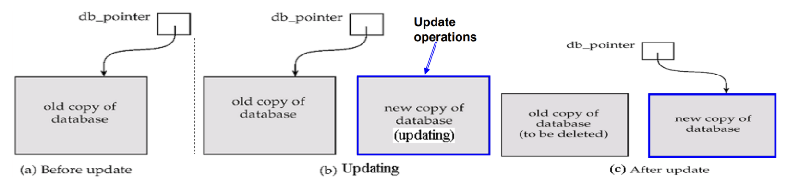</p>

### 12.2 Schedules 调度

考虑两个 transaction $T_1, T_2$：

<p>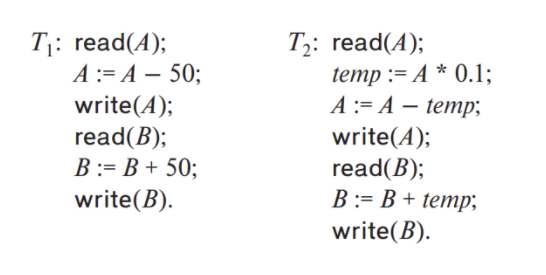</p>

+ Schedule 1 & Schedule 2 (Serial)

    <p>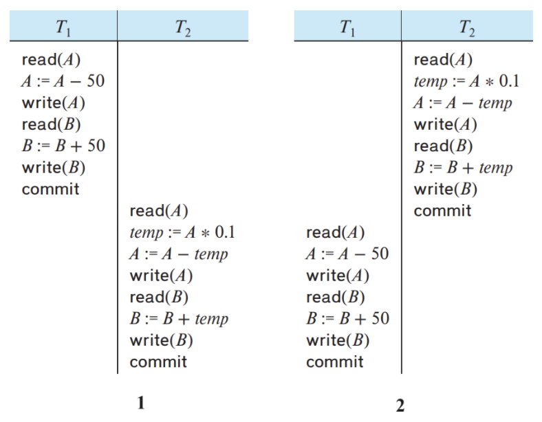</p>

    Serial schedule 意为，在「时间轴」上，每个事务互不穿插。显然，在 serial schedule 下，事务的 consistency 可以得到保证。
    
    但是串行调度较为低效，为此我们需要并行调度。

+ Schedule 3 & Schedule 4 (Concurrent)

    <p>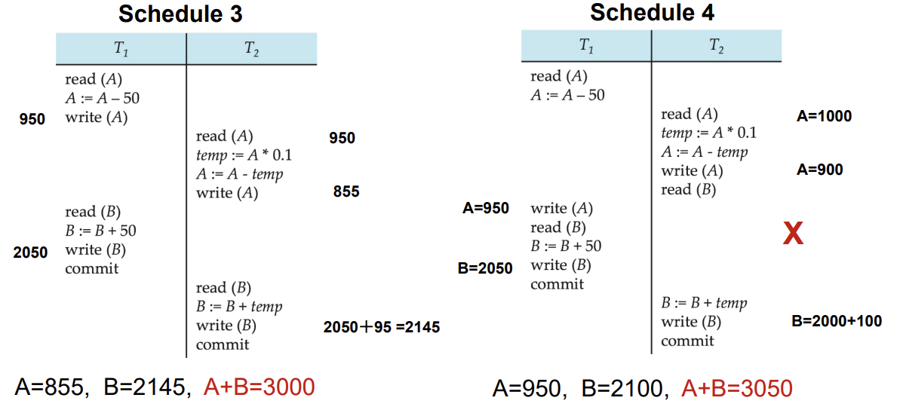</p>

    如果在「时间轴」上事务相互穿插，我们认为这种调度是并行的。
    
    观察可以发现，schedule 4 破坏了事务的 consistency。因为最后 $A+B$ 的值发生了改变。这是一种不好的调度。


### 12.3 Serializability 串行化

从 schedule 4 可以看出，不是每种并行调度都是好的，因为 consistency 可能遭到破坏。但是我们知道，所有的串行调度都可以保证 consistency，所以我们有了一个评判并行调度的标准，**即看它是否可被串行化**。

+ Conflict Serializability

    考虑事务 $T_i,T_j$ 中的指令 $I_i,I_j$。$I_i$ 和 $I_j$ 是冲突的，当且仅当它们同时访问某个数据 $Q$，并且 $I_i$ 和 $I_j$ 至少一者尝试 write $Q$。

    显然，若 2 个指令是有冲突的，则二者的相对执行次序是不可变更的；若 2 个操作不冲突，则可以变更。

    如果一个调度 $S$ 可通过一系列的合法交换（交换后所有冲突指令相对次序不变）变为 $S'$，我们认为它们 **冲突等价**。如果 $S$ 和某个串行调度冲突等价，则称 $S$ **冲突可串行化 (conflict serializable)**。

    例如，下面 schedule 3 可被冲突串行化为 schedule 6。可以看到两个 write(A) 和 write(B) 的相对次序都没有发生改变。

    <p>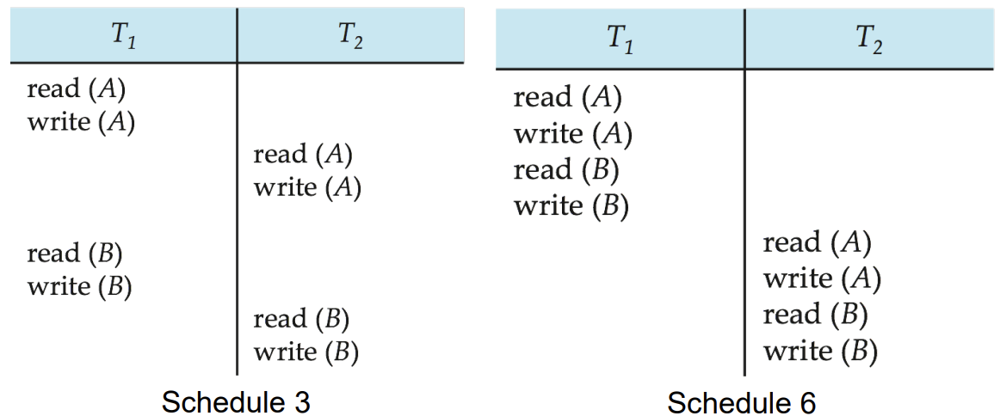</p>

    例如，下面的 schedule 不是冲突可串行化的。

    <p>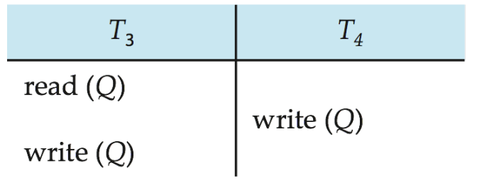</p>

+ View Serializability

    View Serializability 比 Conflict Serializability 更松，所有 conflict serializable schedule 一定是 view serializable schedule。反之不然。

    $S$ 和 $S'$ **视图等价**，当且仅当对于每一个数据 $Q$，满足：

    1. 【首读】在 $S$ 和 $S'$ 中，如果有「$T_i$ 读取 $Q$ 的初值」的指令，那么在 $S'$ 中对应指令也必须是「$T_i$ 读取 $Q$ 的初值」；

    2. 【写读】如果在 $S$ 中有「$T_i$ read $Q$ produced by $T_j$'s write」的指令，那么在 $S'$ 中对应指令也必须是「$T_i$ read $Q$ produced by $T_j$'s write」；

    3. 【末写】在 $S$ 和 $S'$ 中，**最后一个** 写 $Q$ 的事务相同。

    下面是一个 view serializable 但不 conflict serializable 的例子：

    <p>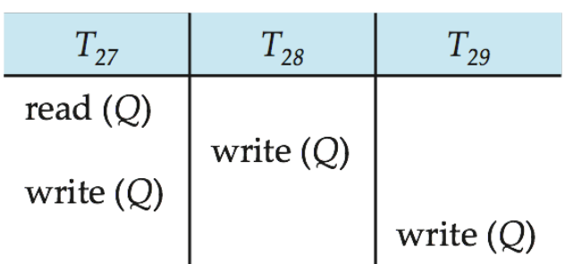</p>


### 12.4 Recoverability 可恢复性

12.1 中提及，事务可能成功 commit，也有可能失败 abort & rollback。接下来我们关注一个 schedule 是否是 recoverable 的。

+ Recoverable Schedule

    对于 recoverable schedule，如果发生了「$T_i$ read $Q$ produced by $T_j$'s write」的情况，那么 $T_i$ 的 commit 必须发生在 $T_j$ 的 commit 之后。下图不是一个 recoverable schedule。

    <p>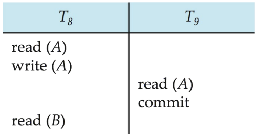</p>

    考虑如果 $T_8$ 需要 abort，那么理所当然的，$T_9$ 也需要 abort（因为它读入了需要被回滚的 $A$ 值）。然而，在上图中 $T_9$ 已然 commit，这就是一个 unrecoverable 的 schedule。

+ Cascading Rollbacks

    如果某个事务 abort，将有可能导致级联回滚。例如，下图中 $T_{10}$ abort 会导致 $T_{11},T_{12}$ 均被回滚。

    <p>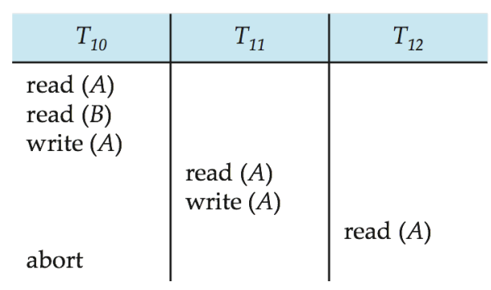</p>

+ Cascadeless Schedule

    比 recoverable schedule 更严格，cascadeless schedule 一定是 recoverable schedule。

    对于 cascadeless schedule，如果发生了「$T_i$ read $Q$ produced by $T_j$'s write」的情况，那么 $T_j$ 的 commit 必须发生在 $T_i$ 的 read 之前。此种 schedule 除了满足可恢复性，同时，当一个事务被 abort，**它永远不会导致级联回滚**。

### 12.5 Testing for Serializability: Precedence Graph

*接下来主要考虑 conflict serializability。*

一个点表示一个事务，一条边表示一个冲突关系。我们画一条 $T_i \to T_j$ 的边，当且仅当 $T_i,T_j$ 中存在冲突指令 $I_i,I_j$，并且 $I_i$ 在 $I_j$ 之前被执行。

<p>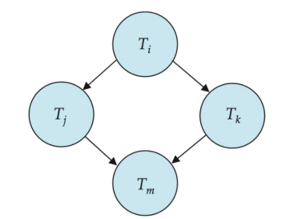</p>

Precedence graph 的拓扑序揭示了某种合法的串行化方案。例如上图一种合法的串行方案为 $(T_i,T_j,T_k,T_m)$。当然，如果存在环，则不可串行化。


---

## Lecture 13. Concurrency Control

### 13.1 Lock-Based Protocols

+ 共享锁、排它锁

    1. Exclusive (X) mode: 当一个事务对数据 $Q$ 上了 X-Lock，则该事务可以读写 $Q$；但其他事务不能读或写 $Q$。

    2. Shared (S) mode: 当一个事务对数据 $Q$ 上了 S-Lock，则该事务可以读 $Q$；但其他事务可以读 $Q$，不能写 $Q$。

    Lock-compatibility matrix: 一个数据可以同时被加上多个 S 锁，但不能同时具有 X, S 锁或多个 X 锁。

    <p>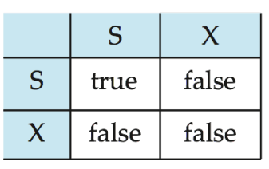</p>

    例子：

    ```
    lock-S (A);
    read (A);
    unlock (A);
    lock-S (B);
    read (B);
    unlock (B);
    display (A+B);
    ```

+ Automatic Acquisition of Lock

    用伪代码的形式呈现获取 S 锁和 X 锁的过程。

    1. read(D)

        ```
        if Ti has a lock on D then
            read(D) 
        else begin
            if necessary wait until no other transaction has a lock-X on D then
                grant Ti a lock-S on D;
                read(D)
        end
        ```
    2. write(D)

        ```
        if Ti has a lock-X on D then
            write(D)
        else begin
            if necessary wait until no other trans. has any lock on D
                if Ti has a lock-S on D then upgrade lock on D to lock-X
                else grant Ti a lock-X on D
                write(D)
        end
        ```

+ Deadlock 死锁

    考虑如下的情形：

    <p>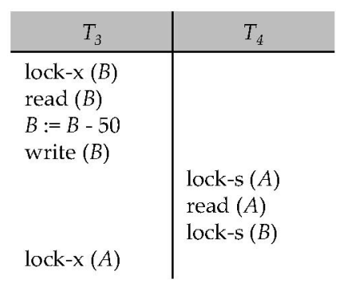</p>

    注意最后两行，$T_4$ 想给 B 上 S 锁，但是得等 $T_3$ 放开它对 B 上的 X 锁；$T_3$ 想给 A 上 X 锁，但是得等 $T_4$ 放开它对 A 上的 S 锁。

    然后两者互相等待对方 unlock，谁也没有等到谁，造成死锁。

+ 2-PL Protocol 二阶段锁协议【IMPORTANT】

    <p>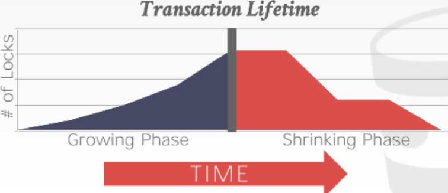</p>

    对于每个事务，其会给各种数据上锁 / 解锁。二阶段锁协议要求，每个事务在上锁 / 解锁的过程中，必须满足：所有上锁完成后，再进行所有解锁。

    + 锁最多的时刻称为 lock point

    + 2-PL 并不一定能防止 deadlock

    + 第一阶段可以：加 S 锁 / 加 X 锁 / S 锁升级为 X 锁；
    
      第二阶段可以：去 S 锁 / 去 X 锁 / X 锁降级为 S 锁。
    
    + 例题

        <p>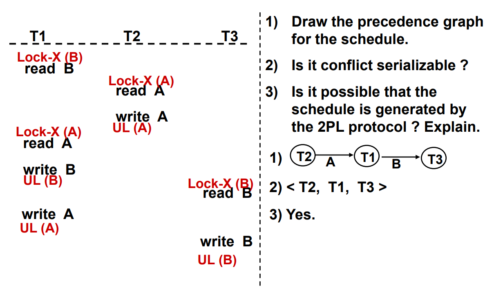</p>

+ Tree Protocols (Graph-Based Protocol 的特例)

    与 2-PL 类似，也是一种锁协议。

    <p>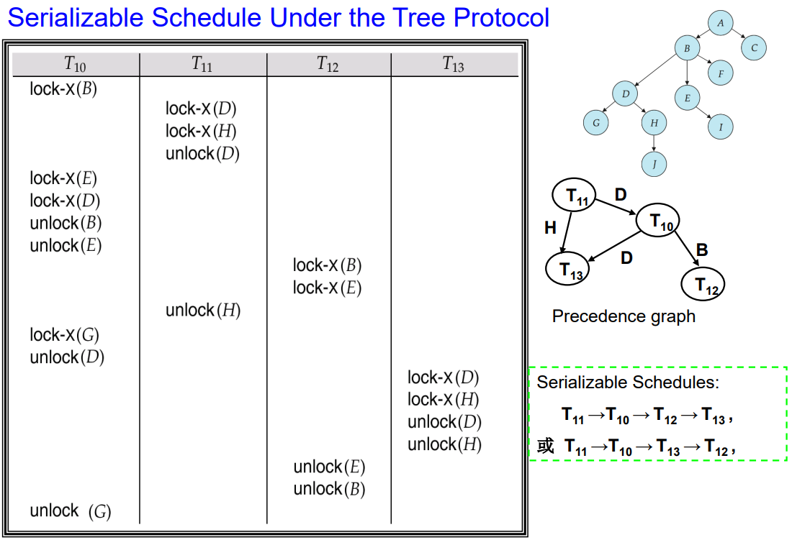</p>

    1. **Only exclusive locks** are allowed.
    2. The **first lock** by $T_i$ **may be on any data item**. Subsequently, a data $Q$ can be locked by $T_i$ only if the **parent** of $Q$ is currently locked by $T_i$.
    3. Data items **may be unlocked at any time**.
    4. A data item that **has been locked and unlocked** by $T_i$ **cannot subsequently be relocked** by $T_i$.

    可以证明，树协议满足以下特性：

    + 冲突可串行化
    + 避免死锁

    相比 2-PL，树协议可以使得 unlock 发生得更早，但它不保证 recoverability。


+ Lock Manager: Lock Table 

    使用一个 lock table 来充当 lock manager 的角色。其中白色矩形表示某个具体的 data item (I7, I23...)，每个 data item 牵出一条链表。链表上蓝色表示锁请求：深蓝表示 lock table grant 了该次锁请求，浅蓝表示 lock table 要求请求的事务进行等待。*（为简化图，暂不在图上区分 X 和 S 锁）*

    注意所有 data item 被存在一个使用 overflow chaining 实现的哈希表上。图上 I7 和 I23 的哈希值相同。

    <p>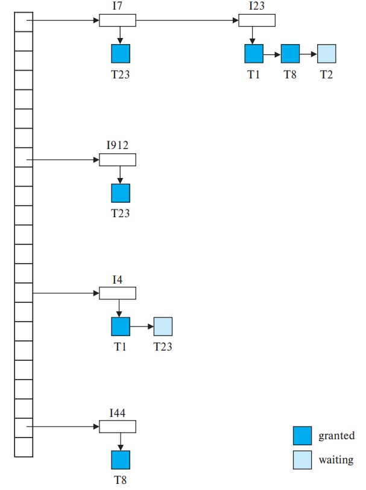</p>

    1. 当一个事务请求锁，则把它放到对应的 data item 链表尾。检视链表前方，如果满足「前方所有请求均已被 grant」和「前方所有锁和本次请求锁兼容」则 grant，否则要求其 wait。

    2. 当一个事务解除锁，则把表示其请求的对于「蓝色框」从链表中清除。同时依次检视其后方，看能否让 waiting request 变为 granted request。


+ 理解、总览、碎碎念

    1. 再次强调，不管是 2-PL 还是 Tree Protocol，他们都只是对于 **单个 transaction** 而言运作的（进行 lock plan 的时候，只会关注单个 transaction）。
    
    2. 【工作流】对于每个 transaction，首先根据 2-PL（或 Tree Protocol 等其它锁协议）生成满足条件的「instruction（例题图黑色部分） + lock action（例题图红色部分）」组合，然后经过 lock manager 被执行。

        注意，在一个 transaction 执行过程中（这个过程可能持续数秒），也可能有另外的 transaction 穿插其中，这就导致了所谓的并行。lock + lock manager 保证了，变量不会被同时违规访问；2-PL lock + lock manager 保证了，如果这些所有事务都能顺利结束，那么执行的结果一定是 **一致的**。
        
        当然 2-PL 不一定保证所有事务能顺利结束，如果穿插的结果不是很理想，也可能陷入死锁。

    3. 冲突可串行化只保证了结果的连续性，并不一定能保证最后的结果就是用户所想要的。如果用户希望获得这几条 transaction 按照某种顺序执行后的结果，那他就不应该让这几条 transaction 在短时间内输入（以致于被并行处理）。

### 13.2 Timestamp-Based Protocols

Protocol 的目标一般是使得生成的 schedule 一定可被冲突可串行化。我们介绍一种另外的达成此目标的 protocol，它基于「时间戳」。

和之前的不一样，当用时间戳来做协议时，我们不再 **借助锁来确保 schedule 冲突可串**。而是借助时间戳。

对于 transaction $i$，时间戳 $TS(i)$ 定义为该事务进入系统的时间。这个定义保证了，不同事务的时间戳一定不同（保证冲突可串有用）。定义一个 data item $Q$ 的读时间戳 $RTS(Q)$ 为 **截至当前** 所有读过 $Q$ 的事务的时间戳的 max；写时间戳 $WTS(Q)$ 为 **截至当前** 所有写过 $Q$ 的事务的时间戳的 max。

直接开始并发各事务：

+ 假设当前事务 $T_i$ 要执行一个读 $Q$，则必须满足 $TS(i) \ge WTS(Q)$ 才允许读取；
+ 假设当前事务 $T_i$ 要执行一个写 $Q$，则必须满足 $TS(i) \ge WTS(Q), TS(i) \ge RTS(Q)$ 才允许写入；
+ 反之，直接回滚 $T_i$；
+ 注意，随着各指令的条条推进，$WTS(Q), RTS(Q)$ 是不断更新的。

在这种协议下，precedence graph 一定是 TS 小的事务指向 TS 大的事务。这保证了 precedence graph 是无环的，对应的 schedule 冲突可串。

下图中，$T_1 \sim T_5$ 的时间戳分别为 $1, 2, 3, 4, 5$。

<p>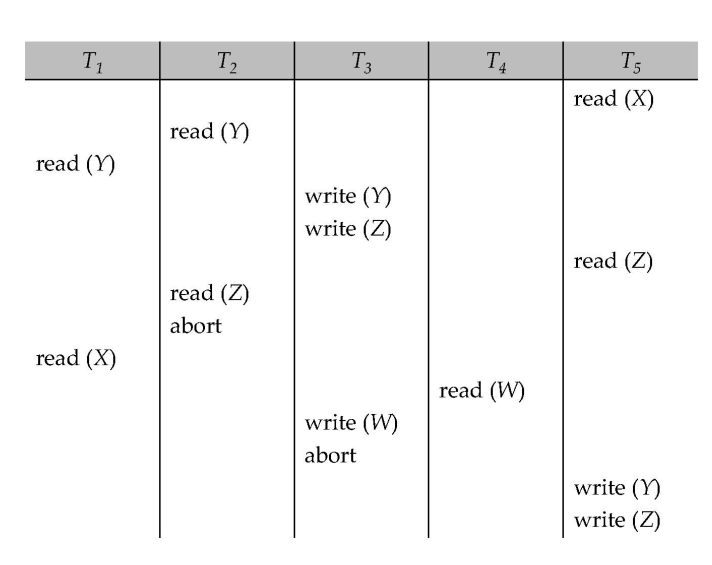</p>

### 13.3 Lock: Multiple Granularity

之前加锁一直是针对某一个 data item —— 这样其实有点麻烦，比如有的时候我们想直接锁掉一个表。

为此，我们可以为锁加上不同的「粒度」。整个数据库的结构可以看成一棵树，加上不同「粒度」之后我们可能不再一定锁 leaf node，也可能锁 internal node。

<p>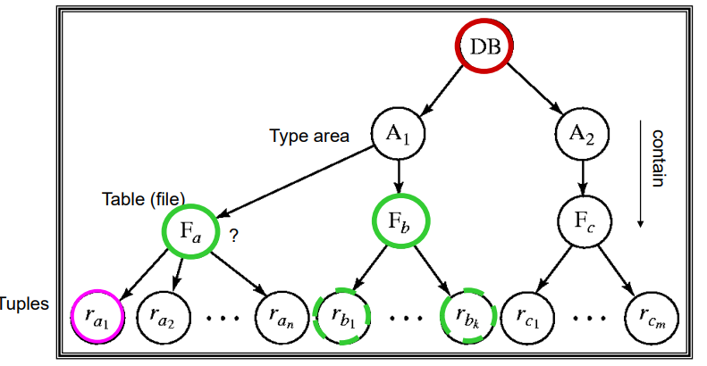</p>

新增三种锁：

+ IS：共享型意向锁。表明其后代存在 S 锁。
+ IX：排它型意向锁。表明其后代存在 X 锁。
+ SIX：SIX = IX + S。如果一个节点即被上了 S 锁，也被上了 IX 锁，则会变成 SIX 锁。

仍然，**一个事务在一个点上最多加一个锁**。思考一下不难发现，我们只需要 SIX 锁这一种「复合锁」特例。一个例子如下：

<p>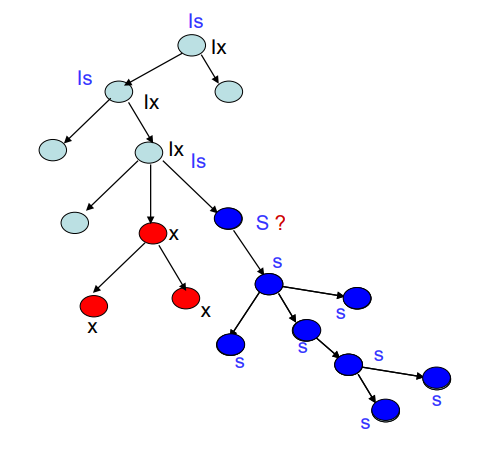</p>

新增三种锁后的兼容性矩阵如下。事务 $i$ 在节点 $N$ 插入锁的时候，只需要对 tree $i$ 的 $N$ 节点加锁，然后依次更新 tree $i$ 路径 $N \to root$ 上所有结点的锁，并检查这条路径上所有结点的锁是否兼容即可。

<p>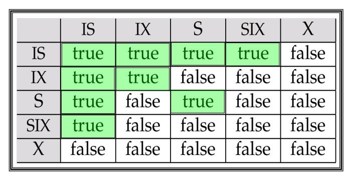</p>

### 13.4 Deadlock Handling

+ Deadlock Prevention

    1. 使用保守二阶段锁 (conservative 2-PL)。

        在 2-PL 的基础上，要求获取所有锁之后，再执行全部指令，再解开所有锁。并发度会降低。

    2. 使用 graph-based protocol (如 tree protocol)。

+ Deadlock Detection

    使用 wait-for graph。图中 $T_i \to T_j$ 表示事务 $i$ 在等事务 $j$ 放锁。检测环是否存在即可。

    <p>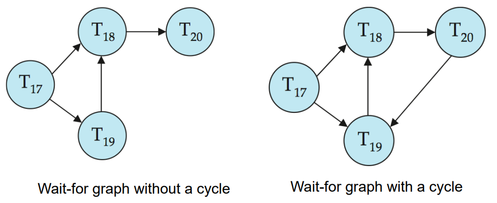</p>

+ Deadlock Recovery

    回滚。分为 total rollback 与 partial rollback。


---

## Lecture 14. Recovery

### 14.1 Introduction

+ Failure Types

    1. Transaction Failure (e.g. overflow, data not found...)

    2. System Crash

    3. Disk Failure

+ Recovery Algorithm Paradigm

    1. Actions taken during normal transaction processing to ensure enough information exists to recover from failures

    2. Actions taken after a failure to recover the database contents to a state that ensures consistency

+ Storage Structure

    + Data Copies on Disks

        Recovery 的一个直觉想法是，在多个 disk 上放多个 data copies。

        假设有两个 disk，每个 disk 上存了一份 data copy。当发生错误时，首先找到所有的「对应两份拷贝不同」的 block，然后分别检查 checksum，用对的那个覆盖错的那个；如果两个 checksum 都有误，用第一个覆盖第二个。

    + Data Access

        Recovery 很大关系上和存储的方式有关。接下来约定一二级存储上的存储范式。

        `read(X)` 指将数据库中的值 X 读取进某一个临时变量中。可能会调用 `input(B)`（将 block B 从硬盘搬到内存）。

        `write(X)` 指将某一个临时变量的值赋给数据库中的值 X。可能会调用 `output(B)`（将 block B 从内存搬到硬盘）。

        下图展示了这一过程。更多有关存储模式的信息参见 Part 3 - Lecture 8 - Storage Access。

        <p>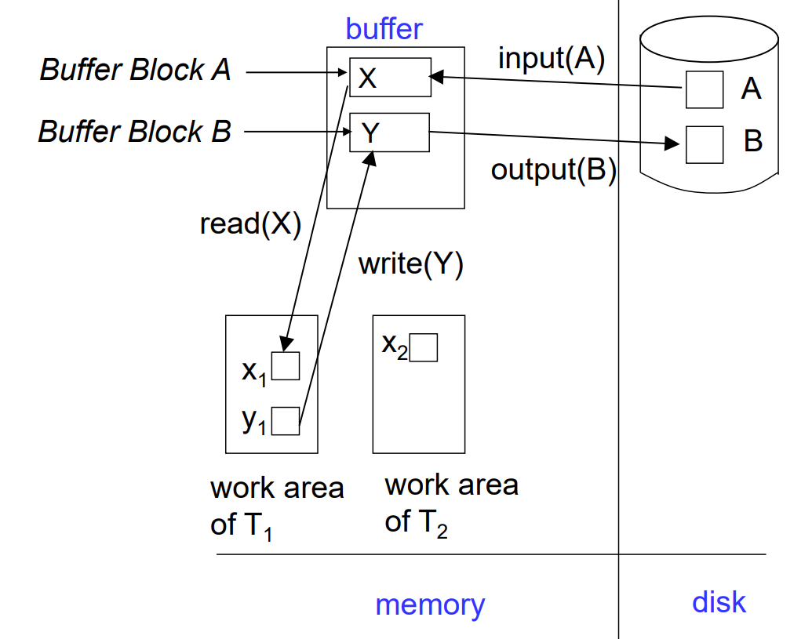</p>

### 14.2 Log-Based Recovery

+ Log File Example

    ```
    <T1 start>
    <T1, A, 100, 200>
    <T2 start>
    <T2, B, 300, 400>
    <T3 start>
    <T1, C, 500, 600>
    <T1 commit>
    <T3, C, 600, 700>
    <T3, C, 700, 800>
    <T3 commit>
    <T2, C, 800, 900>
    <T2, B, 400, 500>
    ```

    其中 log `<Ti, X, A, B>` 表示事务 $T_i$ 将数据 $X$ 由 $A$ 改为 $B$。

    log 的格式如上所述，实际在执行时事务时，由于执行模式的不同，通过 log 恢复数据库的方式也不同。执行模式分为 Deferred database modification (延迟修改) 和 Immediate database modification (即时修改)。

    *接下来注意一个前提：从 buffer 到 disk 的 output 是否发生是不可预料的（由 buffer pool manager 决定），所有的修改若已发生都只是 write to buffer，而不一定被 output to disk。*

+ Recovery Method of Deferred Database Modification

    延迟修改意为，事务中途产生的修改 **不立即生效**，只有在该事务 **commit 之后才生效**。这是一种比较理想的修改方式，实际中可能不总是能做到。
    
    考虑如下的三种 crash 情况（什么时候 log 停表示什么时候发生 crash；注意 log 的 A 值均被隐去，这是因为这种执行模式下我们做恢复不需要 old value）：

    <p>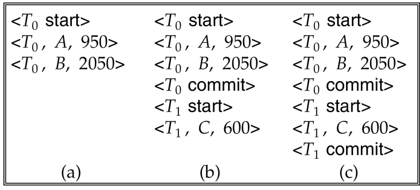</p>

    + a. 不需要采取任何措施。
    
        因为没有 commit，数据库仍未修改。

    + b. 需要 $redo(T_0)$。
    
        按照 log 来说，$T_0$ 的修改应当生效，$T_1$ 的修改应当无效。
        
        注意，虽然 $T_0$ 已被 commit，这只意味着 `<A, 950>` 和 `<B, 2050>` 被写入了 buffer，并不一定被写入 disk，所以我们仍需要做 redo。

        当然，我们不需要管 $T_1$，因为它一定还没有生效。

    + c. 需要 $redo(T_0), redo(T_1)$。

        和 b 类似，不再赘述。

+ Recovery Method of Immediate Database Modification

    即时修改意为，事务中途产生的修改 **立刻生效**。注意每条 log 的产生需要先于对应的 write。一个示例如下：

    <p>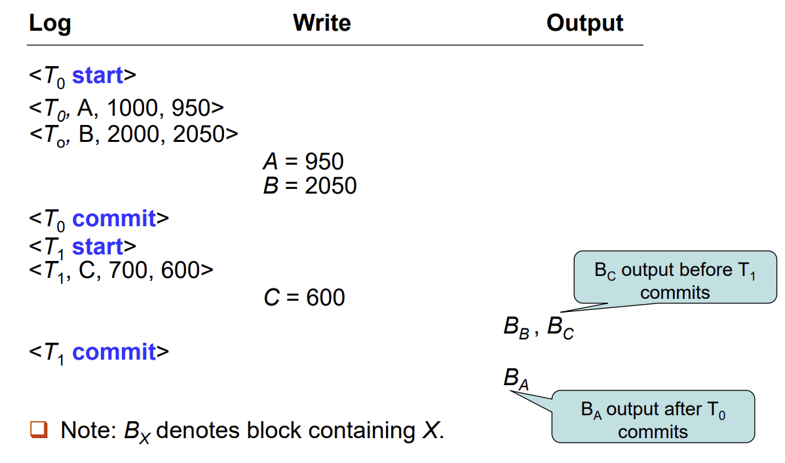</p>

    再次，考虑如下的三种 crash 情况：

    <p>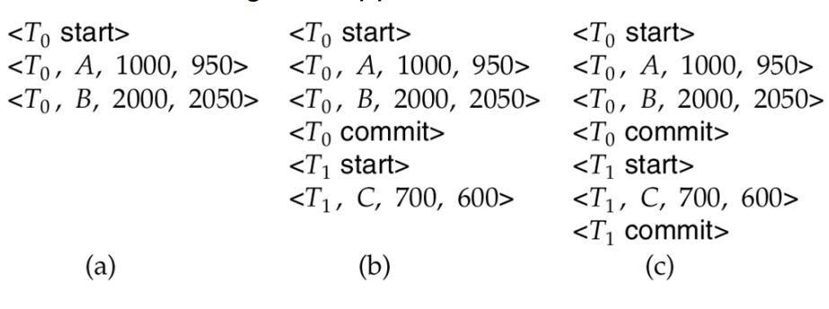</p>

    + a. 需要 $undo(T_0)$。

        在这种修改模式下，`<A, 950>` 和 `<B, 2050>` 的 write 均可能发生，并且 output to disk 也有可能发生。为了万无一失，我们需要依次将 B 恢复为 2000、A 恢复为 1000。

        此外，我们需要向日志后依次加入 `<T0, B, 2000>`、`<T0, A, 1000>`、`<T0, abort>` (这也是省略了 old value 的日志表达)。如果不加的话，原来的日志表示的是 A 被成功改为 950，B 被成功改为 2050，这和 recovery 的实际不符。

    + b. 需要 $redo(T_0),undo(T_1)$。

        显然，`<A, 950>` 和 `<B, 2050>` 的 write 一定已经发生，不过 output to disk 可能还未发生。所以我们需要 redo。

        undo 部分与 a 同理，不再赘述。

        此外，我们需要向日志后依次加入 `<T1, C, 700>`、`<T1, abort>`。注意 $T_0$ 的部分不需要补偿日志。

    + c. 需要 $redo(T_0),redo(T_1)$。

        和 b 同理，不再赘述。

        不需要补偿日志。

+ Checkpoints

    如果我们从上古时期开始记载 log，难道 redo 也必须从上古时期开始吗？显然不是。在上面的例子中，所有第一条 log 之前实际上都隐藏着一个 checkpoint。
    
    一个 checkpoint 意味着在此之前的所有更新都已经同步到 disk。所以说，**我们无需考虑任何一个完全在 checkpoint 之前的事务恢复**。更具体地，checkpointing 需要做的是：

    1. Output all log records currently residing in main memory onto stable storage.
    2. Output all modified buffer blocks to the disk.
    3. Write a log record `<checkpoint L>` onto stable storage where $L$ is a list of all transactions active at the time of checkpoint. ($L$ 是惨遭切断的事务)

    <p>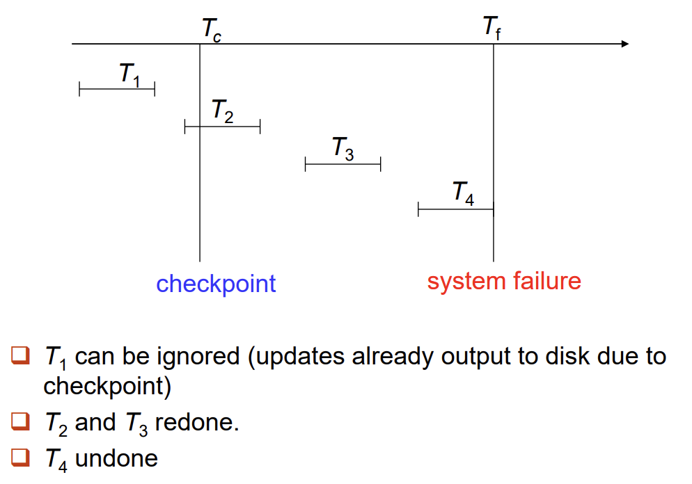</p>

+ Detailed Implementation

    更具体一点是怎么实现的呢？我们以 Immediate Database Modification 为例进行演示：

    <p>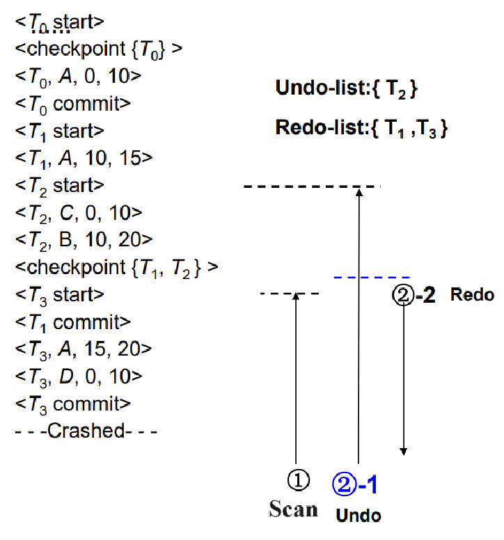</p>

    + Step 1. Scan. 从 crash 扫描到上一个 `<checkpoint L>`，如果发现 `<Ti commit>`，将其加入 redo list。如果一个事务在 $L$ 中或者在  `<checkpoint L>` 之后开始，但不在 redo list，将其加入 undo list。

    + Step 2-1. Undo. 逆序执行 undo list 中所有事务的逆指令。直到全部执行完成。

    + Step 2-2. Redo. 跳到 `<checkpoint L>`，顺序执行 todo list 中所有事务的指令。直到所有均被 commit。

### 14.3 Buffer Management

+ Log Record Buffering

    首先，log record 并非一出现就写入 stable storage —— 和普通的数据一样，他也是先在 buffer pool 中待一会儿，等到特定的时机（如 block 写满 / checkpoint 发生）再统一写入 stable storage。

    关于 log 的 buffering 有如下规则：

    1. log 输出到硬盘的顺序必须和其产生的顺序相同。
    
    2. 在 log `<Ti commit>` 输出到硬盘之后，事务 $T_i$ 才允许进入 commit state。

    3. 在某一条更新 $upd$ log 输出到硬盘之后，$upd$ 才允许被输出到硬盘。

    2,3 体现了 write-ahead logging (WAL) rule。关于 3 的解释，回顾这张图。

    <p></p>
    
    对于 3，考察 (a)：如果某个 $upd$ 先输出到硬盘的话，可能 crash 发生时 $upd$ log 还未进入硬盘（比如我们看不到 `<T0, B, 2000, 2050>`）。此时在硬盘中 B 已经被改为 2050，但我们在日志中没有找到，所以也无法彻底地 undo！

+ Database Buffering

    成熟的 recovery algorithm 支持以下 policies：

    + No-force Policy: Updated blocks need not be written to disk when transaction commits.

    + Steal Policy:  Blocks containing updates of uncommitted transactions can be written to disk even before the transaction commits.

    <p>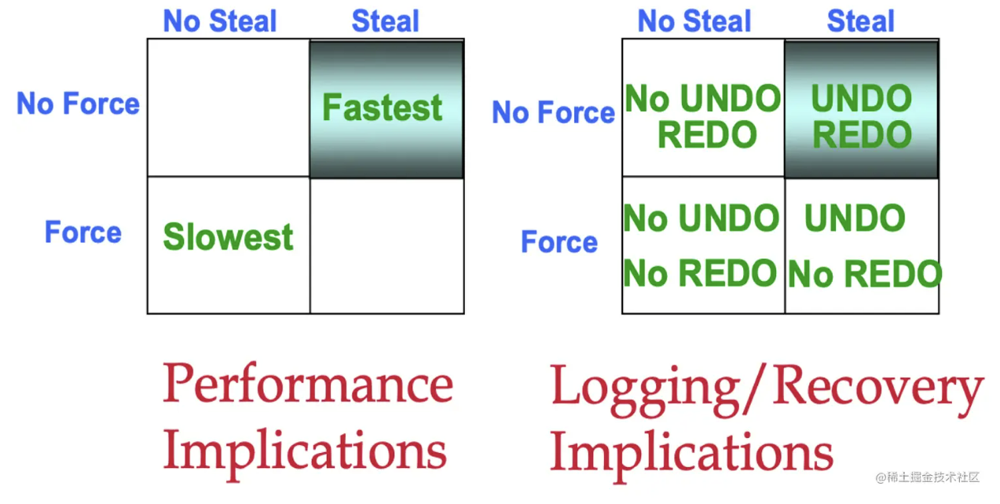</p>

### 14.4 Advanced Recovery Techniques

+ Logical Undo

    之前的日志都属于「物理日志」，现在我们采用「逻辑日志」：即，日志记录某个指令的具体含义。其格式为：

    1. 当指令开始时，记录 `<Ti, Oj, operation-begin>`。注意 $O_j$ 并不表示某个数据，而是 operation identifier。

    2. 记录一般的物理日志。

    3. 当指令结束时，记录 `<Ti, Oj, operation-end, U>`。其中 $U$ 是 2 中操作的逆（逻辑形式）。

    原来的物理日志只包含 2，现在的逻辑日志包含 1~3。如此一来，在 undo 时，我们关注目前记录下的 log：

    + 如果有 `<Ti, Oj, operation-end, U>`，说明这个指令保有了完整的逻辑日志记录。我们直接执行 $U$ 即可。
    
    + 如果没有 `<Ti, Oj, operation-end, U>`（比如只有  `<Ti, X, operation-begin>`、或者啥都没有），说明这个指令并未保有完整的逻辑日志记录。我们仍然像原来一样 undo 物理日志。
    
    一个示例如下：

    <p>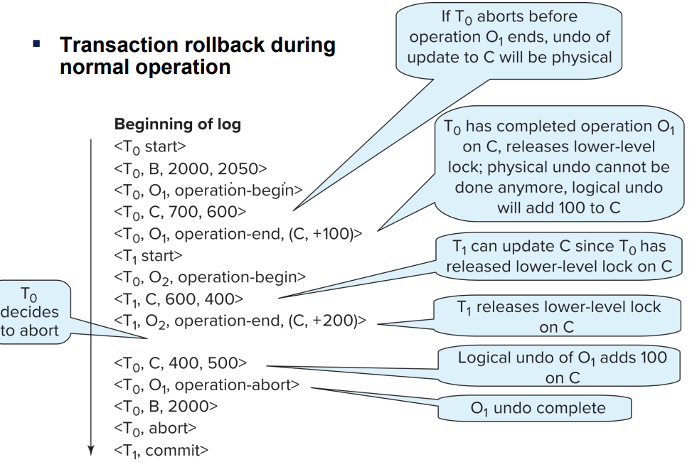</p>

    不难看出，logical undo 的好处在于，当只有某个事物需要回滚时，他不会牵连到其它「无辜」的事务。如果采用 physical undo，在上图的情形下，必须级联回滚。

    注意，从 logical undo 中也可以看出 **rollback 时仍然记录日志** 的重要性：
    
    + 例如 `<T0, C, 400, 500>`，它是 logical undo 的补偿日志。假如说这执行完这一条 logical undo 之后再次发生 crash，我们如果要重新进行 rollback，则应当先将 C physical undo 为 400，在将其 logical undo 为 500。假如我们已经将 C 改为 500 却没有 `<T0, C, 400, 500>`，后面重新 logical undo 的时候就会将 C 改为 600，造成错误。

+ Fuzzy Checkpointing

    基本思想是只懒惰地标注一个 checkpoint，但不实际做 checkpointing。
    
    等到系统空闲下来之后，再去做之前的那些「只标注却没有实际做的」 checkpoint。

    恢复时恢复到最近的实际做的 checkpoint 即可。

### 14.5 ARIES

主要维护的三个 LSN：

+ pageLSN (for REDO): 对于某个 page，最新一个修改它的 log 的 LSN。

+ recLSN (for REDO): 对于某个 page，最久一个修改它的 log 且未被写入 disk 的 LSN（意味着 recLSN 之前的修改全部被写入 disk）。

+ lastLSN (for UNDO): 对于某个 transaction，它最新一次具有更新功能的 log 的 LSN。

`<Checkpoint L>` 记录了：

+ Dirty Page Table

+ Active Transaction List (and their lastLSN)

3 Pass of ARIES：

<p>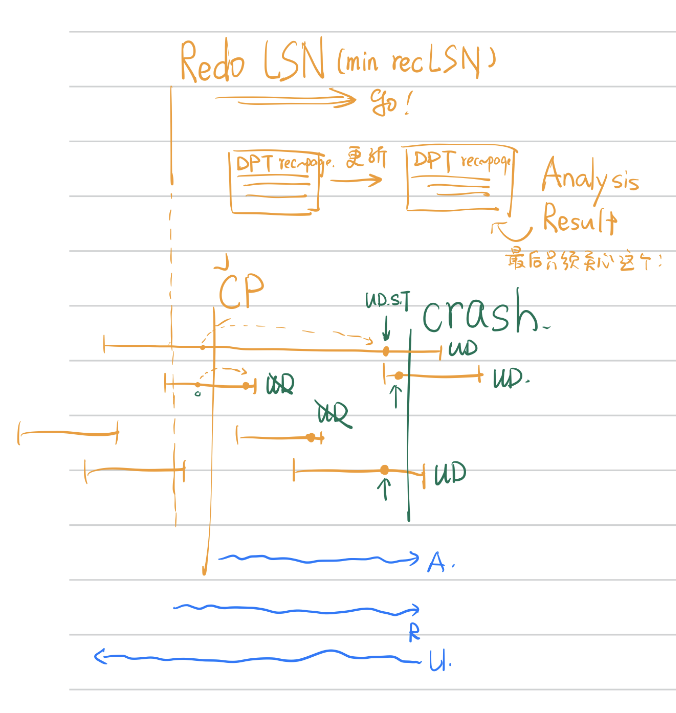</p>

1. Analysis Pass

    |Work about|Initial Work|Scanning Work|
    |---|---|---|
    |-|设置 RedoLSN = min RecLSNs| - |
    |Redo|初始化 DPT|更新 DPT|
    |Undo|初始化 Undo List = $L$|发现新事务，扩展 Undo List；发现事务结束，缩减 Undo List|
    |Undo|初始化 $L$ 的 lastLSN|更新 lastLSN|

2. Redo Pass

    根据【最终的】DPT 和当前 log 的 LSN 判断是否需要 redo：

    + 首先看当前 log 的 page 必须要在 DPT 中，并且 log.LSN $\ge$ page.recLSN。

    + 然后 fetch page，若 fetched page 的 LSN 不等于 log.LSN，则准许 redo。

    直到 crash point。

3. Undo Pass

    根据 Undo List 和 lastLSN 进行 undo：

    + 假设最终的 Undo List 为 $S$，从 $S$ 中选出 lastLSN 最大的那个，undo it，更新这个事务的 lastLSN。如此往复。

    + 更新方法：一般而言 lastLSN 直接更新为对应事务的前一个修改日志的 LSN。但部分时候我们需要跳过一些补偿日志 (CLR)。

    <p>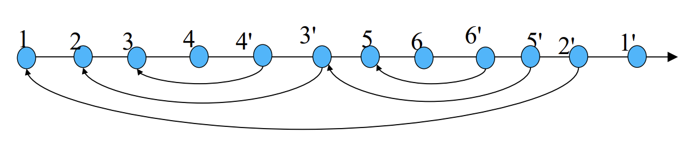</p>

    注意这个数轴表示一个事务下的若干指令。X' 表示 X 对应的补偿日志。为了避免 undo 补偿日志（补偿日志必然已被 redo / do），我们需要将其跳过。比如说，当前 lastLSN = 5，在 undo 5 之后 lastLSN 变为 2，说明接下来对于该事务应当 undo 2。