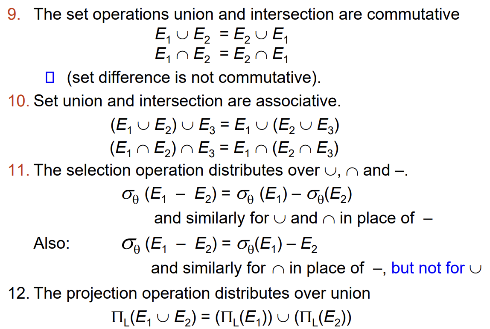

+++
title = '【笔记】数据库系统 (Part IV)'
date = 2024-05-01T07:07:07+01:00
+++

## Lecture 11. Query Optimization

### 11.1 Transformation of Relational Expressions

通过使 query 表达式转换为一些更好做的等价形式来优化查询。

#### Definition of Equivalence

Two relational algebra expressions are said to be equivalent if the two expressions generate the same set of tuples on every legal database instance. Notes that order of tuples is irrelevant.

【NOTES】对于 multiset 的情形，只需要保证重数也一致即可。

#### Equivalence Rules

1. Conjunctive selection operations can be deconstructed into a sequence of individual selections.

    $$\sigma_{\theta_1 \land \theta_2}(E) = \sigma_{\theta_1}(\sigma_{\theta_2}(E))$$

2. Selection operations are commutative.

    $$\sigma_{\theta_1 \land \theta_2}(E) = \sigma_{\theta_2}(\sigma_{\theta_1}(E))$$

3. Only the last in a sequence of projection operations is needed, the others can be omitted.

    $$\Pi_{L_1}(\Pi_{L_2}(\cdots\Pi_{L_n}(E)\cdots)) = \Pi_{L_1}(E)$$

4. Selections can be combined with Cartesian products and theta joins.

    $$\sigma_\theta(E_1 \times E_2) = E_1 \bowtie_\theta E_2$$

    $$\sigma_{\theta_1}(E_1 \bowtie_{\theta_2} E_2) = E_1 \bowtie_{\theta_1 \land \theta_2} E_2$$

5. Theta-join operations (and natural joins) are commutative.

    $$E_1 \bowtie_{\theta} E_2 = E_2 \bowtie_{\theta} E_1$$

6. Natural join operations are associative.

    $$(E_1 \bowtie E_2) \bowtie E_3 = E_1 \bowtie (E_2 \bowtie E_3)$$

    $$(E_1 \bowtie_{\theta_1} E_2) \bowtie_{\theta_2 \land \theta_3} E_3 = E_1 \bowtie_{\theta_1 \land \theta_3} (E_2 \bowtie_{\theta_2} E_3) $$

    后者要求 $\theta_2$ 只能包含 $E_2 / E_3$ 中的属性。

7. **选择操作的分配律：先连后选 $\to$ 先选后连**

    如果 $\theta_1$ 只含 $E_1$ 中的属性，$\theta_2$ 只含 $E_2$ 中的属性：

    $$\sigma_{\theta_1 \land \theta_2}(E_1 \bowtie_\theta E_2) = \sigma_{\theta_1}(E_1) \bowtie_\theta \sigma_{\theta_2}(E_2)$$

8. **投影操作的分配律：先连后投 $\to$ 先投后连**

    约定 $L_1$ 为 $E_1$ 中的属性，$L_2$ 为 $E_2$ 中的属性。
    
    + 如果 $\theta$ 只含 $L_1 \cup L_2$ 中的属性：

        $$\Pi_{L_1 \cup L_2}(E_1 \bowtie_\theta E_2) = \Pi_{L_1}(E_1) \bowtie_\theta \Pi_{L_2}(E_2)$$   

    + 如果 $\theta$ 含有 $L_1 \cup L_2$ 外的属性，我们可以用这种方法构造：

        记 $L_3 = L_1 \cap (\theta - (L_1 \cup L_2)), L_4 = L_2 \cap (\theta - (L_1 \cup L_2))$

        此时
    
        $$\Pi_{L_1 \cup L_2}(E_1 \bowtie_\theta E_2) = \Pi_{L_1 \cup L_2} [\Pi_{L_1 \cup L_3}(E_1) \bowtie_\theta \Pi_{L_2 \cup L_4}(E_2)]$$  

9. 关于 Set Operations 的一些 Equivalence Rule:

    

#### General Tricks

+ Pushing Selections 尽早完成选择操作 (rule 7)

+ Pushing Projections 尽早完成投影操作 (rule 8)

+ Join Ordering 三连接顺序规划 (rule 6)

具体例子参见课件。

$ \Pi_{T.branch_name} ( (\Pi_{branch_name, assets}(\rho_T(branch))) \bowtie_{T.assets > S.assets} (\Pi_{assets} (\sigma_{branch_city = 'Brooklyn'}(\rho_S(branch))))) $